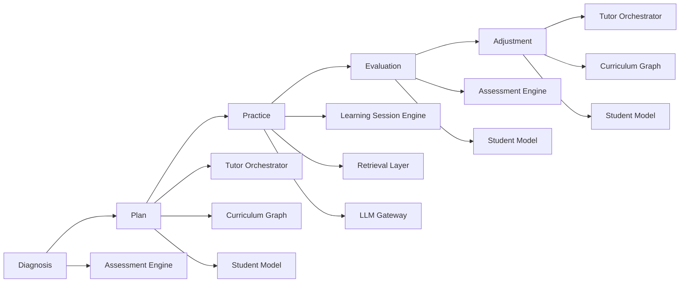

# Goals & Non-Goals

## 1. Purpose of This Document

This document defines what AIGORA is explicitly trying to achieve
(Goals) and what it is intentionally not trying to solve (Non-Goals).

Clear boundaries are essential to:

-   Prevent scope creep
-   Guide architectural decisions
-   Maintain focus
-   Avoid product ambiguity

AIGORA is a long-term educational system. Focus matters.

------------------------------------------------------------------------

# 2. Goals

## 2.1 Build a Structured AI Mathematics Tutor

Design an adaptive AI system capable of guiding a student:

-   From foundational knowledge
-   To competitive university-level performance
-   Through structured curriculum progression

This includes:

-   Concept mastery
-   Procedural fluency
-   Problem interpretation
-   Strategic exam performance

------------------------------------------------------------------------

## 2.2 Implement a Student Model

Develop a formal representation of the learner, including:

-   Mastery levels per topic
-   Error taxonomy mapping
-   Knowledge gaps
-   Learning velocity
-   Confidence estimation

The system must reason about the student, not just respond.

------------------------------------------------------------------------

## 2.3 Curriculum as a Graph

The curriculum must:

-   Be structured as a prerequisite graph
-   Enforce mastery-based progression
-   Support regression when necessary
-   Be extensible over time

No flat list of exercises.

------------------------------------------------------------------------

## 2.4 Adaptive Tutoring Loop

The tutoring process must initially operate as a deterministic pedagogical orchestration loop coordinated by specialized platform components.

The system must behave as a structured pedagogical orchestration pipeline rather than as a reactive chatbot.

### Orchestration Flow

Diagnosis
  → Assessment Engine

Plan
  → Tutor Orchestrator
  → Curriculum Graph
  → Student Model

Practice
  → Learning Session Engine
  → Retrieval Layer
  → LLM Gateway

Evaluation
  → Assessment Engine
  → Student Model

Adjustment
  → Tutor Orchestrator
  → Curriculum Graph
  → Student Model

### High-Level Component Interaction

### Component Responsibilities

| Step       | Responsible Component                                               | Responsibility                                                                                 | Main Dependencies                                  |
| ---------- | ------------------------------------------------------------------- | ---------------------------------------------------------------------------------------------- | -------------------------------------------------- |
| Diagnosis  | [Assessment Engine](../02-architecture/assessment-engine.md)             | Evaluates student mastery, performance, and learning gaps.                                     | Student Model                                      |
| Plan       | [Tutor Orchestrator](../02-architecture/tutor-orchestrator/index.md)           | Selects the next pedagogical action using deterministic orchestration rules.                   | Curriculum Graph, Student Model, Assessment Engine |
| Practice   | [Learning Session Engine](../02-architecture/learning-session-engine.md) | Conducts guided learning sessions, exercises, hints, and interaction flow.                     | Retrieval Layer, LLM Gateway                       |
| Evaluation | [Assessment Engine](../02-architecture/assessment-engine.md)             | Measures learning progression and validates learning outcomes.                                 | Student Model, Learning Session Engine             |
| Adjustment | [Tutor Orchestrator](../02-architecture/tutor-orchestrator/index.md)           | Updates orchestration decisions based on evaluation outcomes and curriculum progression rules. | Student Model, Curriculum Graph, Assessment Engine |

The deterministic orchestration model establishes the architectural foundation for future hybrid and heuristic orchestration capabilities.

Future platform evolution may introduce:

* heuristic orchestration
* probabilistic ranking
* adaptive personalization
* experimentation layers
* AI-assisted pedagogical decisions

while preserving deterministic governance and pedagogical auditability.

------------------------------------------------------------------------

## 2.5 Explainability

The system must provide:

-   Clear reasoning behind exercise selection
-   Transparent feedback
-   Traceable progression logic

Educational decisions must be explainable.

------------------------------------------------------------------------

## 2.6 Exam-Oriented Optimization

Prepare students specifically for competitive exams such as:

-   Fuvest
-   Other Brazilian entrance exams
-   Future international benchmarks (possible expansion)

Focus includes:

-   Time management
-   Strategy selection
-   Pattern recognition
-   Error reduction

------------------------------------------------------------------------

## 2.7 Governance and Engineering Discipline

AIGORA prioritizes:

-   Documentation-first architecture
-   Protected branches
-   CI enforcement
-   Conventional commits
-   Clear operational workflow

Clean engineering is part of the product.

------------------------------------------------------------------------

# 3. Non-Goals

## 3.1 Not a General-Purpose Chatbot

AIGORA is not:

-   A conversational AI for general knowledge
-   A replacement for search engines
-   A generic LLM wrapper

It is a structured tutoring system.

------------------------------------------------------------------------

## 3.2 Not Clinical or Psychological Treatment

Although the system may support study habits and self-regulation, it is
not:

-   A mental health platform
-   A therapy substitute
-   A diagnostic psychological tool

It operates strictly within educational scope.

------------------------------------------------------------------------

## 3.3 Not a Full National Curriculum Replacement (MVP)

The MVP does not aim to:

-   Cover every math topic
-   Replace formal schooling
-   Provide comprehensive K-12 coverage

Scope expansion will be incremental.

------------------------------------------------------------------------

## 3.4 Not an Olympiad Training System (Initially)

AIGORA is not initially focused on:

-   Olympiad-level abstraction
-   Formal proof competitions
-   Deep theoretical mathematics

The focus is structured mastery for competitive entrance exams.

------------------------------------------------------------------------

## 3.5 Not a Fully Autonomous Learning System

The system does not assume:

-   Complete independence from human guidance
-   Replacement of teachers
-   Elimination of structured study discipline

It is an augmentation system.

------------------------------------------------------------------------

# 4. Strategic Boundaries

To maintain focus, new features must pass this test:

1.  Does it improve structured tutoring?
2.  Does it improve student modeling?
3.  Does it improve exam performance?
4.  Does it align with doc-first governance?

If the answer is no to all four, it is out of scope.

------------------------------------------------------------------------

# 5. Evolution Path

Future expansions may include:

-   Broader subject coverage
-   Advanced mathematics modules
-   International exam preparation
-   API exposure for schools

However, these are not part of the initial system objective.

------------------------------------------------------------------------

# 6. Guiding Principle

AIGORA is not trying to do everything.

It is trying to do one thing exceptionally well:

Build a structured, adaptive mathematics tutor capable of guiding a
student from zero to competitive university admission.

Focus over feature quantity. Structure over improvisation. Depth over
breadth.
