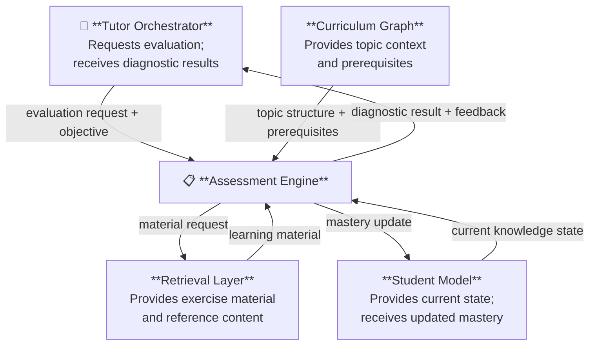

# Assessment Engine

The Assessment Engine is the component responsible for evaluating student knowledge, diagnosing learning gaps, and producing structured feedback that informs the tutoring system.

It operates as the primary source of evidence about the student's current understanding, feeding results directly into the Student Model and guiding the Tutor Orchestrator's decisions about learning progression.

---

# Role in the Architecture

The Assessment Engine transforms student interactions into structured knowledge signals.

Rather than simply checking whether an answer is correct, it produces diagnostic evidence: mastery indicators, error patterns, and confidence signals that allow the system to reason about what the student knows, what they misunderstand, and what they need next.

This diagnostic reasoning is what distinguishes AIGORA from a generic exercise platform.

---

# Responsibilities

The Assessment Engine is responsible for:

- selecting and presenting exercises aligned with the current learning objective
- evaluating student responses against expected outcomes
- classifying errors according to a structured error taxonomy
- estimating mastery level per topic based on accumulated evidence
- emitting assessment results to the Student Model for state updates
- providing diagnostic signals to the Tutor Orchestrator for progression decisions

---

# Conceptual Inputs and Outputs

## Inputs

| Input | Source |
|-------|--------|
| Current learning objective | Tutor Orchestrator |
| Student knowledge state | Student Model |
| Topic context and prerequisites | Curriculum Graph |
| Retrieved learning material | Retrieval Layer |

## Outputs

| Output | Destination |
|--------|-------------|
| Exercise or diagnostic question | Student (via Tutor Orchestrator) |
| Mastery estimate per topic | Student Model |
| Error classification and feedback | Tutor Orchestrator |
| Progression or regression signal | Tutor Orchestrator |

---

# Interaction with Other Components

---

# Diagnostic and Evaluation Workflow

The Assessment Engine operates through the following conceptual stages:

**1. Context Resolution**

The engine receives the current learning objective from the Tutor Orchestrator and queries the Curriculum Graph to understand the topic's position, prerequisites, and mastery criteria. It also reads the student's current knowledge state from the Student Model.

**2. Exercise Selection**

Based on the resolved context, the engine selects or constructs a suitable exercise. Selection criteria include the topic, the student's mastery level, and recent error history. The Retrieval Layer may supply reference material or problem content at this stage.

**3. Response Evaluation**

The student's response is evaluated against the expected outcome. This is not limited to binary correctness — the engine classifies the nature of any error (conceptual gap, procedural mistake, interpretation failure) to support targeted feedback.

**4. Mastery Estimation**

The engine updates its estimate of the student's mastery for the relevant topic, taking into account the full evidence from the current and prior interactions.

**5. Result Emission**

The engine emits the updated mastery estimate to the Student Model and returns a diagnostic result to the Tutor Orchestrator, which uses this signal to decide whether to continue, reinforce, or regress the learning path.

---

# Error Taxonomy

The Assessment Engine operates with a structured classification of student errors. This taxonomy allows the system to distinguish between surface-level mistakes and deeper conceptual misunderstandings, enabling more precise tutoring responses.

Error categories include (conceptually):

- **Conceptual errors** — incorrect understanding of a mathematical principle
- **Procedural errors** — correct understanding but flawed execution
- **Interpretation errors** — failure to correctly read or model the problem
- **Careless errors** — isolated mistakes inconsistent with demonstrated mastery

The specific taxonomy is defined as part of the Student Model documentation.

---

# Architectural Constraints

The Assessment Engine must respect the following constraints defined in [System Constraints](../01-requirements/constraints.md):

- Assessment logic must remain isolated within this component
- The engine must not maintain student state directly — state ownership belongs to the Student Model
- Interactions with external learning material must be mediated through the Retrieval Layer

---

# Related Documents

| Document | Description |
|----------|-------------|
| [Architecture Overview](overview.md) | High-level system architecture |
| [Student Model](student-model.md) | Learner state representation |
| [Curriculum Graph](curriculum-graph/index.md) | Topic dependency structure |
| [Tutor Orchestrator](tutor-orchestrator.md) | Central orchestration engine |
| [Retrieval Layer](retrieval-layer.md) | Knowledge retrieval architecture |
