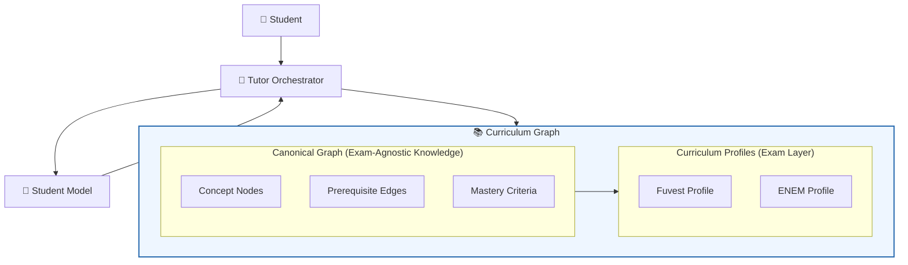

# Curriculum Graph

## Overview
This document defines the structure, design principles, and
operational constraints of the AIGORA Curriculum Graph.

The Curriculum Graph is the backbone of structured learning progression.
Every tutoring decision the orchestrator makes — what to teach next,
what gaps to address, how to navigate regression — is grounded in
the graph's structure.

This document is a companion to the
[Architecture Overview](overview.md) and
[Tutor Orchestrator](tutor-orchestrator.md).

## Problem Statement

An AI tutoring system requires a structured representation of
the knowledge it teaches and the relationships between concepts.

Without an explicit knowledge structure, tutoring decisions become
dependent on ad-hoc heuristics or model-generated associations,
making it difficult to reason about learning progression.

This creates several risks:

- learning paths becoming inconsistent across sessions
- prerequisite gaps remaining undetected
- tutoring strategies drifting away from a coherent curriculum
- difficulty adapting the system to different exams or educational goals

AIGORA addresses this challenge by introducing the **Curriculum Graph**.

The Curriculum Graph provides a canonical representation of
mathematical concepts and their prerequisite relationships,
allowing the Tutor Orchestrator to navigate knowledge progression
systematically while applying exam-specific requirements through
curriculum profiles.

## Architectural Context

The Curriculum Graph defines the structural knowledge model of AIGORA.

It provides the canonical representation of mathematical concepts
and their prerequisite relationships, independent of any specific exam.

The Tutor Orchestrator navigates the graph to determine learning
progression, detect prerequisite gaps, and guide tutoring decisions,
while curriculum profiles apply exam-specific requirements over the
canonical structure.

The student's mastery state is stored separately in the Student Model,
allowing the same canonical graph to serve multiple students and
multiple curricula simultaneously.

---

## Design Principle

The Curriculum Graph has one foundational rule:

> Mathematical knowledge is exam-agnostic.
> Exam requirements are not.

These two concerns must never be conflated inside the graph.

A concept like *quadratic functions* exists independently of whether
Fuvest, ENEM, or any other exam tests it. Its definition, its
prerequisites, and its mastery criteria are mathematical facts —
not exam policies.

What Fuvest *does* with quadratic functions — which aspects it tests,
at what depth, with what time pressure — is an exam concern, not a
knowledge concern.

Keeping these two layers separate is what makes the graph extensible.

---

## Two-Layer Architecture

The Curriculum Graph is composed of two distinct layers.

### Layer 1 — Canonical Graph

The canonical graph is the **exam-agnostic foundation**.

It defines:

- Every mathematical concept as a node
- Every prerequisite relationship as a directed edge
- Mastery criteria for each node, grounded in mathematical understanding
- Regression paths when mastery breaks down

The canonical graph is stable. It does not change when a new
exam curriculum is introduced. It grows only when new mathematical
concepts are added to the system.

No exam logic, no weighting, no prioritization lives here.

### Layer 2 — Curriculum Profile

A curriculum profile is an **exam-specific lens** applied over
the canonical graph.

It defines:

- Which canonical nodes are required for this curriculum
- At what mastery depth each node must be reached
- The relative weight of each node in exam performance
- Exam-specific skill overlays (time pressure, pattern recognition, strategy)
- The recommended progression path through required nodes

A profile does not modify the canonical graph.
It selects from it, weights it, and overlays exam strategy on top of it.

Adding a new curriculum means adding a new profile.
The canonical graph is untouched.

---

## Node Anatomy

Every node in the canonical graph represents a single,
well-scoped mathematical concept.

A node contains:

| Field | Description |
|---|---|
| **id** | Unique identifier |
| **name** | Human-readable concept name |
| **domain** | Broad mathematical domain (e.g. Algebra, Functions) |
| **description** | Precise definition of the concept |
| **mastery\_criteria** | What demonstrating mastery looks like at each level |
| **error\_taxonomy** | Common misconceptions and error patterns for this concept |
| **prerequisite\_ids** | Ordered list of nodes that must be mastered before this one |
| **regression\_ids** | Nodes to revisit when mastery of this node breaks down |

Nodes are mathematical primitives. They carry no exam information.

---

## Edge Anatomy

Edges in the canonical graph represent **prerequisite relationships**.

An edge from node A to node B means:

> A student cannot meaningfully engage with B without sufficient mastery of A.

Edges are directed and weighted by necessity:

| Edge Type | Description |
|---|---|
| **Hard prerequisite** | B cannot be attempted without A. Enforced by the orchestrator. |
| **Soft prerequisite** | B is significantly easier with A. Recommended but not enforced. |
| **Regression target** | If B breaks down, return to A for reinforcement. |

The orchestrator uses edge type to determine whether to block
progression, recommend review, or trigger regression.

---

## Mastery Representation

Each node carries a mastery scale shared across the entire system.

| Level | Label | Description |
|---|---|---|
| 0 | **Unexposed** | Student has not encountered this concept |
| 1 | **Recognises** | Can identify the concept when presented |
| 2 | **Guided** | Can solve with significant scaffolding |
| 3 | **Independent** | Can solve without assistance |
| 4 | **Efficient** | Can solve correctly under time pressure |
| 5 | **Transferable** | Can apply in novel and cross-topic contexts |

Mastery levels are stored in the Student Model, not the graph.

The graph defines what mastery *means* at each level for each node.
The Student Model tracks *where* the student currently sits.

This separation means the same canonical graph serves every student,
while each student's mastery state is entirely their own.

---

## Curriculum Profile Anatomy

A curriculum profile selects and weights the canonical graph
for a specific exam or educational context.

A profile contains:

| Field | Description |
|---|---|
| **id** | Unique profile identifier |
| **name** | Human-readable curriculum name (e.g. "Fuvest", "ENEM") |
| **required\_nodes** | Set of canonical node ids required by this curriculum |
| **mastery\_targets** | Minimum mastery level required per node |
| **node\_weights** | Relative importance of each node in exam performance |
| **progression\_path** | Recommended traversal order through required nodes |
| **exam\_skill\_overlay** | Exam-specific skills layered over content mastery |

A profile cannot add nodes that do not exist in the canonical graph.
It can only select, weight, and sequence from what the canonical layer provides.

---

## Fuvest and ENEM Profiles

The Fuvest and ENEM profiles are the initial curriculum profiles of AIGORA.

It selects the mathematical domains most heavily represented
in the Fuvest exam and applies exam-specific weighting and
skill overlays relevant to competitive university admission in Brazil.

### Required Domains

The Fuvest profile draws primarily from:

- Arithmetic and number theory
- Algebraic manipulation and equations
- Linear and quadratic functions
- Graphs and analytical geometry
- Combinatorics and probability
- Trigonometry
- Introductory logarithms and exponentials

### Exam Skill Overlay

Beyond content mastery, the Fuvest profile adds:

| Skill | Description |
|---|---|
| **Time efficiency** | Solving correctly within strict time constraints |
| **Pattern recognition** | Identifying problem type rapidly to select strategy |
| **Strategic skipping** | Knowing when not to pursue a difficult item |
| **Error detection** | Catching calculation errors before submitting |
| **Multi-step modeling** | Translating complex word problems into solvable structures |

These skills are not mathematical concepts. They are exam performance
skills that the orchestrator layers over content mastery when the
active profile is Fuvest.

### Mastery Targets

The Fuvest profile generally requires:

- Core algebraic and functional concepts at mastery level 4 (Efficient)
- Supporting and peripheral concepts at mastery level 3 (Independent)
- Exam skill overlay items at level 4 (Efficient)

Exact targets are defined per node within the profile specification.

---

## Profile Portability and Student Continuity

A student's mastery state is stored in the Student Model
against canonical node ids — not against profile-specific references.

This means:

- A student who has reached mastery level 4 on quadratic functions
  under the Fuvest profile retains that mastery if they switch to
  a different profile.
- The new profile may require a different mastery target for the
  same node, but the student's existing state is preserved and
  recognised.
- No mastery is lost when a curriculum profile changes.

The canonical graph is the common language.
Profiles are views over it. Students own their state within it.

---

## Graph Traversal by the Orchestrator

The orchestrator navigates the canonical graph through the lens
of the active curriculum profile.

During authority traversal, the orchestrator uses the graph to:

- Locate the student's current position in the required node set
- Identify prerequisite gaps that may explain a current difficulty
- Determine whether a student input refers to the current topic,
  a prerequisite, or a cross-topic connection
- Select regression targets when mastery breaks down
- Confirm whether the student is ready to progress to the next node

The orchestrator always navigates the canonical graph.
The active profile determines which part of the graph is relevant
and at what mastery depth.

---

## Multi-Profile Dynamics

When more than one curriculum profile is defined over the same
canonical graph, several capabilities emerge from the architecture
without additional design effort.

These capabilities are not features implemented by the system.
They are natural properties of the two-layer architecture.

### Gap Delta

When a student transitions from one profile to another —
or prepares for multiple exams simultaneously — the system
can immediately compute which canonical nodes are:

- **Satisfied** — mastery target met under the new profile
- **Undertargeted** — mastered, but below the new profile's required depth
- **Missing** — required by the new profile but not yet engaged

This gap delta requires no new diagnostic session.
It is a direct comparison between the student's canonical mastery
state and the incoming profile's mastery targets.

The orchestrator uses the gap delta to reorient the student's
progression path without discarding prior work.

### Overlap Optimisation

When a student is preparing for more than one profile simultaneously,
canonical nodes that are required by both profiles at comparable
mastery targets represent the highest-leverage study investment.

The system can surface these shared high-weight nodes and
prioritise them in the orchestrator's progression planning —
maximising preparation efficiency across both curricula at once.

### Mastery Transfer Credit

A student's mastery state is anchored to canonical node ids.
It does not belong to any profile.

When a profile changes or a new profile is added, existing
mastery is automatically recognised against the new profile's
targets. No mastery is lost. No re-examination of already-mastered
concepts is required unless the new profile demands a higher
mastery depth.

This makes curriculum transitions structurally seamless.

### Curriculum Readiness Score

A student's canonical mastery state can be projected through
any profile to produce a **curriculum readiness score** —
a measure of how prepared the student currently is for
a specific exam, given their existing mastery.

The score is computed as a weighted function of:

- The student's current mastery level per required node
- The profile's mastery target per node
- The profile's weight per node

A readiness score of 1.0 means all required nodes are at or above
their mastery targets, weighted by exam importance.

This projection is not a new computation — it is a natural
consequence of profiles defining targets and weights over
the canonical mastery scale.

### Profile Difficulty Comparison

Because all profiles define mastery targets against the same
canonical scale and the same canonical nodes, profiles are
objectively comparable:

- Which profile demands deeper mastery of shared nodes
- Which profile requires a broader node set
- Which profile is more demanding in aggregate

This comparison is meaningful precisely because the canonical
graph is exam-agnostic. It is the neutral common ground
against which all profiles are measured.

---

## Extensibility Constraints

To ensure the graph remains extensible across curricula:

- New nodes may only be added to the canonical graph, never to a profile directly.
- Profiles may not define mastery criteria — only mastery targets against canonical criteria.
- Exam skill overlays are profile-specific and must not contaminate canonical node definitions.
- A canonical node must be meaningful independently of any profile.
- Prerequisite edges are canonical facts — they may not be overridden by a profile.

---

## Constraints Summary

- The canonical graph is exam-agnostic. No exam logic lives in nodes or edges.
- Curriculum profiles are lenses over the canonical graph, not extensions of it.
- Mastery criteria are defined in the canonical graph. Mastery state is stored in the Student Model.
- Profiles define mastery targets, not mastery criteria.
- Student mastery state is portable across profiles via canonical node ids.
- Hard prerequisite edges are enforced by the orchestrator. Soft prerequisites are recommended.
- Exam skill overlays belong to profiles, not to canonical nodes.
- Adding a new curriculum means adding a new profile. The canonical graph is untouched.
- The orchestrator always navigates the canonical graph through the active profile.
- Gap delta, mastery transfer, and readiness scoring are structural properties, not additional features.
- Profile difficulty comparison is valid only because the canonical graph is the shared neutral foundation.

