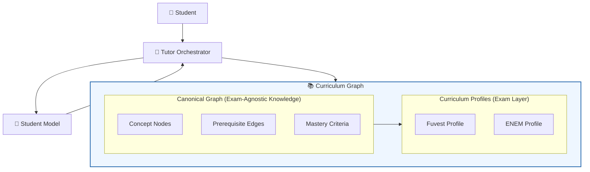

# Curriculum Graph

## Overview
This document defines the purpose, design principles, and
architectural role of the AIGORA Curriculum Graph.

The Curriculum Graph is the foundational structure that enables
controlled and explainable learning progression.
Every tutoring decision the orchestrator makes — what to teach next,
what gaps to address, how to navigate regression — is grounded in
the graph's structure.

This document is a companion to the
[Architecture Overview](../overview.md) and
[Tutor Orchestrator](../tutor-orchestrator.md).

---

## Problem Statement

An AI tutoring system requires a structured representation of
the knowledge it teaches and the relationships between concepts.

Without an explicit knowledge structure, tutoring decisions become
dependent on ad-hoc heuristics or opaque model-generated associations,
making it difficult to reason about learning progression.

This creates several risks:

- learning paths becoming inconsistent across sessions
- prerequisite gaps remaining undetected
- tutoring strategies drifting away from a coherent curriculum
- difficulty adapting the system to different exams or educational goals

AIGORA addresses this challenge by introducing the **Curriculum Graph**.

The Curriculum Graph provides a canonical representation of
mathematical concepts and their prerequisite relationships,
allowing the Tutor Orchestrator to navigate knowledge progression
systematically while applying exam-specific requirements through
curriculum profiles.

---

## Architectural Context

The Curriculum Graph defines the structural knowledge model of AIGORA.

It provides the canonical representation of mathematical concepts
and their prerequisite relationships, independent of any specific exam.

The Tutor Orchestrator navigates the graph to determine learning
progression, detect prerequisite gaps, and guide tutoring decisions,
while curriculum profiles apply exam-specific requirements over the
canonical structure.

The student's mastery state is stored separately in the Student Model,
allowing the same canonical graph to serve multiple students and
multiple curricula simultaneously.

---

## Design Principle

The Curriculum Graph has one foundational rule:

> Mathematical knowledge is exam-agnostic.
> Exam requirements are not.

These two concerns must never be conflated inside the graph.

A concept like *quadratic functions* exists independently of whether
Fuvest, ENEM, or any other exam tests it. Its definition, its
prerequisites, and its mastery criteria are mathematical facts —
not exam policies.

What Fuvest *does* with quadratic functions — which aspects it tests,
at what depth, with what time pressure — is an exam concern, not a
knowledge concern.

Keeping these two layers separate is what makes the graph extensible.

---

## Architectural Solution

To separate stable mathematical knowledge from exam-specific
requirements, the Curriculum Graph adopts a layered architecture design.

---

## Two-Layer Architecture

The Curriculum Graph is composed of two distinct layers.

### Layer 1 — Canonical Graph

The canonical graph is the **exam-agnostic foundation**.

It defines:

- Every mathematical concept as a node
- Every prerequisite relationship as a directed edge
- Mastery criteria for each node, grounded in mathematical understanding
- Regression paths when mastery breaks down

The canonical graph is stable. It does not change when a new
exam curriculum is introduced. It grows only when new mathematical
concepts are added to the system.

No exam logic, no weighting, no prioritization lives here.

### Layer 2 — Curriculum Profile

A curriculum profile is an **exam-specific lens** applied over
the canonical graph.

It defines:

- Which canonical nodes are required for this curriculum
- At what mastery depth each node must be reached
- The relative weight of each node in exam performance
- Exam-specific skill overlays (time pressure, pattern recognition, strategy)
- The recommended progression path through required nodes

A profile does not modify the canonical graph.
It selects from it, weights it, and overlays exam strategy on top of it.

Adding a new curriculum means adding a new profile.
The canonical graph is untouched.

---

## Non-Goals

The Curriculum Graph does not:

- store student-specific state (handled by the Student Model)
- encode exam-specific logic (handled by curriculum profiles)
- perform tutoring decisions (handled by the Tutor Orchestrator)

Its responsibility is strictly to represent structured knowledge
and prerequisite relationships.

--- 

## Documentation Structure

Detailed aspects of the Curriculum Graph are documented in the following files:

- [Domain Model](./model.md)
- [Schema](./schema.md)
- [Query Model](./queries.md)
- [Rules & Constraints](./rules.md)
- [Integration](./integration.md)

These documents expand on the structure, behavior, and operational rules
defined at a high level in this overview.

