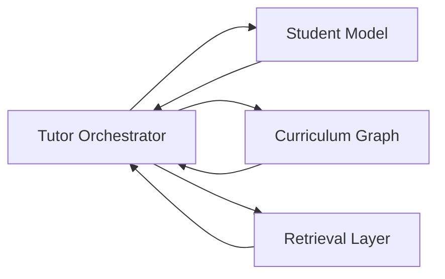

# Curriculum Graph — Integration

## Overview

This document defines how the Curriculum Graph integrates with other
core components of the AIGORA system.

It describes the interaction patterns between the Curriculum Graph and:

- Tutor Orchestrator
- Student Model
- Retrieval Layer (RAG)
- External data ingestion processes

The Curriculum Graph is a **read-optimized knowledge structure** that
provides canonical mathematical relationships and curriculum overlays.

It does not make decisions. It supports decision-making.

---

## Integration Principles

The integration of the Curriculum Graph follows these principles:

- the graph is the **single source of truth for knowledge structure**
- the graph is **read-only during tutoring execution**
- all decision-making happens outside the graph
- student-specific state is not stored in the graph
- curriculum logic is applied through profile traversal

---

## Component Interaction Overview

---

## Tutor Orchestrator Integration

The Tutor Orchestrator is the primary consumer of the Curriculum Graph.

It uses the graph to:

- determine the next topic to teach
- identify prerequisite gaps
- select regression paths
- validate progression readiness
- interpret student input in context of the curriculum

### Interaction Pattern

The orchestrator performs:

- topic lookup
- prerequisite traversal
- curriculum projection
- regression selection

### Example Flow

1. Orchestrator receives a student interaction
2. Resolves current topic in the graph
3. Queries prerequisites
4. Checks student mastery via Student Model
5. Determines next action

---

## Student Model Integration

The Student Model stores **student-specific mastery state**.

The Curriculum Graph defines:

- what mastery means
- how concepts are connected

The Student Model defines:

- current mastery level per topic

### Interaction Pattern

- Graph provides canonical structure
- Student Model provides mastery state
- Orchestrator combines both

### Key Rule

The Curriculum Graph never stores student-specific data.

---

## Retrieval Layer Integration (RAG)

The Retrieval Layer provides:

- explanations
- examples
- exercises
- educational content

The Curriculum Graph provides:

- the **semantic anchor** for retrieval

### Interaction Pattern

1. Orchestrator identifies topic via graph
2. Topic id is used as retrieval key
3. Retrieval Layer returns relevant content

### Example

Topic: Quadratic Functions  
→ Retrieval query: "quadratic functions exercises"

---

## Curriculum Profile Integration

Curriculum Profiles are stored inside the graph and applied dynamically.

The Orchestrator uses profiles to:

- determine required topics
- apply mastery targets
- prioritize progression
- apply exam-specific overlays

### Interaction Pattern

Canonical Graph → Profile Overlay → Orchestrator Decision

---

## Data Ingestion Integration

The Curriculum Graph is populated through ingestion pipelines.

These pipelines are responsible for:

- creating canonical topics
- defining prerequisite relationships
- adding curriculum profiles
- versioning the graph

### Sources

- curriculum definitions (Fuvest, ENEM)
- mathematical ontology
- internal curation

### Key Principle

Graph updates are controlled and do not happen during tutoring runtime.

---

## Read vs Write Model

The Curriculum Graph follows a **read-heavy architecture**.

### Read Operations

- topic lookup
- prerequisite traversal
- profile queries
- regression lookup

### Write Operations

- ingestion pipelines
- version updates
- schema evolution

### Constraint

No writes during active tutoring sessions.

---

## Boundaries

The Curriculum Graph does NOT:

- decide what to teach (Orchestrator)
- track student progress (Student Model)
- generate explanations (LLM / Retrieval)
- store interaction history
- compute readiness scores

It only provides **structured knowledge**.

---

## Failure Handling

If the Curriculum Graph is unavailable:

- the Orchestrator cannot perform structured reasoning
- fallback strategies may include:
  - cached graph data
  - limited heuristic-based decisions

Graph availability is critical for system correctness.

---

## Caching Strategy

To improve performance:

- frequently accessed nodes can be cached
- prerequisite chains can be precomputed
- profile projections can be cached per session

Caching must not violate:

- consistency of canonical structure
- correctness of prerequisite relationships

---

## Summary

The Curriculum Graph integrates with the AIGORA system as the
central knowledge backbone.

It provides:

- canonical structure of mathematical knowledge
- curriculum-aware overlays
- traversal support for reasoning

It works in combination with:

- the Tutor Orchestrator (decision-making)
- the Student Model (state)
- the Retrieval Layer (content)

This separation ensures:

- scalability
- clarity of responsibility
- extensibility across curricula
- explainable tutoring decisions
