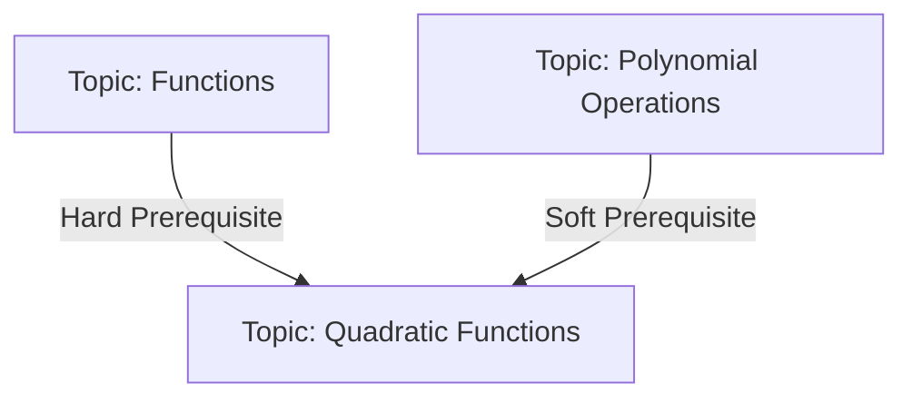
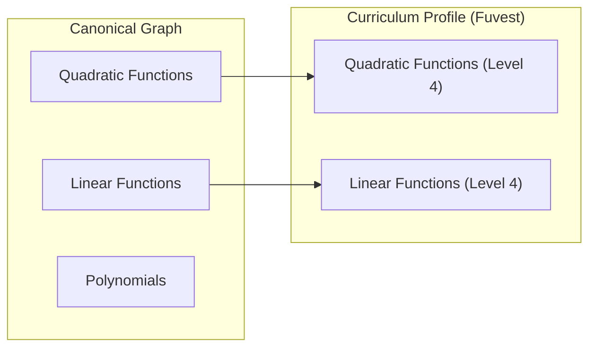

# Curriculum Graph — Domain Model

## Overview

This document defines the domain model of the AIGORA Curriculum Graph.

It specifies the structural components that represent mathematical knowledge,
including nodes, relationships, and mastery definitions.

The model is designed to be:

- **exam-agnostic** at the canonical level
- **extensible** across multiple curricula
- **compatible** with adaptive tutoring systems

This document expands on the high-level concepts introduced in
[index.md](./index.md).

---

## Role in the System

The domain model of the Curriculum Graph is composed of
mathematical knowledge within AIGORA.

It provides the structural foundation used by the Tutor Orchestrator
to reason about learning progression and prerequisite dependencies.

---

## Core Concepts

The Curriculum Graph is composed of the following core elements:

- **Nodes** — represent mathematical concepts
- **Edges** — represent prerequisite relationships between concepts
- **Mastery definitions** — describe levels of understanding per concept
- **Curriculum profiles** — define exam-specific requirements over the graph

---

## Node Model

Each node represents a single, well-scoped mathematical concept.

Nodes are the fundamental units of knowledge in the system.

### Properties

| Field | Description |
|------|------------|
| **id** | Unique identifier of the concept |
| **name** | Human-readable concept name |
| **domain** | Broad mathematical domain (e.g. Algebra, Functions) |
| **description** | Precise definition of the concept |
| **mastery_criteria** | Definition of what mastery means at each level |
| **error_taxonomy** | Common misconceptions and error patterns |
| **prerequisite_ids** | Ordered list of prerequisite node ids |
| **regression_ids** | Nodes to revisit when mastery breaks down |

### Constraints

- A node must represent a **single atomic concept**
- A node must be **independent of any exam**
- A node must have **clear mastery criteria**
- A node must be **meaningful in isolation**

---

## Edge Model

Edges define the navigational structure used by the Tutor Orchestrator.

Edges represent directed prerequisite relationships between nodes.

An edge from node A to node B means:

> A student cannot meaningfully engage with B without sufficient mastery of A.

### Properties

| Field | Description |
|------|------------|
| **type** | Type of prerequisite relationship |
| **source** | Origin node (prerequisite) |
| **target** | Destination node |

### Edge Types

| Type | Description |
|------|------------|
| **Hard prerequisite** | Required before attempting the target node |
| **Soft prerequisite** | Strongly recommended but not strictly required |
| **Regression target** | Suggested fallback when mastery breaks down |

### Constraints

- Edges are **directed**
- Hard prerequisite edges must not form cycles
- Edge semantics must be **consistent across the graph**

---

## Example Graph Structure

## Canonical vs Curriculum Profile Model

---

## Mastery Model

Each node defines a mastery scale shared across the system.

Mastery represents the student's level of understanding of a concept.

### Levels

| Level | Label | Description |
|------|------|------------|
| 0 | **Unexposed** | Student has not encountered the concept |
| 1 | **Recognises** | Can identify the concept |
| 2 | **Guided** | Can solve with assistance |
| 3 | **Independent** | Can solve without assistance |
| 4 | **Efficient** | Can solve under time constraints |
| 5 | **Transferable** | Can apply in novel contexts |

### Key Principles

- Mastery definitions are **stored in the graph**
- Mastery state is **stored in the Student Model**
- The graph defines **what mastery means**
- The Student Model defines **where the student is**

---

## Curriculum Profile Model

Curriculum profiles define exam-specific views over the canonical graph.

They do not modify the graph — they select and weight it.

### Properties

| Field | Description |
|------|------------|
| **id** | Unique profile identifier |
| **name** | Curriculum name (e.g. Fuvest, ENEM) |
| **required_nodes** | Set of required node ids |
| **mastery_targets** | Required mastery level per node |
| **node_weights** | Relative importance of each node |
| **progression_path** | Recommended learning sequence |
| **exam_skill_overlay** | Exam-specific skills applied on top |

### Constraints

- Profiles may only reference existing nodes
- Profiles cannot define new mastery criteria
- Profiles cannot modify graph structure
- Profiles are overlays, not extensions

---

## Canonical vs Profile Separation

The domain model enforces a strict separation:

| Layer | Responsibility |
|------|---------------|
| **Canonical Graph** | Defines mathematical knowledge |
| **Curriculum Profile** | Defines exam requirements |

### Implications

- Knowledge is reusable across exams
- Students retain mastery across profiles
- New curricula can be added without modifying the graph

---

## Design Constraints

To preserve consistency and extensibility:

- Nodes must remain **exam-agnostic**
- Edges must represent **true prerequisite relationships**
- Mastery definitions must be **consistent across nodes**
- Profiles must remain **pure overlays**

---

## Summary

The Curriculum Graph domain model defines a structured,
extensible, and reusable representation of mathematical knowledge.

It enables:

- consistent learning progression
- clear prerequisite reasoning
- multi-curriculum support
- separation between knowledge and evaluation context

This model serves as the structural foundation for all higher-level
tutoring decisions in the system.