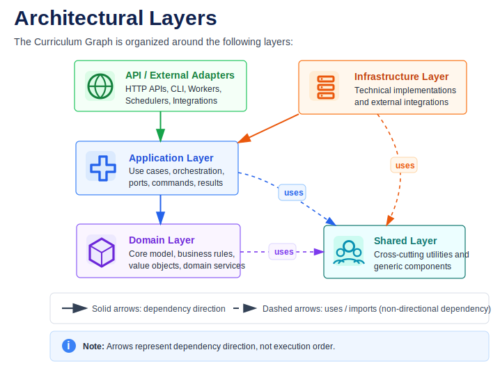
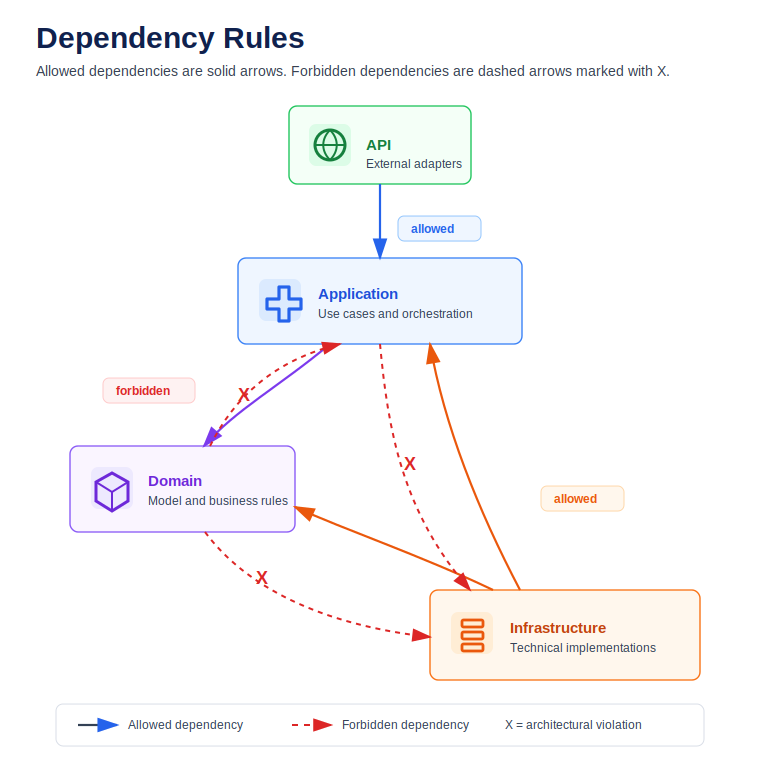
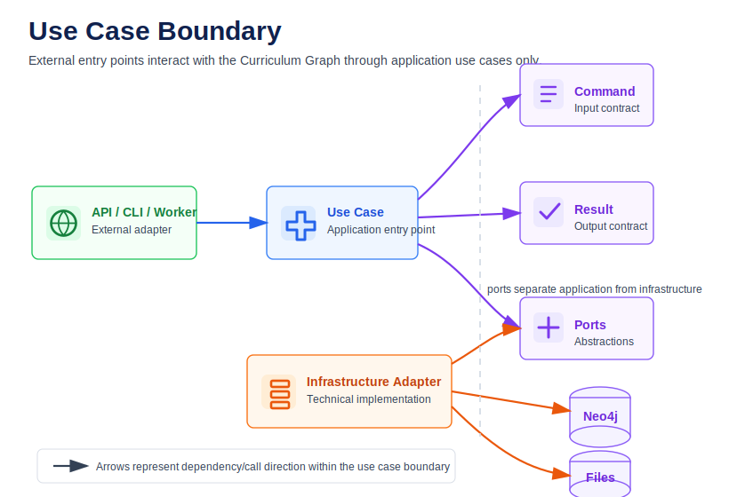
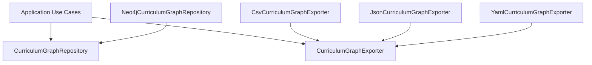

# Curriculum Graph — Clean Architecture

## Overview

This document describes the architectural structure used by the Curriculum Graph bounded context.

The goal is to keep the domain model, application orchestration, infrastructure adapters, and external entry points clearly separated.

The architecture prioritizes:

* domain isolation
* replaceable infrastructure
* explicit orchestration boundaries
* dependency inversion
* scalability for future orchestration and retrieval systems

---

# Architecture Goals

This architecture was designed to optimize:

- long-term maintainability
- infrastructure replaceability
- deterministic orchestration
- bounded context isolation
- scalable retrieval integration
- explicit dependency boundaries

Trade-offs accepted:

- additional abstraction layers
- higher upfront modeling cost
- increased number of application contracts

---
# Architectural Layers

The following diagram illustrates the primary architectural boundaries and dependency direction used by the Curriculum Graph bounded context.

<p align="center">

</p>


<p align="center">
  <em>
    Figure 1 — Architectural layers, dependency boundaries and shared infrastructure usage.
  </em>
</p>

Key observations:

- external systems enter the bounded context through the application layer
- the domain layer remains isolated from infrastructure concerns
- infrastructure implementations depend on application contracts
- shared utilities are accessible across multiple layers

---

# Layer Responsibilities

The architecture separates responsibilities to ensure that domain rules remain stable while infrastructure and delivery
mechanisms evolve independently.

| Layer | Primary Responsibility | Must Not Know |
|---|---|---|
| API | External delivery and transport concerns | Infrastructure internals |
| Application | Orchestration and use case coordination | Database or framework details |
| Domain | Core business rules and invariants | HTTP, persistence or serialization |
| Infrastructure | Technical implementations and integrations | Business orchestration |
| Shared | Generic cross-cutting utilities | Domain-specific behavior |

---

## Domain

The domain layer represents the stable business core of the Curriculum Graph.

Its responsibility is to model learning structures, graph invariants, domain relationships and business rules independently from any
delivery mechanism or infrastructure technology.

The domain layer is intentionally isolated from:
- HTTP
- persistence
- serialization
- file systems
- frameworks
- orchestration concerns

This isolation ensures that the core model remains stable even if external technologies evolve.

---

## Application

The application layer coordinates orchestration flow across the bounded context.

Its responsibility is to:
- execute use cases
- coordinate validation pipelines
- manage application contracts
- isolate orchestration from infrastructure implementations

The application layer defines:
- commands
- results
- ports
- orchestration flows
- pipeline execution

Application orchestration must remain independent from:
- databases
- file systems
- transport protocols
- serialization formats

---

## Infrastructure

The infrastructure layer contains replaceable technical implementations.

Its responsibility is to integrate the Curriculum Graph with external systems such as:
- Neo4j
- file systems
- CSV/JSON/YAML exports
- schema validation
- serialization technologies

Infrastructure components implement application contracts defined through ports.

Because infrastructure is isolated behind abstractions, technical implementations can evolve without impacting domain rules or orchestration logic.

---


> [!IMPORTANT]
> The application layer depends on abstractions, not concrete infrastructure implementations.

## Examples of Violations

The following examples are considered architectural violations:

- domain entities importing FastAPI, Neo4j, CSV, YAML or JSON concerns
- use cases directly importing Neo4j clients or file exporters
- routers directly calling repositories, parsers, mappers or validators
- infrastructure adapters containing business orchestration logic
- shared utilities depending on Curriculum Graph domain-specific behavior

## Why this matters

These rules keep the Curriculum Graph core stable while allowing infrastructure and delivery mechanisms to evolve independently.

They also improve:

- testability
- onboarding clarity
- infrastructure replaceability
- long-term maintainability
- future API and orchestration integration

---

# Dependency Rules

Dependency direction is one of the most important constraints in the Curriculum Graph architecture.

The diagram below shows which layers are allowed to depend on each other and which dependencies are considered architectural violations.

<p align="center">

</p>

Rules:

* Domain must not import Application
* Domain must not import Infrastructure
* Application must not import concrete Infrastructure adapters
* Infrastructure may import Domain and Application ports
* API may depend on Application use cases and request/response schemas

> [!IMPORTANT]
> The application layer depends on abstractions, not concrete infrastructure implementations.

---

# Use Case Boundary

External entry points such as APIs, CLIs, workers, or scheduled jobs should enter the Curriculum Graph through use cases.

<p align="center">

</p>

Routers or external adapters must not directly call:

* file parsers
* mappers
* assemblers
* exporters
* Neo4j repositories
* persistence validators

They should call use cases only.

---

# Ports and Adapters

The Curriculum Graph bounded context adopts a Ports and Adapters (Hexagonal Architecture) approach to isolate application orchestration
from infrastructure concerns.




## Ports

Ports are application-level contracts located at:

`src/aigora/curriculum_graph/application/ports/`

Examples:

* `CurriculumGraphRepository`
* `CurriculumGraphExporter`
* `CurriculumGraphFileParser`
* `CurriculumGraphMapper`
* `CurriculumGraphAssembler`
* `CurriculumGraphSchemaValidator`

---

## Adapters

Adapters are infrastructure implementations of the application ports.

Examples:

* `Neo4jCurriculumGraphRepository`
* `CsvCurriculumGraphExporter`
* `JsonCurriculumGraphExporter`
* `YamlCurriculumGraphExporter`
* `CurriculumGraphFileParser`
* `CurriculumGraphMapper`
* `CurriculumGraphAssembler`

Application depends on Ports.
Infrastructure depends on Ports.
Application never depends directly on infrastructure implementations.

The name `adapter` does not require a folder named `adapters`. In this project, infrastructure components are the adapters.

---

# Design Patterns Used

The architecture currently uses:

| Pattern | Usage |
|---|---|
| Use Case | Application orchestration |
| Command / Result | Stable application contracts |
| Strategy | Export format selection |
| Factory / Registry | Export strategy resolution |
| Pipeline | Graph loading flow |
| Repository | Persistence abstraction |
| Ports and Adapters | Infrastructure isolation |

---

# Command and Result Pattern

Use cases receive explicit command objects and return explicit result objects.

Example:

```text
ExportGraphCommand
  ↓
ExportGraphUseCase.execute(command)
  ↓
ExportGraphResult
```

This keeps application input and output stable, testable, and independent from HTTP schemas or CLI arguments.

---

# Summary

The Curriculum Graph architecture is designed to optimize:

* clear responsibility boundaries
* testability
* replaceable infrastructure
* domain stability
* explicit orchestration
* dependency inversion
* future API and orchestration integration
