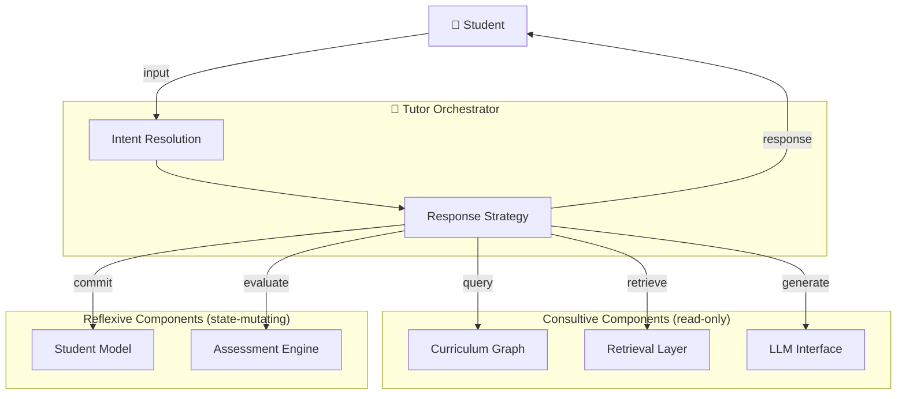

# Interaction Model

This document defines the interaction dynamics of the AIGORA system.

It establishes the protocols governing how the Tutor Orchestrator
communicates with students and coordinates internal components,
and how domain ownership is distributed across the system.

---

# Design Principle

The Tutor Orchestrator operates as a **supervisor**.

It does not execute tutoring actions directly.
It interprets student intent, determines the appropriate response strategy,
and delegates to the right component at the right time.

This separation — between *deciding* and *executing* — is what keeps
the orchestrator coherent under complexity.

---

# Two Interaction Axes

The system has two distinct interaction protocols.
These must never be conflated.

## Axis 1 — Student ↔ Orchestrator

This is the **pedagogical interface**.

The student communicates through natural language or structured input.
The orchestrator is responsible for:

- interpreting the student's intent
- inferring the current knowledge state
- selecting the appropriate tutoring action
- generating or delegating a response

This axis is conversational and adaptive.
Its quality determines the student's learning experience.

## Axis 2 — Orchestrator ↔ Components

This is the **coordination interface**.

The orchestrator invokes internal components to inform decisions
or to update system state.

This axis is programmatic and deterministic.
Its correctness determines the system's structural integrity.

---

# Component Classification

Every component in AIGORA has a declared interaction type.
The orchestrator must resolve this before any invocation.

## Consultive Components

Consultive components are **read-only**.

They answer queries. They do not change system state.
The orchestrator uses them to *inform* a decision.

| Component | Role |
|---|---|
| Curriculum Graph | Query topic dependencies and prerequisites |
| Retrieval Layer (RAG) | Retrieve grounded learning material |
| LLM Interface | Generate explanations, hints, and guided responses |

Consultive calls are safe to retry and safe to parallelize.

## Reflexive Components

Reflexive components **mutate state**.

They record the outcome of an interaction and update the system's
representation of the student. The orchestrator uses them to
*commit* the result of a decision.

| Component | Role |
|---|---|
| Student Model | Update mastery levels, gaps, and learning history |
| Assessment Engine | Record evaluation results and diagnostic outcomes |

Reflexive calls must be intentional and sequenced correctly.
A reflexive call made at the wrong moment corrupts the student model.

---

# Intent Resolution

Before invoking any component, the orchestrator must resolve:

1. **What is the student's intent?**
   Is this a new concept request, a practice attempt, a clarification,
   a help signal, or a navigation action?

2. **What consultive calls are needed?**
   What context must be gathered before a response can be formed?

3. **What response strategy applies?**
   Explain, demonstrate, hint, evaluate, or redirect?

4. **What reflexive calls must follow?**
   What state changes must be committed after the interaction concludes?

This sequence — *resolve intent → consult → respond → reflect* —
is the core loop the orchestrator executes on every interaction.

---

# Domain Ownership

Domains in AIGORA are owned and maintained by different principals.
This determines who builds them, who updates them, and under what authority.

## Staff-Curated Domains

These domains are **built and enriched by the AIGORA team**.

They represent the shared, structured knowledge of the system.
They are broadly accessible to all students and evolve through
deliberate editorial and pedagogical decisions.

| Domain | Description |
|---|---|
| Curriculum Graph | Topic nodes, prerequisite edges, mastery criteria |
| Knowledge Base | Learning materials, explanations, worked examples |
| Assessment Content | Exercise bank, diagnostic questions, evaluation rubrics |

Changes to staff-curated domains require review and governance.
They affect all students simultaneously.

## Student-Built Domains

These domains are **constructed through individual interaction**.

They represent the unique learning state of a single student.
No two students share a student-built domain.
They grow and evolve automatically as the student engages with the system.

| Domain | Description |
|---|---|
| Student Model | Mastery per topic, identified gaps, error patterns |
| Interaction History | Session records, responses, hint usage, timing |
| Learning Trajectory | Progression path taken, regressions, milestones |

Student-built domains are private by design.
Write authority belongs exclusively to the Assessment Engine
and orchestration layer — never to direct student input.

---

# Interaction Diagram

---

# Constraints

- The orchestrator must classify every component invocation as consultive or reflexive before calling it.
- Reflexive calls must occur only after a response strategy has been fully resolved.
- Student-built domains must not be directly writable by student input.
- Staff-curated domains must not be modified at runtime by the orchestrator.
- Intent resolution must precede all component coordination.

---

# Documentation Index

| Document | Description | Status |
|---|---|---|
| [Architecture Overview](overview.md) | High-level system architecture | ✅ Available |
| [Interaction Model](interaction-model.md) | Orchestrator interaction dynamics | ✅ Available |
| [Intent Resolution](intent-resolution.md) | Input taxonomy and orchestration guardrails | ✅ Available |
| [Tutor Orchestrator](tutor-orchestrator.md) | Orchestration engine design | 🚧 Planned |
| [Student Model](student-model.md) | Learner knowledge representation | 🚧 Planned |
| [Curriculum Graph](curriculum-graph.md) | Learning dependency structure | 🚧 Planned |
| [Assessment Engine](assessment-engine.md) | Diagnostic and exercise system | 🚧 Planned |
| [Retrieval Layer](retrieval-layer.md) | Knowledge retrieval architecture | 🚧 Planned |
| [LLM Interface](llm-interface.md) | Language model integration | 🚧 Planned |