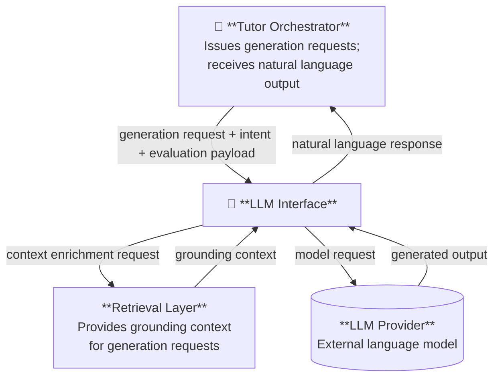

# LLM Interface

The LLM Interface is the component responsible for mediating all communication between the AIGORA tutoring system and large language models.

It establishes a clear architectural boundary between the core tutoring logic and the underlying AI model providers, ensuring that the rest of the system interacts with language models through a controlled and well-defined integration point rather than
directly.

---

# Role in the Architecture

The LLM Interface serves as the single point of contact between AIGORA and external language models.

All requests that require natural language generation — explanations, hints, guided problem-solving responses, and narrative feedback — pass through this component. By centralising model interactions here, the architecture remains independent of specific model providers and preserves flexibility for future evolution.

The LLM Interface does not determine what to say or when to say it. Those decisions belong to the Tutor Orchestrator. The interface is responsible only for how those decisions are translated into model requests and how the resulting output is returned to the system.

---

# Responsibilities

The LLM Interface is responsible for:

- receiving generation requests from system components and translating them into
  model interactions
- incorporating retrieved context from the Retrieval Layer into model requests
  to ensure grounded outputs
- returning generated content (explanations, hints, guidance) to the requesting component
- abstracting all model-specific behaviour so that the rest of the system is
  decoupled from any particular AI provider
- enforcing the constraint that all LLM usage in the system is mediated through
  this component

---

# Conceptual Inputs and Outputs

## Inputs

| Input | Source |
|-------|--------|
| Generation request with pedagogical intent and evaluation payload | Tutor Orchestrator |
| Grounding content and reference material | Retrieval Layer |

## Outputs

| Output | Destination |
|--------|-------------|
| Explanation or concept clarification | Tutor Orchestrator (for student delivery) |
| Hint or guided problem-solving response | Tutor Orchestrator (for student delivery) |
| Narrative feedback on student response | Tutor Orchestrator (for student delivery) |

---

# Interaction with Other Components

---

# Model Interaction Workflow

The LLM Interface operates through the following conceptual stages:

**1. Request Reception**

The Tutor Orchestrator issues a generation request, specifying the pedagogical intent — for example, explaining a concept, providing a hint at a given level of detail, or narrating feedback on a student error. When the request concerns feedback narration, the Orchestrator includes the relevant evaluation result from the Assessment Engine as payload within the request.

**2. Context Assembly**

The interface issues a retrieval request to the Retrieval Layer, specifying the current topic and generation intent. The Retrieval Layer returns grounding content — definitions, worked examples, or reference material — relevant to the request. The interface then assembles the full model input from the pedagogical intent, the evaluation payload (if present), and the retrieved grounding content. This assembly step ensures that model output is anchored in curated material rather than generated without constraints.

**3. Model Interaction**

The assembled input is submitted to the language model. The interface handles all aspects of this interaction, including formatting the request and receiving the model's output. These details are fully encapsulated and not visible to other components.

**4. Output Delivery**

The generated output is returned to the Tutor Orchestrator, which is responsible for determining how and when to deliver it to the student.

---

# Conceptual Role in Tutoring Assistance

The LLM Interface supports the following categories of tutoring interaction:

**Explanation Generation**

Translating a mathematical concept into a clear, appropriately detailed explanation grounded in retrieved curriculum material.

**Hint Generation**

Providing scaffolded guidance at a level of detail calibrated to the student's current state, without revealing the full solution.

**Guided Problem Solving**

Walking the student through reasoning steps in a structured, interactive way that supports understanding rather than answer delivery.

**Feedback Narration**

Communicating evaluation results from the Assessment Engine in natural language, framing errors constructively and reinforcing correct reasoning.

---

# Architectural Constraints

The LLM Interface must respect the following constraints defined in [System Constraints](../01-requirements/constraints.md):

- All LLM usage in the system must be mediated through this component
- No other component may interact with a language model directly
- The interface must remain decoupled from specific model providers to support
  future flexibility
- Responses must be grounded in retrieved material supplied by the Retrieval Layer

---

# Related Documents

| Document | Description |
|----------|-------------|
| [Architecture Overview](overview.md) | High-level system architecture |
| [Tutor Orchestrator](tutor-orchestrator.md) | Central orchestration engine |
| [Retrieval Layer](retrieval-layer.md) | Knowledge retrieval architecture |
| [Assessment Engine](assessment-engine.md) | Diagnostic and evaluation system |