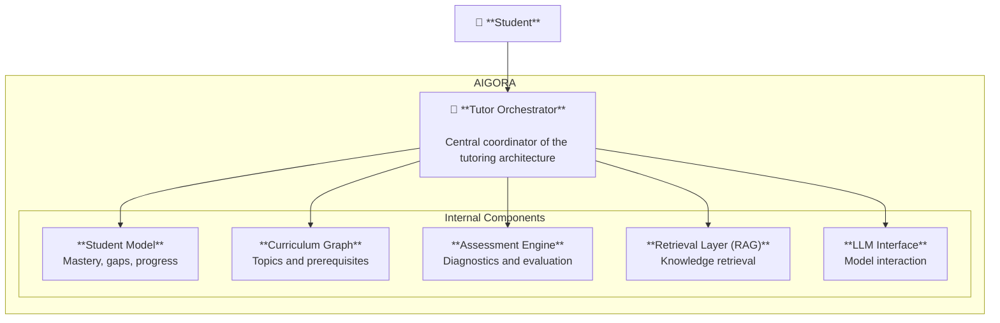

# Architecture Overview

AIGORA is a doc-first AI tutoring architecture designed to guide students
through structured learning paths in mathematics.

Unlike generic conversational AI systems, AIGORA models the learning process
explicitly through curriculum structures, student knowledge representations,
and pedagogical orchestration.

The system integrates curriculum modeling, student diagnostics, assessment
engines, and LLM-assisted tutoring into a modular architecture designed for
incremental evolution.

---

# Architectural Goals

The architecture of AIGORA is designed around the following goals:

• **Structured learning progression**  
Learning is guided through an explicit curriculum graph rather than free-form interaction.

• **Pedagogical orchestration**  
A central orchestration layer selects the next learning action based on the student's knowledge state.

• **Adaptive learning**  
The system continuously updates the student model based on assessments and interactions.

• **LLM-assisted explanations**  
Large Language Models assist with explanations, hints, and guided problem solving.

• **Modular system design**  
Each component is isolated and can evolve independently.

---

# High-Level System Architecture

The **Tutor Orchestrator** acts as the central decision-making component,
coordinating learning interactions between the student and the system.

---

# Core Architecture Components

## Tutor Orchestrator

The Tutor Orchestrator is the central control layer of the system.

It determines the next pedagogical action based on:

• the student's knowledge state  
• curriculum dependencies  
• previous interactions  
• assessment results  

Responsibilities:

- selecting learning strategies
- coordinating system modules
- guiding student progression

> **Documentation Status**  
> 🚧 This component documentation will be introduced in a future revision of the architecture docs.

---

## Student Model

The Student Model represents the learner's knowledge state.

It tracks:

- mastery levels
- misconceptions
- historical interactions
- learning progress

This model enables **adaptive learning decisions**.

> **Documentation Status**  
> 🚧 This component documentation will be introduced in a future revision of the architecture docs.

---

## Curriculum Graph

The Curriculum Graph represents the dependency structure between
concepts within the learning domain.

Concepts are modeled as nodes, with prerequisite relationships forming
directed edges.

Example:

Linear Functions → Quadratic Functions → Polynomial Functions

This structure enables:

- prerequisite reasoning
- curriculum navigation
- concept dependency tracking

> **Documentation Status**  
> 🚧 This component documentation will be introduced in a future revision of the architecture docs.

---

## Assessment Engine

The Assessment Engine evaluates student understanding through
structured exercises and diagnostic questions.

Responsibilities include:

- exercise generation
- answer evaluation
- updating the student model

> **Documentation Status**  
> 🚧 This component documentation will be introduced in a future revision of the architecture docs.

---

## Retrieval Layer (RAG)

The Retrieval Layer provides access to the knowledge base of
learning materials and explanations.

This component retrieves context relevant to the current learning
interaction, enabling LLMs to generate grounded explanations.

> **Documentation Status**  
> 🚧 This component documentation will be introduced in a future revision of the architecture docs.

---

## LLM Interface

The LLM Interface provides a controlled integration point with
large language models used for tutoring assistance.

Typical responsibilities include:

- explanation generation
- hint generation
- guided problem solving
- natural language interaction

> **Documentation Status**  
> 🚧 This component documentation will be introduced in a future revision of the architecture docs.

---

# Documentation Index

The architecture documentation is organized into the following sections:

| Document | Description | Status |
|--------|-------------| ------- |
| [Architecture Overview](overview.md) | High-level architecture description | ✅ Available | 
| [Tutor Orchestrator](tutor-orchestrator.md) | Pedagogical orchestration engine | 🚧 Planned |
| [Student Model](student-model.md) | Representation of learner knowledge | 🚧 Planned |
| [Curriculum Graph](curriculum-graph.md) | Learning dependency structure | 🚧 Planned |
| [Assessment Engine](assessment-engine.md) | Diagnostic and exercise system | 🚧 Planned |
| [Retrieval Layer](retrieval-layer.md) | Knowledge retrieval architecture | 🚧 Planned |
| [LLM Interface](llm-interface.md) | Integration with language models | 🚧 Planned |

---

# Architecture Evolution

The architecture is under active development.

Additional documentation will be introduced as the system evolves,
including:

• learning strategy design  
• knowledge diagnostics  
• curriculum modeling  
• RAG pipeline design  
• orchestration algorithms

---

# Documentation Status

The architecture documentation is being developed incrementally.

New documents will be introduced as the system architecture evolves.
