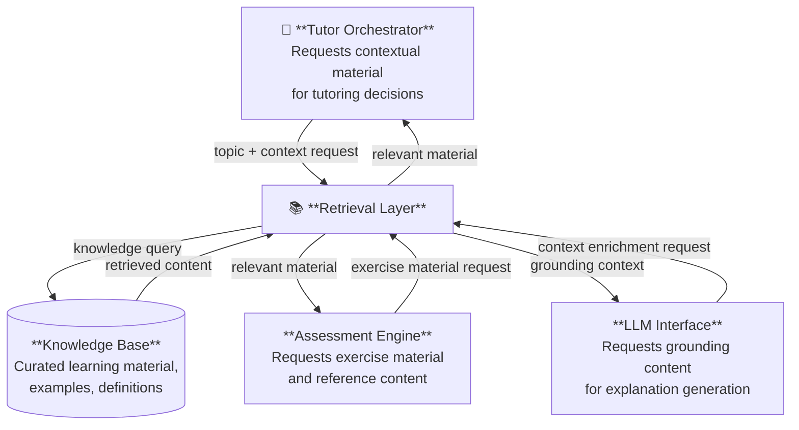

# Retrieval Layer

The Retrieval Layer is the component responsible for accessing and surfacing relevant
knowledge resources from the system's knowledge base to support the tutoring workflow.

It enables the tutoring system to ground explanations, exercises, and guidance in
structured learning material, rather than relying solely on generative model output.
This grounding is central to AIGORA's commitment to pedagogical accuracy and
traceable reasoning.

---

# Role in the Architecture

The Retrieval Layer acts as the interface between the tutoring system and its body of
curated learning content.

When the Tutor Orchestrator, Assessment Engine, or LLM Interface requires contextual
material — an explanation of a concept, a worked example, a reference definition — the
Retrieval Layer is responsible for locating and returning the most relevant content from
the knowledge base.

This retrieval-augmented approach ensures that tutoring interactions are grounded in
intentionally curated educational material, supporting both accuracy and consistency.

---

# Responsibilities

The Retrieval Layer is responsible for:

- receiving retrieval requests from system components and resolving them against the knowledge base
- returning learning material relevant to the current topic, objective, or student context
- supporting explanation generation by providing grounded reference content to the LLM Interface
- supplying exercise material and worked examples to the Assessment Engine
- operating transparently, without exposing the internal structure of the knowledge base to callers

---

# Conceptual Inputs and Outputs

## Inputs

| Input | Source |
|-------|--------|
| Retrieval request with topic or concept context | Tutor Orchestrator |
| Exercise or explanation material request | Assessment Engine |
| Context enrichment request | LLM Interface |

## Outputs

| Output | Destination |
|--------|-------------|
| Relevant learning material (concepts, examples, definitions) | LLM Interface |
| Exercise content and reference problems | Assessment Engine |
| Contextual grounding for tutoring decisions | Tutor Orchestrator |

---

# Interaction with Other Components

---

# Knowledge Retrieval Workflow

The Retrieval Layer operates through the following conceptual stages:

**1. Request Reception**
A system component issues a retrieval request, providing context such as the current
topic, concept identifier, or learning objective. The Retrieval Layer interprets
this request to determine what kind of material is needed.

**2. Query Formulation**
The layer translates the incoming request into a query against the knowledge base.
The form and strategy of this query are internal to the component and not exposed
to callers.

**3. Content Retrieval**
The knowledge base is searched and the most relevant material is retrieved.
Relevance is determined by proximity to the requested topic and the nature of
the requesting component's need (e.g., explanation vs. exercise vs. reference).

**4. Result Delivery**
Retrieved content is returned to the requesting component in a form suitable for
its intended use — enrichment context for the LLM Interface, problem material for
the Assessment Engine, or decision support for the Tutor Orchestrator.

---

# Role in Retrieval-Augmented Tutoring

AIGORA adopts a retrieval-augmented approach to tutoring interactions.

Rather than allowing the LLM Interface to generate explanations from model parameters
alone, the Retrieval Layer first supplies relevant, curated material as grounding context.
This approach reduces the risk of inaccurate or inconsistent explanations and ensures
that tutoring content remains aligned with the defined curriculum.

The Retrieval Layer is therefore not an optional optimization — it is a structural
component that enforces pedagogical grounding at the architectural level.

---

# Architectural Constraints

The Retrieval Layer must respect the following constraints defined in
[System Constraints](../01-requirements/constraints.md):

- LLM responses must be grounded using retrieved learning material
- The internal structure of the knowledge base must not leak into other components
- The layer must accept retrieval requests from multiple components without coupling them
  to each other

---

# Related Documents

| Document | Description |
|----------|-------------|
| [Architecture Overview](overview.md) | High-level system architecture |
| [Tutor Orchestrator](tutor-orchestrator.md) | Central orchestration engine |
| [Assessment Engine](assessment-engine.md) | Diagnostic and evaluation system |
| [LLM Interface](llm-interface.md) | Integration with language models |