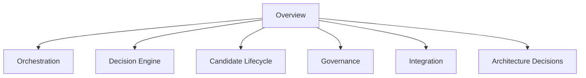

# Architecture Map

## Overview

This document serves as the navigation hub for the AIGORA Tutor Orchestrator architecture documentation.

The documentation is intentionally organized into architectural domains rather than implementation details.

Each domain owns a specific responsibility and documents a distinct aspect of the orchestration system.

The objective is to make architectural knowledge discoverable, maintainable, and scalable as the platform evolves.

---

# Architectural Domains

---

# Documentation Structure

## Overview

Documents that introduce the Tutor Orchestrator architecture and explain its role inside the AIGORA platform.

| Document                                          | Purpose                                                |
| ------------------------------------------------- | ------------------------------------------------------ |
| [Architecture Overview](architecture-overview.md) | High-level architectural overview                      |
| [Tutor Orchestrator](tutor-orchestrator.md)       | Core component definition and responsibilities         |
| [Interaction Model](interaction-model.md)         | Component interactions and orchestration relationships |
| [Architecture Map](architecture-map.md)           | Documentation navigation hub                           |

---

## Orchestration

Documents that describe how pedagogical orchestration operates.

| Document                                                                                                    | Purpose                                            |
| ----------------------------------------------------------------------------------------------------------- | -------------------------------------------------- |
| [Deterministic Orchestration Architecture](../02-orchestration/deterministic-orchestration-architecture.md) | Deterministic orchestration flow and governance    |
| [Event-Driven Pedagogical Flow](../02-orchestration/event-driven-pedagogical-flow.md)                       | Event lifecycle and orchestration sequencing       |
| [Deterministic Governance](../02-orchestration/deterministic-governance.md)                                 | Deterministic guarantees and governance principles |
| [Orchestration Roadmap](../02-orchestration/orchestration-roadmap.md)                                       | Future orchestration evolution                     |

---

## Decision Engine

Documents that describe the pedagogical reasoning subsystem.

| Document                                                                              | Purpose                                        |
| ------------------------------------------------------------------------------------- | ---------------------------------------------- |
| [Decision Engine Architecture](../03-decision-engine/decision-engine-architecture.md) | Coordination of orchestration engines          |
| [Orchestration Engine](../03-decision-engine/orchestration-engine.md)                 | Pipeline coordination and execution sequencing |
| [Policy Engine](../03-decision-engine/policy-engine.md)                               | Pedagogical policy evaluation                  |
| [Strategy Engine](../03-decision-engine/strategy-engine.md)                           | Ranking and prioritization strategies          |
| [Selection Engine](../03-decision-engine/selection-engine.md)                         | Final learning node commitment                 |
| [Auditability Engine](../03-decision-engine/auditability-engine.md)                   | Decision traceability and reproducibility      |

---

## Candidate Lifecycle

Documents that describe how learning candidates are generated, ranked, and selected.

| Document                                                                                          | Purpose                           |
| ------------------------------------------------------------------------------------------------- | --------------------------------- |
| [Candidate Generation Model](../04-candidate-lifecycle/candidate-generation-model.md)             | Candidate creation and enrichment |
| [Candidate Ranking Architecture](../04-candidate-lifecycle/candidate-ranking-architecture.md)     | Candidate prioritization          |
| [Learning Node Selection Strategy](../04-candidate-lifecycle/learning-node-selection-strategy.md) | Final selection strategies        |

---

## Governance

Documents that define ownership, responsibility, and architectural boundaries.

| Document                                                                                               | Purpose                        |
| ------------------------------------------------------------------------------------------------------ | ------------------------------ |
| [Architectural Responsibility Boundaries](../05-governance/architectural-responsibility-boundaries.md) | Bounded context ownership      |
| [Responsibility Matrix](../05-governance/responsibility-matrix.md)                                     | Responsibility allocation      |
| [Component Ownership](../05-governance/component-ownership.md)                                         | Platform ownership model       |
| [Auditability and Decision Traceability](../05-governance/auditability-and-decision-traceability.md)   | Governance and reproducibility |

---

## Integration

Documents that describe runtime integration and external dependencies.

| Document                                                                                          | Purpose                                 |
| ------------------------------------------------------------------------------------------------- | --------------------------------------- |
| [Curriculum Graph Contracts](../06-integration/curriculum-graph-contracts.md)                     | gRPC integration contracts              |
| [Runtime Architecture](../06-integration/runtime-architecture.md)                                 | Runtime interactions and execution flow |
| [Tutor Orchestrator Container Diagram](../06-integration/tutor-orchestrator-container-diagram.md) | Container-level architecture            |

---

## Architecture Decision Records

Documents that preserve architectural reasoning and decision history.

| Document                      | Purpose                                   |
| ----------------------------- | ----------------------------------------- |
| [ADR Index](../adr/README.md) | ADR navigation                            |
| ADR-001                       | Java Architecture Layering                |
| ADR-002                       | Deterministic-First Orchestration         |
| ADR-003                       | Curriculum Graph Integration Through gRPC |
| ADR-004                       | Decision Engine Decomposition             |
| ADR-005                       | Event-Driven Pedagogical Flow             |

---

# Recommended Reading Order

Readers new to the Tutor Orchestrator should follow the documentation in the following order:

1. Architecture Overview
2. Tutor Orchestrator
3. Interaction Model
4. Architectural Responsibility Boundaries
5. Deterministic Orchestration Architecture
6. Decision Engine Architecture
7. Candidate Generation Model
8. Candidate Ranking Architecture
9. Learning Node Selection Strategy
10. Curriculum Graph Contracts
11. Runtime Architecture
12. Architecture Decision Records

This sequence progresses from conceptual architecture to implementation-level architectural decisions.

---

# Documentation Ownership

The documentation is organized around architectural ownership.

Each document should answer one primary question.

| Domain              | Question                                   |
| ------------------- | ------------------------------------------ |
| Overview            | What is the Tutor Orchestrator?            |
| Orchestration       | How does orchestration work?               |
| Decision Engine     | How are decisions made?                    |
| Candidate Lifecycle | How are candidates generated and selected? |
| Governance          | Who owns what?                             |
| Integration         | How do components communicate?             |
| ADRs                | Why were architectural decisions made?     |

This ownership model helps prevent documentation duplication and improves long-term maintainability.
