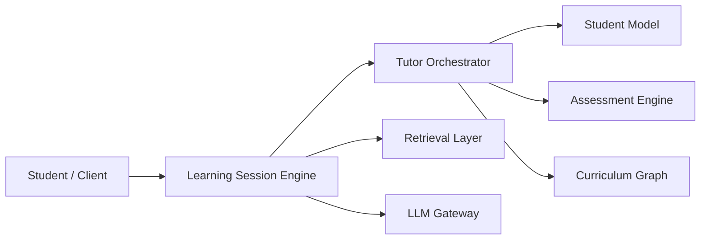

# Architecture Overview

## Overview

This document provides a high-level architectural overview of the AIGORA Tutor Orchestrator.

The Tutor Orchestrator is the pedagogical decision-making component responsible for coordinating deterministic learning progression, orchestration policies, candidate evaluation, ranking, and learning node selection.

It does not own curriculum topology, graph persistence, content generation, or student-state storage.

Instead, it coordinates specialized platform components through explicit architectural boundaries and service contracts.

---

# Purpose

The Tutor Orchestrator exists to answer one core question:

```text
What should the student do next?
```

To answer this question, the Tutor Orchestrator coordinates:

* curriculum topology signals
* student learning state
* assessment outcomes
* deterministic policies
* candidate ranking
* selection strategies
* auditability requirements

The result is a reproducible pedagogical orchestration decision.

---

# Architectural Position

The Tutor Orchestrator sits between the student-facing learning experience and the platform components that provide curriculum, assessment, retrieval, and generation capabilities.



---

# Core Responsibilities

The Tutor Orchestrator owns deterministic pedagogical orchestration.

| Responsibility         | Description                                                |
| ---------------------- | ---------------------------------------------------------- |
| Learning progression   | Decides how the student should move through the curriculum |
| Policy execution       | Applies deterministic pedagogical constraints              |
| Candidate evaluation   | Evaluates possible next learning nodes                     |
| Ranking coordination   | Coordinates deterministic prioritization                   |
| Selection coordination | Commits the next pedagogical decision                      |
| Auditability           | Preserves decision traceability and reproducibility        |

---

# Non-Responsibilities

The Tutor Orchestrator does not own responsibilities that belong to other bounded contexts.

| Responsibility            | Owner                    |
| ------------------------- | ------------------------ |
| Curriculum topology       | Curriculum Graph         |
| Graph persistence         | Curriculum Graph / Neo4j |
| Student state storage     | Student Model            |
| Assessment execution      | Assessment Engine        |
| Content retrieval         | Retrieval Layer          |
| Language generation       | LLM Gateway              |
| Learning session delivery | Learning Session Engine  |

This separation prevents the Tutor Orchestrator from becoming a god component.

---

# Initial Implementation Scope

The first implementation phase focuses exclusively on the deterministic Tutor Orchestrator core.

The initial scope includes:

* deterministic orchestration flow
* candidate generation coordination
* policy execution coordination
* ranking coordination
* learning node selection
* orchestration contracts
* auditability foundations

The following capabilities are intentionally deferred:

* student-aware orchestration
* hybrid orchestration
* heuristic-assisted ranking
* AI-assisted pedagogical decisions
* distributed event streaming
* advanced runtime observability

---

# Architectural Principle

The Tutor Orchestrator is deterministic-first, not deterministic-only.

The first version prioritizes:

* explicit rules
* reproducible decisions
* bounded context isolation
* auditability
* governance

Future versions may introduce adaptive, heuristic, or AI-assisted orchestration capabilities, but they must evolve on top of deterministic governance guarantees.

---

# Related Documents

* [Tutor Orchestrator](tutor-orchestrator.md)
* [Interaction Model](interaction-model.md)
* [Architecture Map](architecture-map.md)
* [Deterministic Orchestration Architecture](../02-orchestration/deterministic-orchestration-architecture.md)
* [Decision Engine Architecture](../03-decision-engine/decision-engine-architecture.md)
* [Component Ownership](../05-governance/component-ownership.md)
* [Runtime Architecture](../06-integration/runtime-architecture.md)
