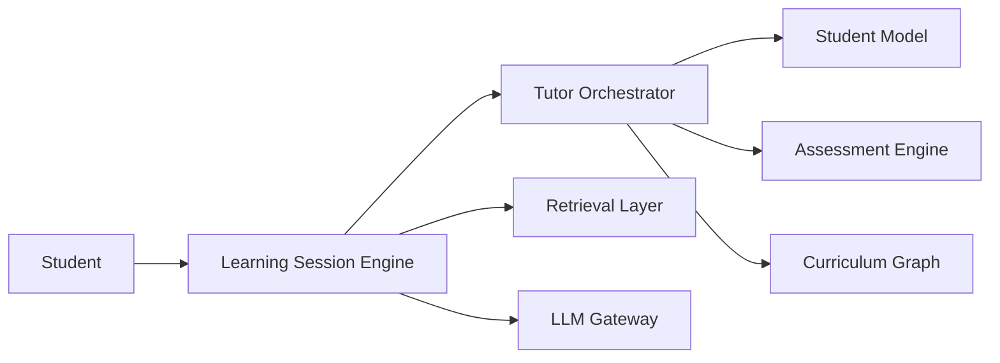
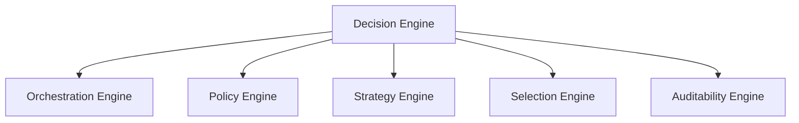
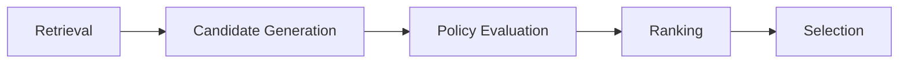

# Tutor Orchestrator

## Overview

The Tutor Orchestrator is the deterministic pedagogical decision-making component of the AIGORA platform.

Its responsibility is to coordinate learning progression by evaluating available learning opportunities, applying pedagogical constraints, ranking eligible candidates, and selecting the most appropriate next learning node.

The Tutor Orchestrator does not own curriculum topology, graph persistence, content generation, or student-state persistence.

Instead, it coordinates specialized platform components through explicit contracts and well-defined architectural boundaries.

---

# Purpose

The Tutor Orchestrator exists to answer a single question:

```text
What should the student do next?
```

To answer this question, the Tutor Orchestrator coordinates:

* curriculum topology
* student learning state
* assessment outcomes
* orchestration policies
* candidate ranking
* learning node selection
* decision traceability

The result is a deterministic pedagogical decision that can be explained, reconstructed, and reproduced.

---

# Architectural Principle

The Tutor Orchestrator follows a deterministic-first orchestration model.

All pedagogical decisions must be:

* deterministic
* auditable
* reproducible
* traceable
* governed through explicit orchestration rules

Future adaptive and AI-assisted capabilities may be introduced, but they must evolve on top of deterministic governance guarantees.

---

# Core Responsibilities

The Tutor Orchestrator owns:

* pedagogical decision-making
* learning progression
* candidate evaluation
* policy execution
* candidate ranking
* learning node selection
* orchestration governance
* decision traceability

The Tutor Orchestrator acts as the pedagogical reasoning layer of the platform.

---

# Non-Responsibilities

The Tutor Orchestrator does not own:

* curriculum topology
* graph traversal
* graph persistence
* Neo4j access
* student state persistence
* assessment execution
* content retrieval
* language generation
* learning content storage

These responsibilities belong to other platform components.

---

# High-Level Architecture



The Tutor Orchestrator sits between the learning experience and the platform services that provide topology, assessment, and student-state information.

---

# Decision Engine

The Tutor Orchestrator delegates pedagogical decision-making to the Decision Engine.

The Decision Engine is composed of specialized orchestration engines.



Each engine owns a single orchestration concern.

This decomposition improves maintainability, auditability, and long-term scalability.

---

# Curriculum Graph Integration

The Tutor Orchestrator does not own curriculum topology.

Curriculum topology is owned exclusively by the Curriculum Graph component.

All topology access occurs through explicit gRPC contracts.

```text
Tutor Orchestrator
        ↓ gRPC
Curriculum Graph
        ↓
Neo4j
```

This separation preserves bounded context ownership and prevents topology logic from leaking into pedagogical decision-making.

---

# Decision Lifecycle

The Tutor Orchestrator coordinates the deterministic orchestration lifecycle.



The lifecycle remains deterministic and reproducible.

---

# Initial Implementation Scope

The first implementation phase focuses on deterministic orchestration.

Included:

* graph-driven orchestration
* deterministic policies
* deterministic ranking
* deterministic selection
* orchestration traceability
* decision governance

Excluded:

* student-aware orchestration
* hybrid orchestration
* adaptive ranking
* confidence-aware progression
* AI-assisted pedagogical decisions
* heuristic orchestration

This approach reduces complexity while establishing a stable architectural foundation.

---

# Future Evolution

Future versions of the Tutor Orchestrator may introduce:

* student-aware orchestration
* hybrid orchestration
* adaptive ranking
* confidence-based progression
* remediation optimization
* AI-assisted recommendation support

All future capabilities must preserve deterministic governance principles.

---

# Related Documents

## Overview

* [Architecture Overview](architecture-overview.md)
* [Architecture Map](architecture-map.md)

## Orchestration

* [Deterministic Orchestration Architecture](../02-orchestration/deterministic-orchestration-architecture.md)
* [Event-Driven Pedagogical Flow](../02-orchestration/event-driven-pedagogical-flow.md)

## Decision Engine

* [Decision Engine Architecture](../03-decision-engine/decision-engine-architecture.md)
* [Orchestration Engine](../03-decision-engine/orchestration-engine.md)
* [Policy Engine](../03-decision-engine/policy-engine.md)
* [Strategy Engine](../03-decision-engine/strategy-engine.md)
* [Selection Engine](../03-decision-engine/selection-engine.md)
* [Auditability Engine](../03-decision-engine/auditability-engine.md)

## Governance

* [Component Ownership](../05-governance/component-ownership.md)
* [Architectural Responsibility Boundaries](../05-governance/architectural-responsibility-boundaries.md)
* [Responsibility Matrix](../05-governance/responsibility-matrix.md)

## Integration

* [Runtime Architecture](../06-integration/runtime-architecture.md)
* [Curriculum Graph Contracts](../06-integration/curriculum-graph-contracts.md)
* [Tutor Orchestrator Container Diagram](../06-integration/tutor-orchestrator-container-diagram.md)

## Architecture Decision Records

* [ADR Index](../adr/README.md)
