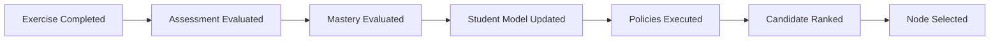

# Event-Driven Pedagogical Flow

## Overview

This document defines the event-driven pedagogical orchestration flow used by the AIGORA Tutor Orchestrator.

The architecture coordinates assessment, orchestration, student progression, and deterministic learning node selection through explicit educational events.

The orchestration lifecycle is intentionally event-driven to preserve:

* deterministic sequencing
* auditability
* bounded context isolation
* orchestration traceability
* reproducible pedagogical decisions

---

# Initial Implementation Scope

The first implementation phase focuses exclusively on the deterministic Tutor Orchestrator core.

At this stage, the primary goal is to establish the deterministic orchestration foundation and validate the orchestration lifecycle, governance boundaries, and decision-making architecture.

The initial implementation scope includes:

* deterministic orchestration pipeline
* event-driven orchestration flow
* deterministic policy execution
* deterministic ranking
* learning node selection
* orchestration contracts
* orchestration traceability
* auditability foundations
* bounded context enforcement

The first implementation phase prioritizes orchestration coordination and deterministic governance over adaptive and AI-assisted orchestration capabilities.

---

# External Components During Initial Phase

During the first implementation phase, the following components are considered external dependencies:

* Curriculum Graph
* Student Model
* Assessment Engine
* Retrieval Layer
* LLM Gateway

These components may initially be integrated through:

* mocked adapters
* simplified implementations
* static contracts
* gRPC contract simulations
* temporary infrastructure abstractions

This approach allows the deterministic orchestration core to evolve independently while preserving bounded context isolation.

---

# Deferred Capabilities

The following capabilities are intentionally deferred to future implementation phases:

* student-aware orchestration
* hybrid orchestration
* heuristic-assisted ranking
* adaptive learning progression
* AI-assisted recommendation strategies
* distributed event streaming
* advanced observability infrastructure
* semantic orchestration evaluation
* probabilistic orchestration models

The architecture is intentionally designed to evolve incrementally while preserving deterministic governance guarantees.

---

# Architectural Rationale

The deterministic orchestration core establishes the governance foundation for all future orchestration evolution.

Prioritizing the deterministic Tutor Orchestrator first provides:

* stable orchestration contracts
* explicit orchestration boundaries
* reproducible decision-making
* auditability foundations
* deterministic orchestration guarantees
* isolated orchestration evolution
* long-term architectural maintainability

Future orchestration capabilities must evolve on top of these deterministic governance guarantees rather than bypassing them.

---

# Architectural Principle

Pedagogical orchestration must evolve through explicit, traceable, and reproducible educational events.

Events coordinate orchestration stages while preserving deterministic orchestration guarantees and architectural governance boundaries.

The event flow acts as the synchronization mechanism between learning progression, assessment evaluation, student state mutation, and orchestration decisions.

---

# High-Level Event Flow

---

# Event Responsibilities

| Event                                                   | Purpose                                                     | Owner              | Output                 |
| ------------------------------------------------------- | ----------------------------------------------------------- | ------------------ | ---------------------- |
| [ExerciseCompleted](#1-exercise-completion)             | Capture exercise completion and student interaction outcome | Tutor Orchestrator | Exercise submission    |
| [AssessmentEvaluated](#2-assessment-evaluation)         | Evaluate answer quality and correctness                     | Assessment Engine  | Assessment result      |
| [MasteryEvaluated](#3-mastery-evaluation)               | Determine mastery progression and learning state impact     | Tutor Orchestrator | Mastery decision       |
| [StudentModelUpdated](#4-student-state-synchronization) | Persist updated learning state and progression data         | Student Model      | Updated student state  |
| [PoliciesExecuted](#5-policy-execution)                 | Execute deterministic pedagogical policies                  | Tutor Orchestrator | Filtered candidates    |
| [CandidateRanked](#6-candidate-ranking)                 | Rank orchestration candidates deterministically             | Tutor Orchestrator | Ranked candidates      |
| [NodeSelected](#7-node-selection)                       | Commit the next pedagogical orchestration decision          | Tutor Orchestrator | Selected learning node |

---

# Orchestration Lifecycle

The orchestration lifecycle follows a deterministic progression model.

## 1. Exercise Completion

The student completes a learning interaction.

The orchestration layer captures:

* exercise submission
* interaction metadata
* timing information
* learning context

This event initiates the pedagogical orchestration flow.

---

## 2. Assessment Evaluation

The Assessment Engine evaluates:

* correctness
* answer quality
* conceptual understanding
* learning performance indicators

Assessment results become orchestration signals for mastery evaluation.

---

## 3. Mastery Evaluation

The orchestration layer determines:

* mastery progression
* instability signals
* regression indicators
* remediation requirements

This stage transforms assessment outcomes into pedagogical state decisions.

---

## 4. Student State Synchronization

The Student Model persists:

* updated mastery levels
* progression history
* learning gaps
* remediation state
* interaction evidence

This stage guarantees orchestration consistency before future decisions occur.

---

## 5. Policy Execution

The Tutor Orchestrator executes deterministic orchestration policies such as:

* eligibility validation
* progression constraints
* regression policies
* review prioritization
* remediation enforcement

Only policy-approved candidates may continue to ranking.

---

## 6. Candidate Ranking

The orchestration engine applies deterministic ranking strategies to produce a stable candidate ordering.

Ranking may include:

* topology priority
* remediation priority
* progression stability
* deterministic tie-breaking

Ranking produces preference ordering but does not commit the final orchestration decision.

---

## 7. Node Selection

The selection layer commits the final pedagogical orchestration decision.

The selected node becomes:

* the next learning objective
* the next guided learning session
* the next pedagogical interaction target

Selection must remain deterministic, reproducible, and auditable.

---

# Observability and Traceability

The orchestration architecture must preserve complete event traceability.

The system supports:

* event sequencing traceability
* pedagogical event reconstruction
* asynchronous orchestration visibility
* deterministic orchestration logs
* policy execution tracing
* ranking traceability
* selection traceability
* orchestration reproducibility

Every orchestration decision must be reconstructable through event history.

---

# Deterministic Guarantees

Global deterministic governance is documented in:

- [Deterministic Governance](deterministic-governance.md)

The event-driven orchestration flow preserves the following guarantees:

* stable event sequencing
* reproducible orchestration flow
* deterministic policy execution
* deterministic ranking
* deterministic node selection
* explicit orchestration sequencing
* stable decision reconstruction

The same orchestration inputs must always produce the same orchestration outputs.

---

# Architectural Constraints

The event-driven orchestration model enforces strict architectural boundaries.

| Constraint                 | Description                                                                      |
| -------------------------- | -------------------------------------------------------------------------------- |
| Curriculum Graph isolation | Curriculum Graph does not perform pedagogical decisions                          |
| Deterministic governance   | All orchestration decisions must pass through deterministic policy evaluation    |
| Student state ownership    | Student state mutation belongs exclusively to orchestration and assessment flows |
| Selection isolation        | Ranking does not directly commit orchestration decisions                         |
| Event sequencing integrity | Events must preserve deterministic ordering                                      |

These constraints preserve bounded context isolation and orchestration governance consistency.

---

# Future Evolution

Future orchestration evolution is centralized in:

- [Orchestration Roadmap](orchestration-roadmap.md)

This document focuses only on the subsystem behavior described above.
