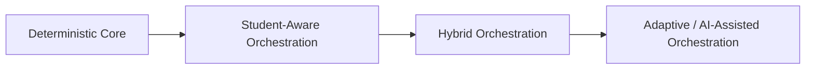

# Orchestration Roadmap

## Overview

This document centralizes the future evolution path of the Tutor Orchestrator architecture.

The current architecture is deterministic-first. Future capabilities must evolve on top of deterministic governance rather than bypassing it.

---

# Evolution Stages

---

# Near-Term Evolution

- graph-only candidate generation
- deterministic policies
- deterministic ranking
- deterministic selection
- auditability foundations
- contract-based integration

---

# Future Capabilities

- student-aware orchestration
- hybrid orchestration
- heuristic-assisted ranking
- adaptive learning progression
- AI-assisted recommendation strategies
- semantic orchestration evaluation
- distributed event coordination
- advanced observability

---

# Governance Constraint

Every future orchestration capability must preserve:

- deterministic governance
- orchestration auditability
- bounded context isolation
- reproducible decision-making
- pedagogical consistency
