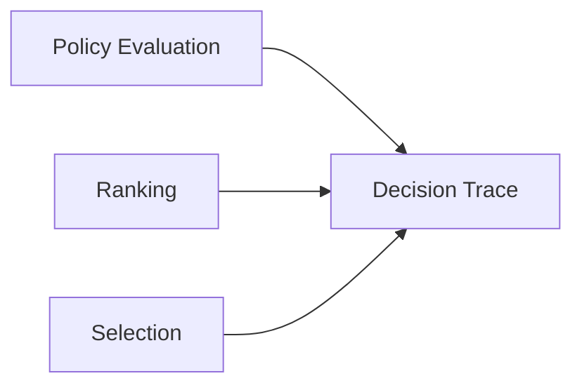
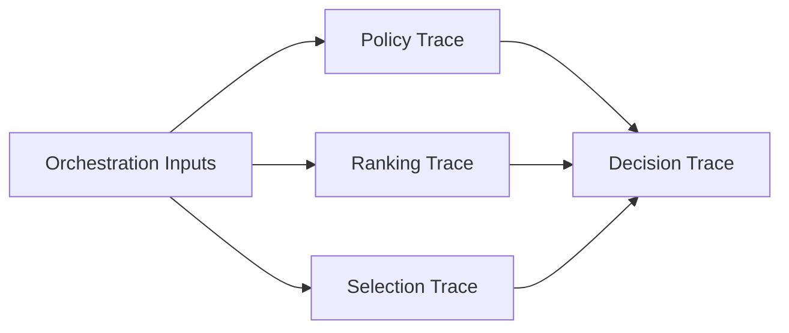
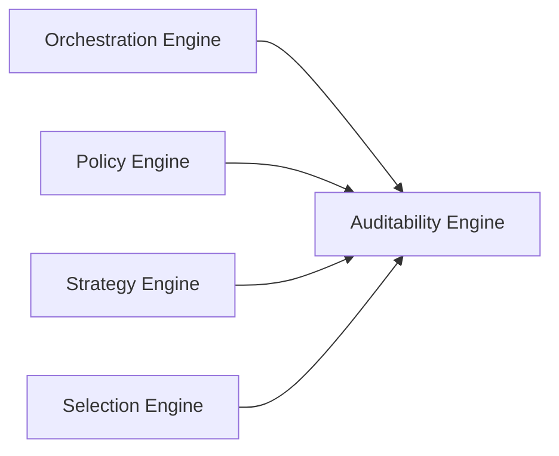

# Auditability Engine

## Overview

This document defines the Auditability Engine used by the AIGORA Tutor Orchestrator.

The Auditability Engine is responsible for preserving decision traceability, decision reconstruction, orchestration observability, and deterministic reproducibility.

The engine does not make pedagogical decisions.

The engine does not evaluate candidates.

The engine does not rank or select learning nodes.

Its responsibility is to explain, reconstruct, and reproduce orchestration decisions.

---

# Purpose

The Auditability Engine exists to answer the following question:

```text
Why was this decision made?
```

The engine captures orchestration evidence throughout the decision lifecycle and produces artifacts that allow decisions to be reconstructed and audited.

The result is a transparent and reproducible orchestration process.

---

# Architectural Principle

Every orchestration decision must be:

* explainable
* reconstructable
* reproducible
* traceable

Auditability is a first-class architectural responsibility.

The Auditability Engine preserves the evidence required to explain how a decision was produced.

---

# High-Level Auditability Flow



The Auditability Engine collects decision evidence across orchestration stages and transforms it into an auditable decision record.

---

# Responsibilities

The Auditability Engine owns:

* decision trace generation
* decision reconstruction
* policy traceability
* ranking traceability
* selection traceability
* graph version traceability
* orchestration observability
* decision reproducibility

The engine acts as the governance subsystem of the Tutor Orchestrator.

---

# Non-Responsibilities

The Auditability Engine does not own:

* orchestration sequencing
* policy evaluation
* candidate ranking
* candidate selection
* graph traversal
* mastery persistence
* pedagogical decision-making

These responsibilities belong to other engines.

---

# Auditability Lifecycle



The engine aggregates decision evidence into a single traceable orchestration record.

---

# Traceability Categories

| Category               | Purpose                           |
| ---------------------- | --------------------------------- |
| Policy Traceability    | Explain policy outcomes           |
| Ranking Traceability   | Explain candidate preference      |
| Selection Traceability | Explain final commitment          |
| Graph Traceability     | Preserve topology context         |
| Runtime Traceability   | Explain execution behavior        |
| Decision Traceability  | Reconstruct the complete decision |

Each category captures a different aspect of orchestration behavior.

---

# Policy Traceability

The Auditability Engine records:

* executed policies
* policy ordering
* policy outcomes
* rejection reasons
* approved candidates

Example:

```text
EligibilityPolicy
    ↓ Approved

CompletionPolicy
    ↓ Approved

RegressionPolicy
    ↓ Rejected
```

This allows policy execution to be reconstructed.

---

# Ranking Traceability

The engine records:

* ranking strategy
* candidate scores
* candidate ordering
* ranking metadata
* ranking timestamp

Example:

| Rank | Candidate | Score |
| ---- | --------- | ----- |
| 1    | Node A    | 92    |
| 2    | Node B    | 85    |
| 3    | Node C    | 78    |

This explains why candidates were preferred.

---

# Selection Traceability

The engine records:

* selected node
* tie-breaking results
* fallback execution
* selection strategy
* selection timestamp

Example:

```text
Ranked Candidates
    ↓
Tie-Breaking
    ↓
Node Selected
```

This explains why the final candidate was chosen.

---

# Graph Traceability

The Auditability Engine records:

* graph version
* topology snapshot reference
* retrieval context
* candidate source information

Example:

| Field          | Value                  |
| -------------- | ---------------------- |
| graphVersion   | 0.4.0                  |
| nodeId         | algebra.linear.vectors |
| retrievalDepth | 2                      |

This enables topology reproduction.

---

# Decision Reconstruction

The Auditability Engine must be capable of reconstructing:

* why a node was selected
* why candidates were rejected
* which policies executed
* how ranking was produced
* how ties were resolved
* which graph version was used

A decision should never become a black box.

---

# Decision Trace Structure

Example decision trace:

| Field                   | Description                |
| ----------------------- | -------------------------- |
| decisionId              | Unique decision identifier |
| graphVersion            | Curriculum graph version   |
| candidateSetReference   | Candidate set identifier   |
| policyTraceReference    | Policy execution trace     |
| rankingTraceReference   | Ranking trace              |
| selectionTraceReference | Selection trace            |
| timestamp               | Decision timestamp         |

The trace acts as the authoritative explanation of the orchestration decision.

---

# Deterministic Reproducibility

The Auditability Engine preserves:

* decision reproducibility
* policy reproducibility
* ranking reproducibility
* selection reproducibility
* graph version reproducibility

The same input should always produce the same decision trace.

---

# Runtime Observability

The engine should expose:

* correlation ID
* decision ID
* graph version
* policy latency
* ranking latency
* selection latency
* dependency failures
* retry attempts

These signals support operational visibility.

---

# Governance Benefits

The Auditability Engine provides:

* pedagogical transparency
* platform accountability
* decision governance
* recommendation explainability
* operational observability
* debugging support

This makes orchestration behavior understandable and defensible.

---

# Future Evolution

Future capabilities may introduce:

* distributed tracing
* event replay systems
* orchestration simulation
* decision visualization
* heuristic traceability
* AI-assisted recommendation explainability

while preserving deterministic governance guarantees.

---

# Relationship with Other Engines



The Auditability Engine does not participate in decision-making.

It explains and reconstructs decisions produced by the other engines.

---

# Related Documents

* [Decision Engine Architecture](decision-engine-architecture.md)
* [Orchestration Engine](orchestration-engine.md)
* [Policy Engine](policy-engine.md)
* [Strategy Engine](strategy-engine.md)
* [Selection Engine](selection-engine.md)
* [Auditability and Decision Traceability](../05-governance/auditability-and-decision-traceability.md)
* [Deterministic Governance](../02-orchestration/deterministic-governance.md)
* [Decision Lifecycle](../03-decision-engine/decision-lifecycle.md)
