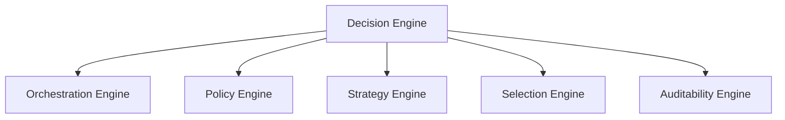
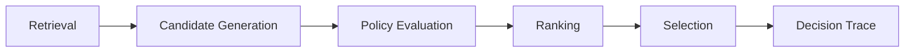
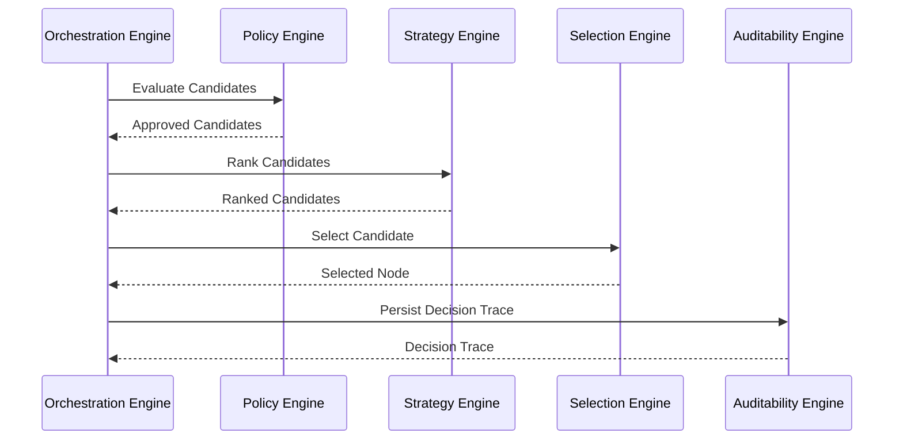

# Decision Engine Architecture

## Overview

This document defines the architecture of the Decision Engine used by the AIGORA Tutor Orchestrator.

The Decision Engine is the deterministic pedagogical reasoning subsystem responsible for transforming curriculum topology, student context, and assessment signals into a reproducible orchestration decision.

The Decision Engine does not centralize decision-making logic in a single component.

Instead, it delegates responsibilities to specialized orchestration engines while preserving deterministic governance, bounded context isolation, and decision traceability.

---

# Purpose

The Decision Engine exists to answer the following question:

```text
What should the student do next?
```

To answer this question, the engine coordinates:

* orchestration flow
* policy evaluation
* candidate prioritization
* learning node selection
* decision traceability

The result is a deterministic pedagogical decision that can be explained, reconstructed, and reproduced.

---

# Architectural Principle

The Decision Engine follows a decomposition-first architecture.

Responsibilities are distributed across specialized engines that own a single orchestration concern.

This architecture promotes:

* clear ownership boundaries
* deterministic execution
* easier testing
* improved maintainability
* decision transparency
* long-term extensibility

No individual engine should own the complete decision lifecycle.

---

# Decision Engine Composition

The Decision Engine is composed of five specialized engines.



Together, these engines form the pedagogical decision-making subsystem of the Tutor Orchestrator.

---

# Engine Responsibilities

| Engine                                          | Responsibility                              |
| ----------------------------------------------- | ------------------------------------------- |
| [Orchestration Engine](orchestration-engine.md) | Coordinates orchestration execution flow    |
| [Policy Engine](policy-engine.md)               | Determines candidate eligibility            |
| [Strategy Engine](strategy-engine.md)           | Determines candidate preference             |
| [Selection Engine](selection-engine.md)         | Produces the final orchestration commitment |
| [Auditability Engine](auditability-engine.md)   | Preserves traceability and reproducibility  |

Each engine owns one part of the decision lifecycle.

---

# High-Level Decision Flow



The Decision Engine coordinates this lifecycle while preserving deterministic execution guarantees.

---

# Decision Ownership Model

The decision lifecycle follows a strict ownership model.

```text
Orchestration Engine
    ↓
Coordinates execution

Policy Engine
    ↓
Determines what is allowed

Strategy Engine
    ↓
Determines what is preferred

Selection Engine
    ↓
Determines what is selected

Auditability Engine
    ↓
Explains why it happened
```

This separation prevents responsibility leakage across engines.

---

# Decision Inputs

The Decision Engine consumes information from multiple platform components.

| Source                  | Purpose                              |
| ----------------------- | ------------------------------------ |
| Curriculum Graph        | Curriculum topology and dependencies |
| Student Model           | Learning state and mastery signals   |
| Assessment Engine       | Evaluation and performance signals   |
| Learning Session Engine | Orchestration requests               |
| Retrieval Layer         | Learning context (future use)        |

These inputs provide the context required for deterministic orchestration.

---

# Decision Output

The Decision Engine produces a single orchestration decision.

Example:

| Field            | Description                |
| ---------------- | -------------------------- |
| selectedNodeId   | Selected learning node     |
| graphVersion     | Curriculum graph version   |
| decisionId       | Unique decision identifier |
| rankingReference | Ranking trace reference    |
| decisionTraceId  | Auditability reference     |
| timestamp        | Decision timestamp         |

The output represents the official pedagogical commitment of the Tutor Orchestrator.

---

# Deterministic Guarantees

The Decision Engine preserves:

* deterministic orchestration flow
* deterministic policy execution
* deterministic ranking
* deterministic tie-breaking
* deterministic selection
* reproducible decisions
* traceable decision history

The same orchestration input must always produce the same orchestration outcome.

---

# Runtime Collaboration

The engines collaborate through a deterministic execution sequence.



This interaction model preserves explicit ownership boundaries.

---

# Architectural Boundaries

The Decision Engine operates within explicit architectural constraints.

| Boundary          | Constraint                        |
| ----------------- | --------------------------------- |
| Curriculum Graph  | Owns topology, not pedagogy       |
| Student Model     | Owns state, not decisions         |
| Assessment Engine | Owns evaluation, not progression  |
| Retrieval Layer   | Owns retrieval, not orchestration |
| LLM Gateway       | Owns generation, not governance   |

These boundaries prevent coupling between educational semantics and infrastructure concerns.

---

# Initial Implementation Scope

The first implementation phase focuses on deterministic orchestration.

Implemented capabilities:

* graph-driven orchestration
* deterministic policy execution
* deterministic ranking
* deterministic selection
* decision traceability foundations

Deferred capabilities:

* student-aware orchestration
* hybrid orchestration
* adaptive ranking
* confidence-aware progression
* heuristic-assisted orchestration

This incremental approach reduces complexity while preserving future extensibility.

---

# Future Evolution

Future versions of the Decision Engine may introduce:

* student-aware orchestration
* hybrid orchestration
* adaptive ranking
* confidence-based progression
* controlled heuristic assistance
* AI-assisted recommendation support

All future capabilities must remain compatible with deterministic governance principles.

---

# Related Documents

* [Orchestration Engine](orchestration-engine.md)
* [Policy Engine](policy-engine.md)
* [Strategy Engine](strategy-engine.md)
* [Selection Engine](selection-engine.md)
* [Auditability Engine](auditability-engine.md)
* [Deterministic Orchestration Architecture](../02-orchestration/deterministic-orchestration-architecture.md)
* [Runtime Architecture](../06-integration/runtime-architecture.md)
* [Component Ownership](../05-governance/component-ownership.md)
