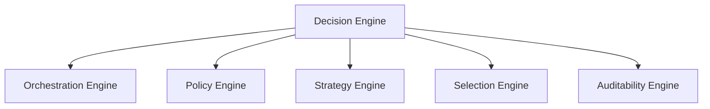
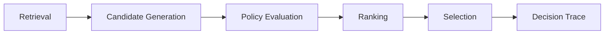

# Decision Engine Architecture

## Overview

This document defines the architecture of the Decision Engine used by the AIGORA Tutor Orchestrator.

The Decision Engine acts as the deterministic pedagogical reasoning core of the platform.

Its responsibility is to coordinate the orchestration engines responsible for evaluating candidates, enforcing policies, producing rankings, selecting learning nodes, and preserving decision traceability.

The Decision Engine does not centralize all decision logic.

Instead, it delegates responsibilities to specialized engines while preserving deterministic governance guarantees.

---

# Purpose

The Decision Engine exists to answer the following question:

```text
What should the student do next?
```

To answer this question, the engine coordinates:

* orchestration flow
* policy evaluation
* candidate preference
* final selection
* decision traceability

The resulting output is a deterministic pedagogical decision.

---

# Architectural Principle

The Decision Engine follows a decomposition-first architecture.

Responsibilities are distributed across specialized engines that own specific decision-making concerns.

This architecture promotes:

* bounded responsibilities
* explicit ownership
* deterministic behavior
* auditability
* maintainability
* long-term extensibility

---

# Decision Engine Composition

The Decision Engine is composed of the following engines.



Each engine owns a specific part of the decision lifecycle.

---

# Engine Responsibilities

| Engine               | Responsibility                                     |
| -------------------- | -------------------------------------------------- |
| Orchestration Engine | Coordinates orchestration flow and stage execution |
| Policy Engine        | Determines candidate eligibility                   |
| Strategy Engine      | Determines candidate preference                    |
| Selection Engine     | Produces the final orchestration commitment        |
| Auditability Engine  | Preserves decision reconstruction and traceability |

Together, these engines form the deterministic decision-making subsystem of the Tutor Orchestrator.

---

# High-Level Decision Lifecycle



The Decision Engine coordinates this lifecycle while preserving deterministic execution guarantees.

---

# Decision Flow Ownership

The Decision Engine delegates responsibility to specialized engines.

```text
Orchestration Engine
    ↓
coordinates execution

Policy Engine
    ↓
determines allowed candidates

Strategy Engine
    ↓
determines preferred candidates

Selection Engine
    ↓
determines selected candidate

Auditability Engine
    ↓
explains and reconstructs decisions
```

This ownership model prevents decision logic from becoming concentrated in a single component.

---

# Decision Inputs

The Decision Engine consumes information from multiple platform components.

| Source                  | Purpose                          |
| ----------------------- | -------------------------------- |
| Curriculum Graph        | Provides topology information    |
| Student Model           | Provides learning state          |
| Assessment Engine       | Provides evaluation signals      |
| Learning Session Engine | Initiates orchestration requests |

These inputs provide the context required for deterministic orchestration.

---

# Decision Output

The Decision Engine produces a single orchestration decision.

Example output:

| Field            | Description               |
| ---------------- | ------------------------- |
| selectedNodeId   | Selected learning node    |
| graphVersion     | Curriculum graph version  |
| rankingReference | Ranking result identifier |
| decisionTraceId  | Auditability reference    |
| timestamp        | Decision timestamp        |

The output represents the official pedagogical commitment of the Tutor Orchestrator.

---

# Deterministic Guarantees

The Decision Engine preserves:

* deterministic orchestration flow
* deterministic policy execution
* deterministic ranking
* deterministic selection
* deterministic tie-breaking
* reproducible decisions
* traceable decision history

The same input must always produce the same decision outcome.

---

# Architectural Boundaries

The Decision Engine operates within explicit architectural boundaries.

| Boundary          | Constraint                        |
| ----------------- | --------------------------------- |
| Curriculum Graph  | Owns topology, not pedagogy       |
| Student Model     | Owns state, not decisions         |
| Assessment Engine | Owns evaluation, not progression  |
| Retrieval Layer   | Owns retrieval, not orchestration |
| LLM Gateway       | Owns generation, not governance   |

These boundaries preserve bounded context ownership.

---

# Initial Implementation Scope

The first implementation phase focuses on deterministic orchestration.

Implemented capabilities:

* graph-driven orchestration
* deterministic policies
* deterministic ranking
* deterministic selection
* decision traceability foundations

Deferred capabilities:

* student-aware orchestration
* hybrid orchestration
* adaptive ranking
* heuristic-assisted decisions
* AI-assisted recommendations

This incremental approach reduces architectural complexity while preserving future extensibility.

---

# Future Evolution

Future versions of the Decision Engine may introduce:

* student-aware decision strategies
* hybrid topology and mastery orchestration
* adaptive ranking models
* confidence-aware progression
* controlled heuristic assistance

All future capabilities must preserve deterministic governance principles.

---

# Related Documents

* [Orchestration Engine](orchestration-engine.md)
* [Policy Engine](policy-engine.md)
* [Strategy Engine](strategy-engine.md)
* [Selection Engine](selection-engine.md)
* [Auditability Engine](auditability-engine.md)
* [Deterministic Orchestration Architecture](../02-orchestration/deterministic-orchestration-architecture.md)
* [Component Ownership](../05-governance/component-ownership.md)
