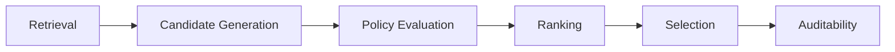
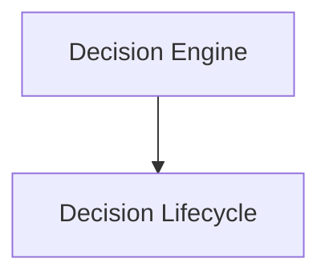

# Decision Lifecycle

## Overview

This document defines the canonical decision lifecycle used by the AIGORA Tutor Orchestrator.

The decision lifecycle describes how orchestration inputs are transformed into a deterministic pedagogical decision.

The objective is to provide a single reference for understanding how the Decision Engine produces learning progression decisions.

---

# Purpose

The Decision Lifecycle exists to answer the following question:

```text
How does the Tutor Orchestrator produce a decision?
```

The lifecycle defines the sequence of stages that transform curriculum topology, student context, and assessment signals into a final learning node selection.

---

# Architectural Principle

The decision lifecycle follows a deterministic execution model.

Each stage owns a specific responsibility and produces an explicit output consumed by the next stage.

The same orchestration input must always produce the same lifecycle execution and the same orchestration outcome.

---

# High-Level Lifecycle



Each stage transforms orchestration data while preserving deterministic guarantees.

---

# Lifecycle Stages

| Stage                | Purpose                                | Output               |
| -------------------- | -------------------------------------- | -------------------- |
| Retrieval            | Retrieve topology and learning context | Retrieved Nodes      |
| Candidate Generation | Build orchestration candidates         | Generated Candidates |
| Policy Evaluation    | Filter invalid candidates              | Approved Candidates  |
| Ranking              | Determine candidate preference         | Ranked Candidates    |
| Selection            | Produce final decision                 | Selected Node        |
| Auditability         | Persist decision evidence              | Decision Trace       |

---

# Stage 1 — Retrieval

The retrieval stage collects the information required to start orchestration.

Sources may include:

* Curriculum Graph
* Student Model
* Assessment Engine

Output:

```text
Retrieved Nodes
```

Retrieval does not perform pedagogical decisions.

Its responsibility is to gather orchestration inputs.

---

# Stage 2 — Candidate Generation

The candidate generation stage transforms retrieved nodes into orchestration candidates.

Responsibilities:

* candidate enrichment
* candidate normalization
* candidate classification

Output:

```text
Generated Candidates
```

Candidate generation prepares learning opportunities for evaluation.

---

# Stage 3 — Policy Evaluation

The policy evaluation stage determines candidate eligibility.

Responsibilities:

* eligibility validation
* completion validation
* regression validation
* pedagogical constraint enforcement

Output:

```text
Approved Candidates
```

Candidates that fail policy evaluation are removed from the orchestration pipeline.

---

# Stage 4 — Ranking

The ranking stage determines candidate preference.

Responsibilities:

* scoring
* prioritization
* preference ordering

Output:

```text
Ranked Candidates
```

Ranking determines which candidates are preferred.

Ranking does not perform final selection.

---

# Stage 5 — Selection

The selection stage transforms candidate preference into a final orchestration commitment.

Responsibilities:

* selection evaluation
* tie-breaking
* fallback validation
* final node commitment

Output:

```text
Selected Node
```

Selection determines the official orchestration outcome.

---

# Stage 6 — Auditability

The auditability stage preserves orchestration evidence.

Responsibilities:

* policy traceability
* ranking traceability
* selection traceability
* decision reconstruction

Output:

```text
Decision Trace
```

Auditability allows decisions to be explained, reconstructed, and reproduced.

---

# Lifecycle Ownership

Each stage is owned by a specific orchestration component.

| Stage                | Owner                        |
| -------------------- | ---------------------------- |
| Retrieval            | Curriculum Graph Integration |
| Candidate Generation | Candidate Generation Model   |
| Policy Evaluation    | Policy Engine                |
| Ranking              | Strategy Engine              |
| Selection            | Selection Engine             |
| Auditability         | Auditability Engine          |

This ownership model prevents responsibility leakage.

---

# Deterministic Guarantees

The decision lifecycle preserves:

* deterministic execution order
* deterministic policy evaluation
* deterministic ranking
* deterministic tie-breaking
* deterministic selection
* reproducible decisions

The same orchestration input must always produce the same lifecycle outcome.

---

# Failure Handling

Failures may occur at any stage of the lifecycle.

Examples include:

* retrieval failures
* invalid candidates
* policy evaluation failures
* ranking failures
* selection failures

Failures must remain:

* observable
* traceable
* bounded
* reproducible

The lifecycle must never silently skip a stage.

---

# Relationship with the Decision Engine

The Decision Lifecycle defines the execution flow coordinated by the Decision Engine.



The Decision Engine coordinates the lifecycle.

The lifecycle defines how orchestration decisions are produced.

---

# Related Documents

* [Decision Engine Architecture](decision-engine-architecture.md)
* [Orchestration Engine](orchestration-engine.md)
* [Policy Engine](policy-engine.md)
* [Strategy Engine](strategy-engine.md)
* [Selection Engine](selection-engine.md)
* [Auditability Engine](auditability-engine.md)
* [Runtime Architecture](../06-integration/runtime-architecture.md)
* [Decision Lifecycle](../03-decision-engine/decision-lifecycle.md)
