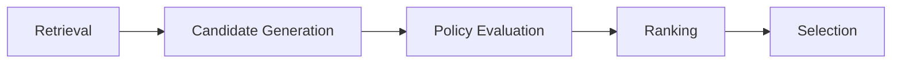
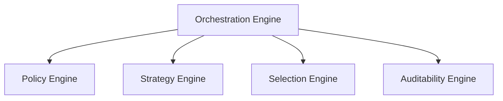
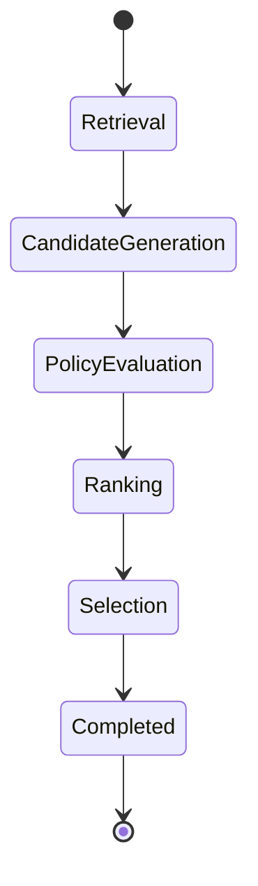
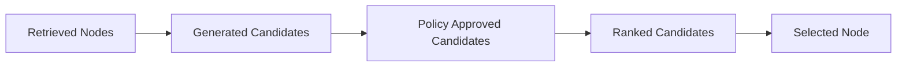

# Orchestration Engine

## Overview

This document defines the Orchestration Engine used by the AIGORA Tutor Orchestrator.

The Orchestration Engine is responsible for coordinating the execution flow of the pedagogical orchestration pipeline.

It does not perform pedagogical reasoning.

Instead, it coordinates the execution of specialized orchestration engines while preserving deterministic execution guarantees.

---

# Purpose

The Orchestration Engine exists to answer the following question:

```text
In what order should orchestration stages execute?
```

The engine coordinates orchestration flow but does not decide:

* which candidate should win
* which policy should approve a candidate
* which ranking strategy should be applied

Those responsibilities belong to specialized engines.

---

# Architectural Principle

The Orchestration Engine owns orchestration sequencing.

Decision-making remains delegated to specialized orchestration engines.

This separation prevents orchestration flow management from becoming tightly coupled to pedagogical decision logic.

---

# High-Level Orchestration Pipeline

The Orchestration Engine coordinates the execution of the deterministic orchestration pipeline.



The engine guarantees that stages execute in a deterministic and reproducible order.

---

# Responsibilities

The Orchestration Engine owns:

* orchestration sequencing
* stage coordination
* orchestration lifecycle management
* candidate lifecycle coordination
* execution ordering
* orchestration flow control
* orchestration state transitions

The engine acts as the runtime coordinator of the orchestration pipeline.

---

# Non-Responsibilities

The Orchestration Engine does not own:

* policy evaluation
* candidate scoring
* candidate ranking
* tie-breaking
* learning node selection
* graph traversal
* mastery evaluation

These responsibilities belong to specialized components.

---

# Engine Relationships



The Orchestration Engine coordinates execution but does not replace the responsibilities of other engines.

---

# Stage Lifecycle

Each orchestration request follows a deterministic lifecycle.



The lifecycle must remain stable and reproducible.

---

# Candidate Lifecycle Coordination

The Orchestration Engine coordinates candidate progression through the orchestration pipeline.



The engine manages candidate flow between stages.

It does not determine candidate validity or preference.

---

# Deterministic Guarantees

The Orchestration Engine preserves:

* deterministic stage ordering
* deterministic execution sequencing
* reproducible orchestration flow
* stable orchestration lifecycle transitions
* bounded orchestration responsibilities

The same orchestration input must always produce the same orchestration flow.

---

# Failure Handling

The Orchestration Engine coordinates failure handling across orchestration stages.

Possible failures include:

* graph retrieval failures
* policy evaluation failures
* ranking failures
* selection failures
* dependency timeouts

The engine must ensure failures remain:

* observable
* traceable
* bounded
* recoverable when appropriate

---

# Observability

The engine should expose:

* orchestration correlation ID
* stage execution order
* stage execution duration
* stage failures
* retry attempts
* orchestration completion status

These signals allow orchestration execution to be reconstructed.

---

# Related Documents

* [Decision Engine Architecture](decision-engine-architecture.md)
* [Policy Engine](policy-engine.md)
* [Strategy Engine](strategy-engine.md)
* [Selection Engine](selection-engine.md)
* [Auditability Engine](auditability-engine.md)
* [Deterministic Orchestration Architecture](../02-orchestration/deterministic-orchestration-architecture.md)
