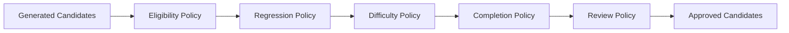
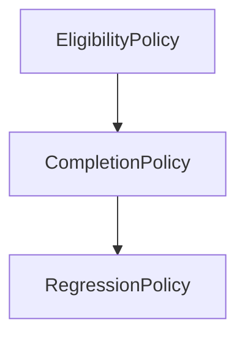
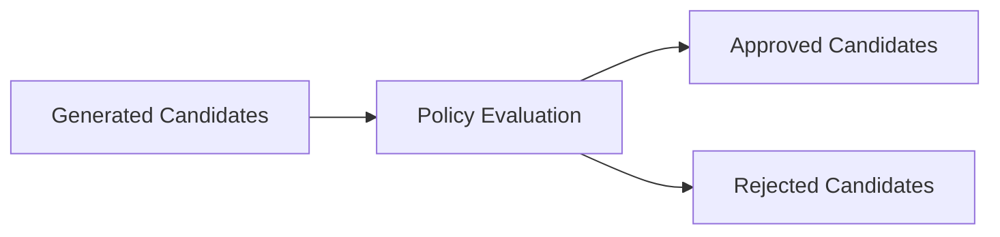

# Policy Engine

## Overview

This document defines the Policy Engine used by the AIGORA Tutor Orchestrator.

The Policy Engine is responsible for evaluating deterministic pedagogical constraints and determining which learning candidates are eligible to participate in the orchestration process.

The Policy Engine does not rank candidates, score candidates, or select learning nodes.

Its responsibility is to determine what is allowed.

---

# Purpose

The Policy Engine exists to answer the following question:

```text
Which candidates are allowed to continue through the orchestration pipeline?
```

The engine evaluates pedagogical constraints and removes candidates that violate orchestration policies.

The result is a filtered candidate set that can safely proceed to ranking and selection.

---

# Architectural Principle

Policies determine eligibility.

Policies do not determine preference.

This separation prevents pedagogical constraints from becoming tightly coupled to ranking and selection logic.

The Policy Engine defines what is permitted.

The Strategy Engine defines what is preferred.

The Selection Engine defines what is selected.

---

# High-Level Policy Evaluation Flow



The policy pipeline progressively filters candidates until only policy-compliant candidates remain.

---

# Responsibilities

The Policy Engine owns:

* policy evaluation
* candidate filtering
* eligibility validation
* pedagogical constraint enforcement
* policy sequencing
* policy auditability
* policy trace generation

The engine acts as the pedagogical gatekeeper of the orchestration pipeline.

---

# Non-Responsibilities

The Policy Engine does not own:

* candidate ranking
* candidate scoring
* tie-breaking
* final node selection
* graph traversal
* mastery persistence
* orchestration sequencing

These responsibilities belong to other components.

---

# Policy Categories

The Policy Engine supports multiple policy categories.

| Category             | Purpose                                                      |
| -------------------- | ------------------------------------------------------------ |
| Eligibility Policies | Determine whether a candidate may be considered              |
| Completion Policies  | Prevent progression when completion requirements are not met |
| Regression Policies  | Enable remediation and regression paths                      |
| Difficulty Policies  | Enforce progression difficulty constraints                   |
| Review Policies      | Prioritize review and reinforcement requirements             |

Each policy category owns a specific pedagogical concern.

---

# Initial Policies

The first implementation phase focuses on deterministic topology-driven policies.



Additional policies may be introduced incrementally as the Student Model evolves.

---

# Policy Execution Order

Policy execution order must be deterministic.

```text
1. EligibilityPolicy
2. CompletionPolicy
3. RegressionPolicy
4. DifficultyPolicy
5. ReviewPolicy
```

The same orchestration input must always produce the same policy execution sequence.

Policy ordering must never depend on runtime randomness.

---

# Policy Evaluation Result

Each policy evaluation produces one of the following outcomes.

| Result    | Meaning                                         |
| --------- | ----------------------------------------------- |
| Approved  | Candidate remains in the orchestration pipeline |
| Rejected  | Candidate is removed from consideration         |
| Deferred  | Candidate may be reconsidered later             |
| Escalated | Candidate requires additional evaluation        |

These outcomes allow policies to communicate decisions consistently.

---

# Candidate Filtering Lifecycle



The Policy Engine transforms generated candidates into policy-approved candidates.

Only approved candidates may proceed to ranking.

---

# Deterministic Guarantees

The Policy Engine preserves:

* deterministic policy execution
* deterministic candidate filtering
* reproducible policy outcomes
* stable policy ordering
* explicit policy traceability

Given the same input, the engine must always produce the same policy evaluation result.

---

# Policy Traceability

Every policy evaluation should produce a policy trace.

The trace should include:

* policy identifier
* policy version
* candidate identifier
* evaluation result
* rejection reason
* evaluation timestamp

These traces support auditability and decision reconstruction.

---

# Policy Failure Handling

Policy evaluation failures must remain explicit and observable.

Possible failures include:

* invalid candidate state
* missing dependency information
* inconsistent topology data
* invalid orchestration inputs

The engine must never silently ignore policy failures.

---

# Future Evolution

Future orchestration capabilities may introduce:

* student-aware policies
* hybrid topology and mastery policies
* adaptive remediation policies
* retention-based policies
* confidence-driven policies

while preserving deterministic governance guarantees.

---

# Related Documents

* [Decision Engine Architecture](../03-decision-engine/decision-engine-architecture.md)
* [Orchestration Engine](../03-decision-engine/orchestration-engine.md)
* [Strategy Engine](../03-decision-engine/selection-engine.md)
* [Selection Engine](../03-decision-engine/strategy-engine.md)
* [Deterministic Orchestration Rule Model](../02-orchestration/deterministic-orchestration-rule-model.md)
* [Deterministic Governance](../02-orchestration/deterministic-governance.md)
