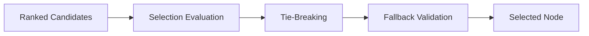
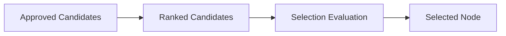
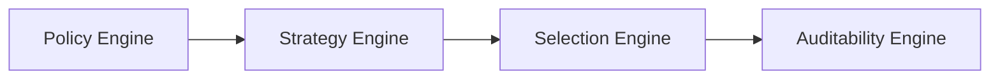

# Selection Engine

## Overview

This document defines the Selection Engine used by the AIGORA Tutor Orchestrator.

The Selection Engine is responsible for choosing the final learning node after candidate ranking has been completed.

The Selection Engine does not generate candidates.

The Selection Engine does not evaluate policies.

The Selection Engine does not score candidates.

Its responsibility is to transform candidate preference into a final orchestration commitment.

---

# Purpose

The Selection Engine exists to answer the following question:

```text
Which candidate should become the final orchestration decision?
```

The engine evaluates ranked candidates and produces a single deterministic orchestration outcome.

The result is the selected learning node that will drive the next pedagogical action.

---

# Architectural Principle

Ranking determines preference.

Selection determines commitment.

This separation allows ranking strategies to evolve independently from selection logic while preserving deterministic governance guarantees.

The Selection Engine acts as the final decision authority inside the orchestration pipeline.

---

# High-Level Selection Flow



The Selection Engine transforms candidate preference into a final learning decision.

---

# Responsibilities

The Selection Engine owns:

* final candidate selection
* selection evaluation
* deterministic tie-breaking
* fallback validation
* selection trace generation
* orchestration commitment

The engine acts as the final decision point of the orchestration process.

---

# Non-Responsibilities

The Selection Engine does not own:

* candidate generation
* policy evaluation
* candidate scoring
* candidate ranking
* graph traversal
* mastery persistence
* orchestration sequencing

These responsibilities belong to other components.

---

# Selection Lifecycle



The Selection Engine operates only after ranking has completed.

---

# Selection Categories

| Category                  | Purpose                                        |
| ------------------------- | ---------------------------------------------- |
| Graph-Only Selection      | Uses topology-driven deterministic selection   |
| Student-Aware Selection   | Uses student progression signals               |
| Hybrid Selection          | Combines topology and student context          |
| Future Adaptive Selection | Uses controlled adaptive orchestration signals |

The initial implementation focuses on deterministic graph-driven selection.

---

# Graph-Only Selection

The first implementation phase uses topology-derived information.

Possible signals include:

* dependency distance
* traversal continuity
* prerequisite proximity
* graph depth
* curriculum progression order

These signals do not require Student Model integration.

---

# Student-Aware Selection

Future orchestration capabilities may introduce:

* remediation selection
* review prioritization
* mastery instability detection
* retention reinforcement
* confidence-driven progression

These signals require Student Model integration.

---

# Hybrid Selection

Advanced orchestration capabilities may combine:

* curriculum topology
* mastery progression
* remediation opportunities
* review requirements
* pedagogical continuity

Hybrid selection represents the long-term evolution of adaptive orchestration.

---

# Selection Evaluation

The Selection Engine evaluates ranked candidates before committing a final decision.

```text
Ranked Candidates
    ↓
Selection Evaluation
    ↓
Selection Decision
```

The highest-ranked candidate may not always become the final selected node.

Selection rules may introduce additional deterministic constraints.

---

# Tie-Breaking

When multiple candidates have equivalent ranking results, deterministic tie-breaking is required.

Example:

| Candidate | Score |
| --------- | ----- |
| Node A    | 90    |
| Node B    | 90    |

The Selection Engine must resolve ties using stable and reproducible rules.

Possible tie-breaking signals include:

* dependency distance
* graph depth
* traversal order
* candidate identifier ordering

Tie-breaking must never depend on randomness.

---

# Fallback Validation

The Selection Engine validates whether the selected candidate can be safely committed.

Possible fallback situations include:

* invalid candidate state
* stale topology information
* inconsistent dependency data
* orchestration constraint violations

If the preferred candidate cannot be selected, deterministic fallback rules are applied.

---

# Selection Output

The Selection Engine produces a final orchestration decision.

Example output:

| Field             | Description                   |
| ----------------- | ----------------------------- |
| selectedNodeId    | Selected learning node        |
| graphVersion      | Curriculum graph version used |
| selectionStrategy | Applied selection strategy    |
| rankingReference  | Associated ranking result     |
| decisionTimestamp | Decision timestamp            |

The output represents the official pedagogical commitment of the orchestration process.

---

# Deterministic Guarantees

The Selection Engine preserves:

* deterministic selection
* deterministic tie-breaking
* deterministic fallback behavior
* reproducible orchestration decisions
* stable decision outputs
* explicit selection traceability

The same orchestration input must always produce the same selected node.

---

# Selection Traceability

Every selection should produce a selection trace.

The trace should include:

* selected node identifier
* candidate ranking reference
* tie-breaking result
* fallback result
* graph version
* selection strategy
* decision timestamp

These traces support auditability and decision reconstruction.

---

# Failure Handling

Selection failures must remain explicit.

Possible failures include:

* empty candidate set
* invalid ranking output
* inconsistent topology state
* selection constraint violations

Failures must never silently alter orchestration decisions.

---

# Future Evolution

Future selection capabilities may introduce:

* student-aware selection
* hybrid selection
* remediation-driven selection
* confidence-aware selection
* adaptive progression selection

while preserving deterministic governance guarantees.

---

# Relationship with Other Engines



The Policy Engine determines which candidates are allowed.

The Strategy Engine determines which candidates are preferred.

The Selection Engine determines which candidate is selected.

The Auditability Engine explains and reconstructs the final decision.

---

# Related Documents

* [Decision Engine Architecture](decision-engine-architecture.md)
* [Orchestration Engine](orchestration-engine.md)
* [Policy Engine](policy-engine.md)
* [Strategy Engine](strategy-engine.md)
* [Learning Node Selection Strategy](../04-candidate-lifecycle/learning-node-selection-strategy.md)
* [Deterministic Governance](../02-orchestration/deterministic-governance.md)
* [Decision Lifecycle](../03-decision-engine/decision-lifecycle.md)
