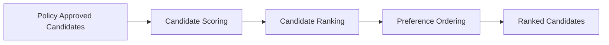
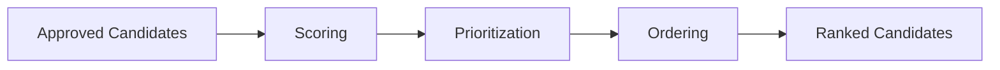
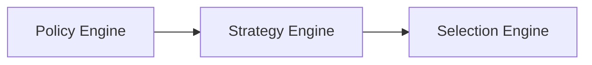

# Strategy Engine

## Overview

This document defines the Strategy Engine used by the AIGORA Tutor Orchestrator.

The Strategy Engine is responsible for evaluating policy-approved candidates, assigning deterministic scores, and producing a stable candidate preference ordering.

The Strategy Engine does not decide whether a candidate is allowed.

The Strategy Engine does not perform final node selection.

Its responsibility is to determine candidate preference.

---

# Purpose

The Strategy Engine exists to answer the following question:

```text
Among all valid candidates,
which candidates should be preferred?
```

The engine evaluates approved candidates and transforms them into a ranked candidate list.

The resulting ranking becomes the input of the Selection Engine.

---

# Architectural Principle

Policies determine eligibility.

Strategies determine preference.

Selection determines commitment.

This separation prevents ranking concerns from becoming coupled to eligibility or selection logic.

---

# High-Level Ranking Flow



The Strategy Engine transforms valid candidates into a deterministic preference ordering.

---

# Responsibilities

The Strategy Engine owns:

* candidate scoring
* candidate prioritization
* ranking strategies
* weighting strategies
* deterministic ordering
* tie-breaking preparation
* ranking trace generation

The engine acts as the preference evaluation subsystem of the Tutor Orchestrator.

---

# Non-Responsibilities

The Strategy Engine does not own:

* candidate generation
* policy evaluation
* eligibility validation
* graph traversal
* mastery persistence
* final node selection
* orchestration sequencing

These responsibilities belong to other components.

---

# Ranking Lifecycle



The Strategy Engine continuously refines candidate preference until a deterministic ranking is produced.

---

# Strategy Categories

The Strategy Engine supports multiple ranking categories.

| Category                 | Purpose                                  |
| ------------------------ | ---------------------------------------- |
| Graph-Only Ranking       | Uses curriculum topology signals         |
| Student-Aware Ranking    | Uses student progression signals         |
| Hybrid Ranking           | Combines topology and student context    |
| Future Heuristic Ranking | Uses controlled adaptive ranking signals |

The initial implementation focuses on deterministic topology-driven ranking.

---

# Graph-Only Ranking

The first implementation phase prioritizes graph-based signals.

Possible signals include:

* dependency distance
* traversal depth
* prerequisite count
* topology proximity
* curriculum continuity
* difficulty metadata

These signals do not require Student Model integration.

---

# Student-Aware Ranking

Future ranking capabilities may incorporate:

* mastery instability
* review priority
* retention decay
* recent mistakes
* learning confidence
* progression readiness

These signals depend on Student Model integration.

---

# Hybrid Ranking

Advanced orchestration capabilities may combine:

* curriculum topology
* mastery progression
* remediation requirements
* review opportunities
* pedagogical continuity

Hybrid ranking represents the long-term direction of adaptive orchestration.

---

# Deterministic Scoring

Each candidate receives a deterministic score.

```text
Candidate
    ↓
Signal Evaluation
    ↓
Weighted Scoring
    ↓
Deterministic Score
```

The same candidate evaluated under the same conditions must always produce the same score.

Randomized scoring is not allowed.

---

# Preference Ordering

The Strategy Engine produces a stable ordering.

Example:

| Rank | Candidate | Score |
| ---- | --------- | ----- |
| 1    | Node A    | 92    |
| 2    | Node B    | 85    |
| 3    | Node C    | 78    |

The ordering represents preference, not commitment.

Selection remains the responsibility of the Selection Engine.

---

# Tie-Breaking Preparation

The Strategy Engine prepares candidates for deterministic tie-breaking.

Example:

| Candidate | Score |
| --------- | ----- |
| Node A    | 90    |
| Node B    | 90    |

Tie resolution is delegated to the Selection Engine.

The Strategy Engine provides enough metadata to support stable tie-breaking.

---

# Ranking Traceability

Every ranking execution should produce a ranking trace.

The trace should include:

* candidate identifier
* scoring inputs
* scoring output
* ranking position
* ranking strategy
* ranking timestamp

These traces support auditability and decision reconstruction.

---

# Deterministic Guarantees

The Strategy Engine preserves:

* deterministic scoring
* deterministic ranking
* stable ordering
* reproducible prioritization
* explicit ranking strategies
* traceable ranking decisions

The same orchestration input must always produce the same ranking output.

---

# Failure Handling

Ranking failures must remain explicit.

Possible failures include:

* missing candidate metadata
* invalid ranking signals
* inconsistent topology information
* invalid scoring inputs

Failures must never silently alter ranking outcomes.

---

# Future Evolution

Future ranking capabilities may introduce:

* student-aware ranking
* hybrid ranking
* confidence-based ranking
* remediation-aware ranking
* retention-aware ranking
* controlled heuristic ranking

while preserving deterministic governance guarantees.

---

# Relationship with Other Engines



The Policy Engine determines which candidates are allowed.

The Strategy Engine determines which candidates are preferred.

The Selection Engine determines which candidate is ultimately selected.

---

# Related Documents

* [Decision Engine Architecture](decision-engine-architecture.md)
* [Orchestration Engine](orchestration-engine.md)
* [Policy Engine](policy-engine.md)
* [Selection Engine](selection-engine.md)
* [Candidate Ranking Architecture](../04-candidate-lifecycle/candidate-ranking-architecture.md)
* [Deterministic Governance](../02-orchestration/deterministic-governance.md)
* [Decision Lifecycle](../03-decision-engine/decision-lifecycle.md)
