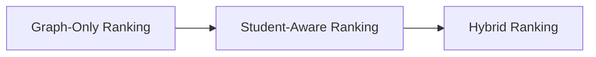
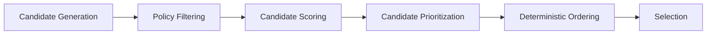

# Candidate Ranking Architecture

## Overview

This document defines the ranking architecture used by the AIGORA Tutor Orchestrator.

The ranking system is responsible for evaluating, prioritizing, and ordering orchestration candidates before final learning node selection occurs.

The architecture is intentionally deterministic-first and designed to evolve incrementally toward adaptive and student-aware orchestration capabilities.

Ranking produces candidate preference ordering but does not commit the final orchestration decision.

---

# Architectural Principle

The ranking architecture evolves incrementally across multiple orchestration maturity stages.



Initial implementations prioritize deterministic topology-based ranking.

Student-aware and hybrid ranking strategies are progressively introduced as the Student Model matures and richer pedagogical signals become available.

The ranking layer must preserve:

- deterministic evaluation
- stable candidate ordering
- orchestration reproducibility
- bounded context isolation
- auditability

---

# Ranking Categories

The orchestration engine organizes ranking behavior into distinct categories according to orchestration maturity and dependency scope.

| # | Category | Dependency Scope | Student-Aware | Determinism Level | Complexity | Status |
|---|---|---|---|---|---|---|
| 1 | [Graph-Only Ranking](#1-graph-only-ranking) | Curriculum Graph | No | Fully deterministic | Low | Implemented First |
| 2 | [Student-Aware Ranking](#2-student-aware-ranking) | Student Model | Yes | Deterministic | Medium | Planned for Future Iterations |
| 3 | [Hybrid Ranking](#3-hybrid-ranking) | Curriculum Graph + Student Model | Yes | Hybrid deterministic orchestration | High | Planned for Advanced Orchestration |

---

# 1. Graph-Only Ranking

Graph-only ranking strategies depend exclusively on curriculum topology and graph structure.

These strategies do not require Student Model integration.

## Responsibilities

- topology-based prioritization
- traversal-aware ranking
- curriculum continuity preservation
- deterministic topology scoring
- stable candidate ordering

## Example Signals

- `dependencyDistance`
- `graphDepth`
- `topologyProximity`
- `prerequisiteCount`
- `nodeDifficulty`
- `learningPathContinuity`

## Example

```text
Prefer nodes closer to the current topology region.
```

## Characteristics

| Property | Description |
|---|---|
| Dependency Scope | Curriculum Graph only |
| Student State Dependency | No |
| Determinism Level | Fully deterministic |
| Execution Complexity | Low |
| Initial Adoption Priority | Highest |

## Status

```text
IMPLEMENTED FIRST
```

Graph-only ranking establishes the deterministic foundation of orchestration prioritization.

---

# 2. Student-Aware Ranking

Student-aware ranking strategies depend on student learning state and pedagogical progression signals.

These strategies require Student Model integration.

## Responsibilities

- mastery-aware prioritization
- remediation-aware ranking
- review prioritization
- instability-aware ranking
- progression pacing control

## Example Signals

- `masteryGap`
- `reviewPriority`
- `recentMistakes`
- `retentionDecay`
- `confidenceLevel`
- `repetitionNeeds`

## Example

```text
Prioritize nodes with unstable mastery.
```

## Characteristics

| Property | Description |
|---|---|
| Dependency Scope | Student Model |
| Student State Dependency | Yes |
| Determinism Level | Deterministic |
| Execution Complexity | Medium |
| Initial Adoption Priority | Incremental |

## Status

```text
PLANNED FOR FUTURE ITERATIONS
```

Student-aware ranking progressively introduces pedagogical personalization while preserving deterministic orchestration guarantees.

---

# 3. Hybrid Ranking

Hybrid ranking strategies combine curriculum topology with student learning state.

These strategies represent advanced adaptive orchestration capabilities.

## Responsibilities

- adaptive progression prioritization
- personalized learning continuity
- remediation-aware progression balancing
- context-sensitive candidate evaluation
- hybrid pedagogical prioritization

## Example Signals

- `topologyValidButPedagogicallyRisky`
- `adaptiveDifficultyProgression`
- `personalizedLearningContinuity`
- `remediationAwareProgression`
- `contextSensitiveRanking`

## Example

```text
Prefer topology-adjacent nodes with optimal
mastery progression potential.
```

## Characteristics

| Property | Description |
|---|---|
| Dependency Scope | Curriculum Graph + Student Model |
| Student State Dependency | Yes |
| Determinism Level | Hybrid deterministic orchestration |
| Execution Complexity | High |
| Initial Adoption Priority | Advanced orchestration phase |

## Status

```text
PLANNED FOR ADVANCED ORCHESTRATION
```

Hybrid ranking represents the long-term evolution of adaptive pedagogical orchestration inside AIGORA.

---

# Ranking Lifecycle

The ranking lifecycle operates after policy evaluation and before final orchestration selection.



Ranking determines preference ordering.

Selection commits the final orchestration decision.

This separation preserves orchestration clarity and bounded governance.

---

# Ranking Signals

Ranking strategies evaluate orchestration candidates using deterministic orchestration signals.

## Topology Signals

- dependency distance
- graph depth
- prerequisite count
- traversal proximity
- curriculum continuity

## Pedagogical Signals

- mastery stability
- remediation priority
- review requirement
- retention decay
- progression readiness

All ranking signals must remain deterministic, reproducible, and traceable.

---

# Deterministic Guarantees

Global deterministic governance is documented in:

- [Deterministic Governance](../02-orchestration/deterministic-governance.md)


The ranking architecture preserves the following guarantees:

- same input produces the same ranking output
- stable deterministic ordering
- deterministic tie-breaking
- explicit weighting strategies
- reproducible orchestration decisions
- deterministic candidate evaluation
- stable orchestration sequencing

These guarantees ensure pedagogical consistency and orchestration reproducibility.

---

# Tie-Breaking Strategy

The ranking system must preserve stable deterministic tie-breaking behavior.

Tie-breaking strategies may include:

- topology proximity
- dependency distance
- traversal depth
- stable candidate identifiers
- deterministic fallback ordering

Tie-breaking behavior must remain:

- explicit
- reproducible
- auditable
- deterministic

---

# Architectural Constraints

The ranking layer enforces strict orchestration boundaries.

| Constraint | Description |
|---|---|
| Curriculum Graph isolation | Ranking does not own topology retrieval |
| Policy isolation | Ranking cannot bypass policy evaluation |
| Selection isolation | Ranking does not commit orchestration decisions |
| Infrastructure isolation | Ranking logic remains independent from infrastructure concerns |
| Deterministic governance | Candidate ordering must remain reproducible |

These constraints preserve orchestration governance and bounded context isolation.

---

# Future Evolution

Future orchestration evolution is centralized in:

- [Orchestration Roadmap](../02-orchestration/orchestration-roadmap.md)

This document focuses only on the subsystem behavior described above.
