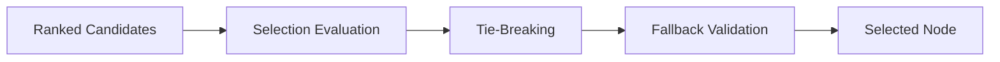

# Learning Node Selection Strategy

## Overview

This document defines the selection architecture used by the AIGORA Tutor Orchestrator.

The selection subsystem is responsible for committing the final pedagogical orchestration decision after candidate generation, policy evaluation, and deterministic ranking have already been completed.

Selection represents the final orchestration commitment stage of the deterministic orchestration pipeline.

The architecture is intentionally deterministic-first and designed to evolve incrementally toward adaptive and student-aware orchestration capabilities while preserving:

- deterministic governance
- orchestration reproducibility
- bounded context isolation
- auditability
- pedagogical consistency

The global orchestration lifecycle is documented in:

- [Deterministic Orchestration Architecture](../02-orchestration/deterministic-orchestration-architecture.md)

---

# Architectural Principle

Selection commits the final pedagogical orchestration decision.

The selection subsystem receives an ordered candidate set and determines which learning node becomes the next pedagogical objective.

Selection must preserve:

- deterministic behavior
- stable orchestration ordering
- explicit governance constraints
- reproducible decision-making
- auditable orchestration flow

Ranking determines preference ordering.

Selection commits orchestration intent.

---

# Selection Lifecycle

The selection subsystem operates after orchestration ranking has already completed.



Selection does not perform:

- topology retrieval
- candidate generation
- policy evaluation
- ranking evaluation

Selection operates exclusively on policy-approved and ranked orchestration candidates.

---

# Selection Responsibilities

| Responsibility | Purpose |
|---|---|
| Final orchestration commitment | Commit the next pedagogical decision |
| Deterministic candidate evaluation | Preserve reproducible orchestration behavior |
| Stable tie-breaking | Resolve equivalent candidates deterministically |
| Fallback selection | Guarantee orchestration continuity |
| Governance enforcement | Preserve orchestration constraints |
| Selection traceability | Preserve orchestration auditability |

---

# Selection Strategy Categories

| # | Category | Dependency Scope | Student-Aware | Determinism Level | Complexity | Status |
|---|---|---|---|---|---|---|
| 1 | [Graph-Only Selection](#1-graph-only-selection) | Curriculum Graph | No | Fully deterministic | Low | Implemented First |
| 2 | [Student-Aware Selection](#2-student-aware-selection) | Student Model | Yes | Deterministic | Medium | Planned for Future Iterations |
| 3 | [Hybrid Selection](#3-hybrid-selection) | Curriculum Graph + Student Model | Yes | Hybrid deterministic orchestration | High | Planned for Advanced Orchestration |

The selection subsystem evolves incrementally while preserving deterministic orchestration guarantees.

---

# 1. Graph-Only Selection

Graph-only selection strategies depend exclusively on curriculum topology and deterministic ranking output.

These strategies do not require Student Model integration.

## Responsibilities

- topology-valid node selection
- deterministic orchestration commitment
- stable topology progression
- deterministic fallback selection
- adjacency-preserving progression

## Example Rules

- highest-ranked topology-valid node wins
- fallback to nearest adjacent node
- preserve deterministic traversal ordering
- prefer nodes with lower dependency distance

## Example

```text
If two nodes have the same score,
select the node with the lowest dependency distance.
```

## Characteristics

| Property | Description |
|---|---|
| Dependency Scope | Curriculum Graph only |
| Student State Dependency | No |
| Determinism Level | Fully deterministic |
| Execution Complexity | Low |
| Initial Adoption Priority | Highest |

## Status

```text
IMPLEMENTED FIRST
```

Graph-only selection establishes the deterministic foundation of orchestration commitment behavior.

---

# 2. Student-Aware Selection

Student-aware selection strategies depend on student learning state and pedagogical progression signals.

These strategies require Student Model integration.

## Responsibilities

- remediation-aware selection
- review-first orchestration
- instability-aware progression
- regression-triggered selection
- progression pacing control

## Example Rules

- prefer remediation over progression when mastery instability is detected
- prioritize review nodes after repeated mistakes
- avoid progression during unstable learning periods

## Example

```text
Select remediation instead of progression
when mastery instability is detected.
```

## Characteristics

| Property | Description |
|---|---|
| Dependency Scope | Student Model |
| Student State Dependency | Yes |
| Determinism Level | Deterministic |
| Execution Complexity | Medium |
| Initial Adoption Priority | Incremental |

## Status

```text
PLANNED FOR FUTURE ITERATIONS
```

Student-aware selection progressively introduces personalized orchestration behavior while preserving deterministic governance guarantees.

---

# 3. Hybrid Selection

Hybrid selection combines curriculum topology with student learning state.

These strategies represent advanced adaptive orchestration capabilities.

## Responsibilities

- adaptive progression balancing
- personalized learning continuity
- remediation-aware orchestration
- context-sensitive selection
- hybrid pedagogical prioritization

## Example Rules

- dynamically rebalance progression and remediation
- adapt progression pacing to learning stability
- prioritize topology-valid nodes with the highest pedagogical value

## Example

```text
Select the topology-valid node with the highest
pedagogical progression value for the current student context.
```

## Characteristics

| Property | Description |
|---|---|
| Dependency Scope | Curriculum Graph + Student Model |
| Student State Dependency | Yes |
| Determinism Level | Hybrid deterministic orchestration |
| Execution Complexity | High |
| Initial Adoption Priority | Advanced orchestration phase |

## Status

```text
PLANNED FOR ADVANCED ORCHESTRATION
```

Hybrid selection represents the long-term evolution of adaptive pedagogical orchestration within AIGORA.

---

# Tie-Breaking Strategy

The selection subsystem must preserve stable deterministic tie-breaking behavior.

Tie-breaking strategies may include:

- dependency distance
- topology proximity
- traversal depth
- stable candidate identifiers
- deterministic fallback ordering

Tie-breaking behavior must remain:

- explicit
- reproducible
- deterministic
- auditable

Stable tie-breaking guarantees orchestration reproducibility.

---

# Fallback Selection

The selection subsystem must guarantee orchestration continuity under constrained orchestration scenarios.

Possible fallback strategies include:

- nearest topology-adjacent node
- remediation-first fallback
- review-priority fallback
- deterministic safe-node selection
- curriculum continuity fallback

Fallback behavior must preserve deterministic orchestration guarantees.

---

# Deterministic Guarantees

Global deterministic governance is documented in:

- [Deterministic Governance](deterministic-governance.md)


The selection architecture preserves the following guarantees:

- same input produces the same selection result
- stable deterministic tie-breaking
- reproducible orchestration decisions
- deterministic fallback selection
- explicit override rules
- deterministic orchestration sequencing
- auditable decision traceability

These guarantees ensure pedagogical consistency and orchestration reproducibility.

---

# Selection Governance Constraints

The selection subsystem must preserve strict orchestration governance boundaries.

| Constraint | Description |
|---|---|
| Policy isolation | Selection cannot bypass policy evaluation |
| Ranking isolation | Selection does not perform ranking evaluation |
| Topology isolation | Selection does not mutate curriculum topology |
| Governance preservation | Selection must preserve deterministic guarantees |
| Infrastructure isolation | Selection logic remains infrastructure-independent |

These constraints preserve orchestration consistency and bounded context isolation.

---

# Auditability and Traceability

The selection subsystem must support complete orchestration traceability.

The architecture preserves:

- selection traceability
- deterministic tie-breaking reconstruction
- fallback decision visibility
- orchestration reproducibility
- stable decision reconstruction
- orchestration event traceability

Every selection decision must remain explainable and reconstructable.

---

# Operational Visibility

The selection subsystem must expose operational orchestration visibility.

The architecture must support:

- selection latency visibility
- tie-breaking visibility
- fallback selection traceability
- orchestration interruption visibility
- deterministic replay capability
- distributed orchestration observability

Operational visibility is fundamental for production-grade orchestration systems.

---

# Non-Goals

The selection subsystem does not aim to:

- perform curriculum retrieval
- replace ranking behavior
- bypass orchestration policies
- mutate curriculum topology
- centralize orchestration logic
- bypass deterministic governance

These non-goals preserve orchestration boundaries and architectural consistency.

---

# Future Evolution

Future orchestration evolution is centralized in:

- [Orchestration Roadmap](orchestration-roadmap.md)

This document focuses only on the subsystem behavior described above.
