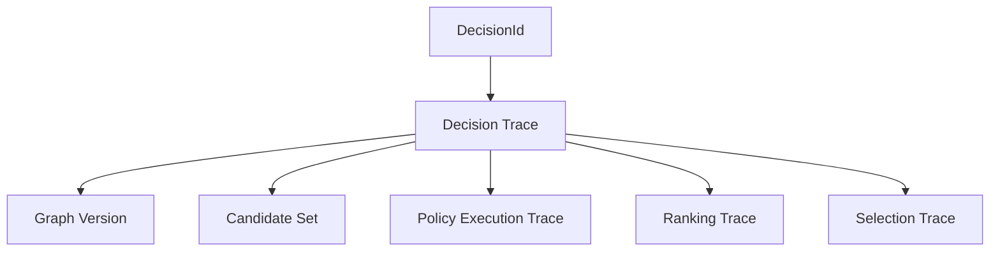
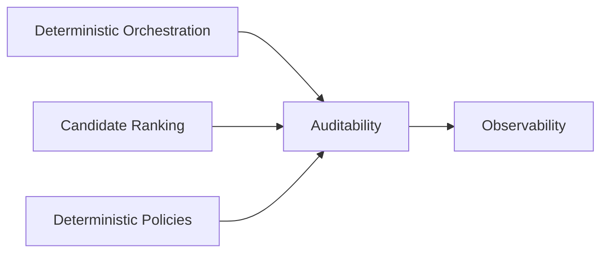

# Auditability and Decision Traceability

## Overview

This document defines the auditability and decision traceability architecture used by the AIGORA Tutor Orchestrator.

The orchestration architecture is designed to preserve reproducibility, decision reconstruction, policy traceability, ranking traceability, and deterministic orchestration governance.

Auditability is a first-class architectural capability of the deterministic orchestration system.

Every orchestration decision must be explainable, reconstructable, and reproducible.

---

# Architectural Principle

The Tutor Orchestrator follows an auditability-first architecture.

Every orchestration decision must produce sufficient information to support:

* decision reconstruction
* orchestration replay
* governance analysis
* pedagogical transparency
* recommendation explainability

A decision that cannot be reconstructed is considered an architectural failure.

---

# Auditability Responsibilities

| Capability                 | Purpose                           | Traceability Goal                    | Primary Output          |
| -------------------------- | --------------------------------- | ------------------------------------ | ----------------------- |
| Policy Execution Tracing   | Trace policy evaluation           | Reconstruct orchestration decisions  | Policy Execution Trace  |
| Ranking Traceability       | Trace candidate ranking           | Reconstruct candidate preference     | Ranking Trace           |
| Selection Traceability     | Trace final node selection        | Reconstruct orchestration commitment | Selection Trace         |
| Graph Version Traceability | Persist graph snapshot references | Reproduce topology state             | Graph Version Reference |
| Candidate Traceability     | Persist candidate metadata        | Reconstruct candidate space          | Candidate Trace         |
| Orchestration Logging      | Persist orchestration execution   | Full orchestration replay            | Decision Trace          |

---

# Decision Trace Model

Every orchestration execution produces a Decision Trace.

The Decision Trace is the primary audit artifact generated by the Tutor Orchestrator.

It contains all information required to reconstruct a deterministic orchestration decision.

---

## Decision Trace Components

| Component        | Purpose                                  |
| ---------------- | ---------------------------------------- |
| DecisionId       | Unique orchestration decision identifier |
| CorrelationId    | Request traceability                     |
| StudentId        | Student context reference                |
| GraphVersion     | Curriculum snapshot used                 |
| CandidateSet     | Generated learning candidates            |
| ExecutedPolicies | Policies evaluated during orchestration  |
| RankingResult    | Candidate ordering produced by ranking   |
| SelectedNode     | Final selected learning node             |
| Timestamp        | Decision creation time                   |

---

# Decision Reconstruction

The architecture must support complete decision reconstruction.

A decision can be reconstructed through the following trace chain:



The reconstruction process enables auditors and developers to determine:

* why a node was selected
* which policies were executed
* which candidates were rejected
* how ranking was produced
* which tie-breaking strategy was applied
* which graph version was used

---

# Traceability Dimensions

The Tutor Orchestrator preserves multiple traceability dimensions.

| Dimension              | Purpose                                         |
| ---------------------- | ----------------------------------------------- |
| Student Traceability   | Identify which student triggered a decision     |
| Graph Traceability     | Identify which curriculum version was evaluated |
| Policy Traceability    | Reconstruct policy execution behavior           |
| Candidate Traceability | Reconstruct generated candidate space           |
| Ranking Traceability   | Reconstruct candidate ordering                  |
| Selection Traceability | Reconstruct final decision selection            |
| Runtime Traceability   | Identify when the decision occurred             |
| Request Traceability   | Connect decisions to orchestration requests     |

Together these dimensions provide complete deterministic traceability.

---

# Deterministic Reproducibility

The auditability architecture preserves deterministic reproducibility guarantees.

For the same:

* Student State
* Curriculum Graph Version
* Candidate Set
* Policy Configuration

the orchestration process must produce the same outcome.

---

## Reproducibility Guarantees

* same input produces same orchestration output
* stable policy execution order
* stable ranking order
* deterministic tie-breaking
* reproducible node selection
* reproducible decision traces

These guarantees allow future decision replay and audit validation.

---

# Relationship to Observability

Auditability and observability are complementary capabilities.

| Capability    | Purpose                             |
| ------------- | ----------------------------------- |
| Observability | Understand runtime behavior         |
| Auditability  | Reconstruct orchestration decisions |

Observability answers:

```text
What happened?
When did it happen?
How long did it take?
```

Auditability answers:

```text
Why was this decision made?
How can the decision be reproduced?
Which rules influenced the outcome?
```

The Tutor Orchestrator requires both capabilities.

---

# Governance and Compliance

Auditability supports long-term governance requirements.

The architecture enables:

* decision governance
* orchestration accountability
* platform traceability
* pedagogical transparency
* recommendation explainability
* compliance reporting
* future decision replay

Auditability is a governance capability rather than a debugging feature.

---

# Architectural Constraints

The Tutor Orchestrator enforces the following constraints.

| Constraint                 | Description                                   |
| -------------------------- | --------------------------------------------- |
| Decision Trace Required    | Every decision must produce a trace record    |
| DecisionId Required        | Every decision must have a unique identifier  |
| CorrelationId Required     | Every request must be traceable               |
| Graph Version Traceability | Every decision must reference a graph version |
| Policy Traceability        | Policy execution must be reconstructable      |
| Ranking Traceability       | Ranking execution must be reconstructable     |
| Candidate Traceability     | Candidate generation must be reconstructable  |
| Selection Traceability     | Final node selection must be explainable      |

No deterministic decision may exist without an audit trail.

---

# Scope

This document defines:

* decision traceability
* policy traceability
* ranking traceability
* candidate traceability
* graph version traceability
* decision reconstruction
* deterministic reproducibility

This document does not define:

* observability implementation
* distributed tracing implementation
* logging infrastructure
* telemetry collection
* monitoring platforms

Those concerns belong to their respective governance and infrastructure documents.

---

# Relationship to Other Documentation



The Auditability Architecture builds upon deterministic orchestration and provides decision reconstruction capabilities across the orchestration lifecycle.

---

# Ownership

The Auditability Architecture section owns:

```text
Decision Trace Model

Decision Reconstruction

Policy Traceability

Ranking Traceability

Candidate Traceability

Graph Version Traceability
```

The Auditability Architecture section does not own:

```text
Policy Logic

Ranking Algorithms

Observability Infrastructure

Monitoring Platforms

Telemetry Collection
```

Those responsibilities remain inside their respective architectural sections.

---

# Future Evolution

Future capabilities may introduce:

* distributed tracing integration
* event replay systems
* decision replay engines
* orchestration simulation
* heuristic orchestration traceability
* AI-assisted recommendation explainability
* governance dashboards
* compliance reporting APIs

The auditability architecture defined in this document provides the foundation for those future capabilities.

---

# Related Documents

* [Deterministic Orchestration](../03-orchestration/deterministic-orchestration.md)
* [Deterministic Candidate Ranking](../03-orchestration/deterministic-candidate-ranking.md)
* [Deterministic Policies](../03-orchestration/deterministic-policies.md)
* [Observability Strategy](observability-strategy.md)
* [Decision Lifecycle](decision-lifecycle.md)
* [Event-Driven Pedagogical Flow](../03-orchestration/event-driven-pedagogical-flow.md)
* [Runtime Architecture](../06-integration/runtime-architecture.md)
