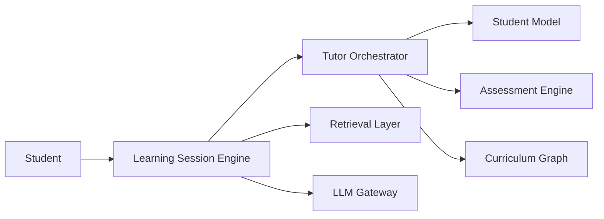

# Component Ownership

## Overview

This document defines ownership boundaries between the major components of the AIGORA platform.

The purpose of this document is to establish explicit architectural ownership, reduce coupling, prevent responsibility leakage, and preserve bounded context isolation.

Every platform capability must have a single authoritative owner.

The ownership model defines which component is responsible for making decisions, storing data, exposing capabilities, and enforcing business rules.

---

# Architectural Principle

AIGORA follows a bounded context architecture.

Each component owns a specific domain responsibility and exposes capabilities through explicit contracts.

Responsibilities must not be duplicated across components.

The ownership model ensures:

* clear architectural boundaries
* reduced coupling
* independent evolution
* deterministic governance
* easier maintainability
* better scalability

---

# Platform Components

---

# Ownership Matrix

| Component               | Primary Ownership            |
| ----------------------- | ---------------------------- |
| Tutor Orchestrator      | Pedagogical decision-making  |
| Curriculum Graph        | Knowledge topology           |
| Student Model           | Student learning state       |
| Assessment Engine       | Learning evaluation          |
| Learning Session Engine | Learning experience delivery |
| Retrieval Layer         | Context retrieval            |
| LLM Gateway             | Language model access        |

---

# Component Responsibilities

## Tutor Orchestrator

### Owns

* pedagogical decisions
* learning progression
* candidate evaluation
* policy execution
* ranking coordination
* selection coordination
* deterministic orchestration
* orchestration auditability

### Does Not Own

* curriculum topology
* graph traversal
* graph persistence
* student state persistence
* assessment execution
* content generation
* content retrieval

---

## Curriculum Graph

### Owns

* curriculum topology
* prerequisite relationships
* dependency relationships
* graph traversal
* learning path structure
* curriculum versioning
* topology retrieval

### Does Not Own

* pedagogical decisions
* candidate ranking
* student progression
* remediation decisions
* mastery evaluation

---

## Student Model

### Owns

* mastery state
* learning history
* progression history
* performance evidence
* confidence indicators
* learning signals

### Does Not Own

* curriculum topology
* orchestration decisions
* ranking strategies
* assessment execution

---

## Assessment Engine

### Owns

* answer evaluation
* exercise evaluation
* mastery measurement
* scoring strategies
* assessment outcomes

### Does Not Own

* learning progression
* candidate selection
* orchestration policies

---

## Learning Session Engine

### Owns

* learning session lifecycle
* exercise delivery
* instructional flow
* user interaction coordination
* learning experience execution

### Does Not Own

* pedagogical decisions
* curriculum topology
* mastery computation

---

## Retrieval Layer

### Owns

* contextual retrieval
* resource retrieval
* document retrieval
* RAG retrieval pipelines
* retrieval optimization

### Does Not Own

* orchestration decisions
* topology ownership
* student state

---

## LLM Gateway

### Owns

* language model access
* model routing
* prompt execution
* model abstraction
* provider integration

### Does Not Own

* pedagogical decisions
* curriculum topology
* orchestration governance
* student progression

---

# Ownership Boundaries

The following architectural boundaries must always be preserved.

| Boundary                               | Constraint                                             |
| -------------------------------------- | ------------------------------------------------------ |
| Curriculum Graph → Tutor Orchestrator  | Graph never performs pedagogical decisions             |
| Tutor Orchestrator → Curriculum Graph  | Orchestrator never owns topology                       |
| Student Model → Tutor Orchestrator     | Student Model stores state but does not make decisions |
| Assessment Engine → Tutor Orchestrator | Assessment evaluates but does not orchestrate          |
| Retrieval Layer → Tutor Orchestrator   | Retrieval provides context but does not decide         |
| LLM Gateway → Tutor Orchestrator       | Generation cannot bypass orchestration policies        |

---

# Ownership Rules

The platform follows the following governance rules:

1. Every capability must have a single owner.
2. Ownership must be explicit.
3. Responsibilities must not overlap.
4. Components communicate through contracts.
5. Infrastructure details must remain encapsulated.
6. Pedagogical decisions belong exclusively to the Tutor Orchestrator.
7. Curriculum topology belongs exclusively to the Curriculum Graph.

---

# Decision Ownership Examples

| Question                             | Owner              |
| ------------------------------------ | ------------------ |
| What should the student learn next?  | Tutor Orchestrator |
| Which nodes depend on this concept?  | Curriculum Graph   |
| What is the student's mastery level? | Student Model      |
| Was the exercise answered correctly? | Assessment Engine  |
| Which resources should be retrieved? | Retrieval Layer    |
| Which LLM provider should be called? | LLM Gateway        |

These examples illustrate how ownership boundaries apply to real platform decisions.

---

# Architectural Goal

The ownership model exists to ensure that every architectural decision inside AIGORA can be traced to a clearly defined component owner.

This principle preserves bounded context isolation, deterministic orchestration governance, and long-term architectural maintainability.
