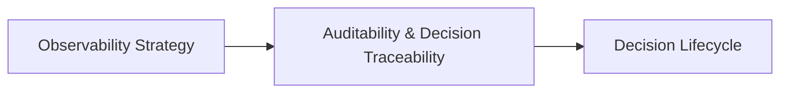
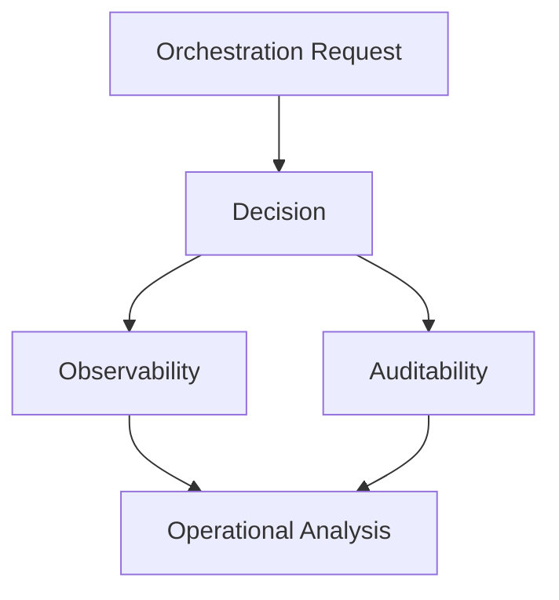
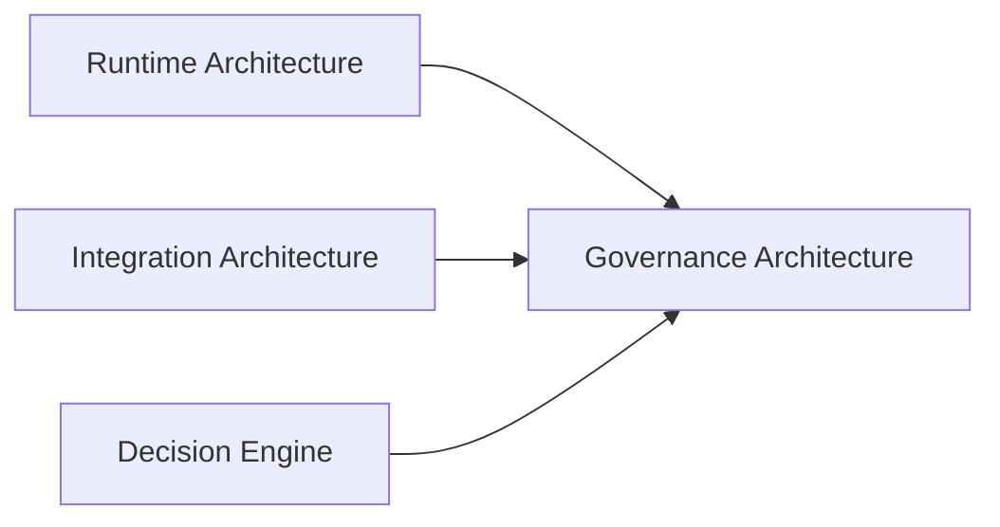

# Governance Architecture

This section defines the governance architecture of the Tutor Orchestrator.

The objective is to establish the principles, mechanisms, and architectural capabilities required to make orchestration decisions observable, auditable, traceable, and operationally reliable.

Governance concerns ensure that deterministic orchestration behavior remains explainable, reproducible, and manageable throughout the system lifecycle.

---

# Overview

The governance architecture is organized into a set of complementary documents.

Each document focuses on a specific governance concern.



The recommended reading order follows the progression from operational visibility to decision reconstruction.

---

# Reading Order

For new contributors, the recommended reading sequence is:

```text
1. Observability Strategy
2. Auditability and Decision Traceability
3. Decision Lifecycle
```

This sequence progressively introduces:

* observability foundations
* decision traceability
* governance responsibilities
* auditability requirements
* orchestration lifecycle visibility

---

# Governance Documentation

## Observability

Defines how orchestration behavior is monitored and measured.

| Document                                            | Purpose                                                               |
| --------------------------------------------------- | --------------------------------------------------------------------- |
| [Observability Strategy](observability-strategy.md) | Defines logging, correlation IDs, metrics, and operational visibility |

---

## Auditability

Defines how deterministic decisions are reconstructed and explained.

| Document                                                                            | Purpose                                                               |
| ----------------------------------------------------------------------------------- | --------------------------------------------------------------------- |
| [Auditability and Decision Traceability](auditability-and-decision-traceability.md) | Defines decision reconstruction, traceability, and audit requirements |

---

## Decision Governance

Defines how orchestration decisions evolve through the orchestration lifecycle.

| Document                                    | Purpose                                                                |
| ------------------------------------------- | ---------------------------------------------------------------------- |
| [Decision Lifecycle](decision-lifecycle.md) | Defines the lifecycle and governance stages of orchestration decisions |

---

# Governance Architecture Model



Governance capabilities operate alongside orchestration execution.

They do not participate in decision-making.

They provide visibility and accountability.

---

# Architectural Principles

The governance architecture follows the principles below.

---

## Observability by Design

Every orchestration request should produce sufficient signals to support operational diagnosis and performance analysis.

---

## Auditability by Design

Every orchestration decision should be explainable and reconstructable.

---

## Deterministic Traceability

The same orchestration inputs must always produce reproducible decision traces.

---

## Infrastructure Independence

Governance requirements remain independent from specific monitoring vendors and observability technologies.

Examples:

```text
OpenTelemetry

Prometheus

Grafana

Datadog

Elastic Stack

New Relic
```

---

## Operational Transparency

System behavior should be visible without exposing internal implementation details to consumers.

---

# Governance Scope

This section defines:

* observability strategy
* structured logging expectations
* correlation identifiers
* auditability requirements
* decision traceability
* governance responsibilities
* operational visibility

This section does not define:

* orchestration policies
* ranking strategies
* domain models
* curriculum topology
* infrastructure implementations
* monitoring platform configuration

Those concerns belong to other architectural sections.

---

# Relationship to Other Documentation



The Governance Architecture section builds on orchestration execution and integration behavior to provide visibility, accountability, and operational insight.

---

# Ownership

The Governance Architecture section owns:

```text
Observability Strategy

Correlation IDs

Auditability Requirements

Decision Traceability

Operational Metrics

Structured Logging Expectations
```

The Governance Architecture section does not own:

```text
Orchestration Logic

Policy Evaluation

Candidate Ranking

Curriculum Topology

Infrastructure Implementations
```

Those responsibilities remain within their respective bounded contexts.

---

# Future Evolution

Future governance capabilities may include:

```text
Distributed Tracing

Decision Replay

Operational Dashboards

SLO Monitoring

Compliance Reporting

Governance Analytics

Decision Explainability APIs
```

These capabilities build upon the governance foundations defined in this section.

---

# Related Documents

* [Observability Strategy](observability-strategy.md)
* [Auditability and Decision Traceability](auditability-and-decision-traceability.md)
* [Decision Lifecycle](decision-lifecycle.md)
* [Runtime Architecture](../06-integration/runtime-architecture.md)
* [Error Model](../07-java-architecture/error-model.md)
* [Deterministic Orchestration](../03-orchestration/deterministic-orchestration.md)
