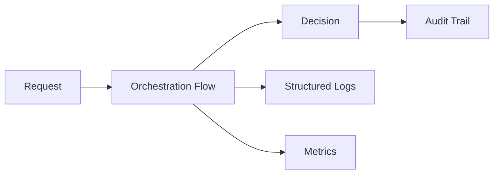
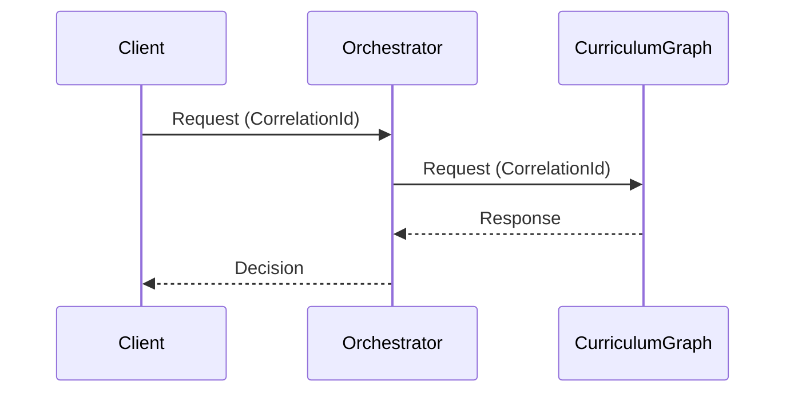
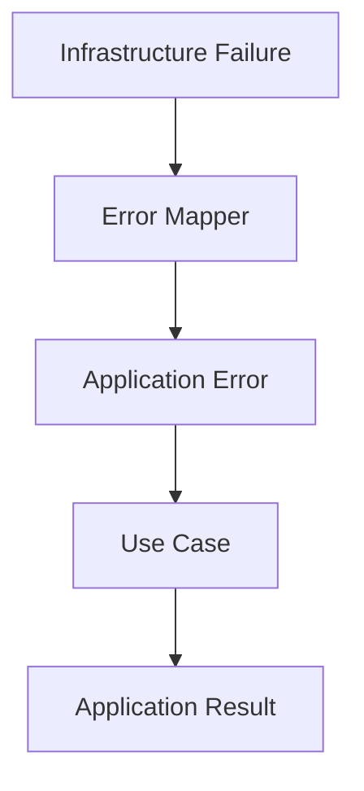
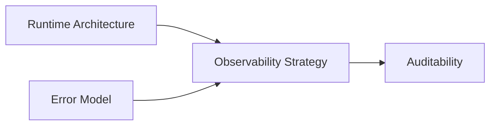

# Observability Strategy

This document defines the observability strategy for the Tutor Orchestrator.

The objective is to make deterministic orchestration behavior traceable, debuggable, measurable, and auditable across application, integration, and infrastructure boundaries.

The observability strategy establishes how orchestration requests, decisions, failures, and external dependencies are observed without introducing coupling between domain logic and monitoring technologies.

---

# Overview

The Tutor Orchestrator is responsible for producing deterministic pedagogical decisions.

Because orchestration decisions directly affect learning progression, every orchestration request must be observable.

The observability strategy supports:

* deterministic decision traceability
* operational diagnostics
* dependency visibility
* performance analysis
* production support
* auditability
* future observability platforms

Examples:

```text
OpenTelemetry

Prometheus

Grafana

Datadog

New Relic

Elastic Stack
```

This document defines observability requirements independently from implementation technologies.

---

# Observability Goals

The Tutor Orchestrator observability strategy is designed to answer the following questions.

## Request Visibility

```text
What request was executed?
```

---

## Decision Visibility

```text
What orchestration decision was produced?
```

---

## Failure Visibility

```text
Why did orchestration fail?
```

---

## Dependency Visibility

```text
Was the Curriculum Graph available?
```

---

## Performance Visibility

```text
How long did orchestration take?
```

---

## Auditability

```text
Can the decision be reconstructed later?
```

Every orchestration request should be traceable from entry point to decision outcome.

---

# Observability Architecture



Observability is treated as a cross-cutting concern.

---

# Correlation IDs

Every orchestration request must contain a Correlation ID.

Purpose:

* request tracing
* dependency tracing
* audit reconstruction
* debugging support

---

## Correlation Lifecycle



The Correlation ID must remain consistent throughout the entire orchestration lifecycle.

---

# Structured Logging Strategy

All logs must be structured.

Logs must be machine-readable.

---

## Required Fields

Every orchestration log should include:

```text
timestamp

correlation_id

decision_id

student_id

graph_version

event_name

event_type

duration_ms
```

---

## Example

```json
{
  "event_name": "orchestration.decision.created",
  "correlation_id": "abc123",
  "decision_id": "dec-001",
  "student_id": "student-42",
  "graph_version": "v1.3",
  "duration_ms": 42
}
```

Structured logs enable future analytics and operational dashboards.

---

# Observability Events

The following events should be observable.

---

## Request Lifecycle

```text
orchestration.request.started

orchestration.request.completed

orchestration.request.failed
```

---

## Decision Lifecycle

```text
orchestration.decision.created

orchestration.decision.rejected

orchestration.decision.completed
```

---

## Candidate Lifecycle

```text
candidate.generation.started

candidate.generation.completed

candidate.ranking.completed
```

---

## Policy Lifecycle

```text
policy.evaluation.started

policy.evaluation.completed

policy.evaluation.failed
```

---

## Dependency Lifecycle

```text
curriculum_graph.request.started

curriculum_graph.request.completed

curriculum_graph.request.failed
```

---

# Latency Metrics

Latency metrics must exist for every major orchestration stage.

---

## Orchestration Metrics

```text
orchestration_latency
```

Measures:

```text
Request Start
        ↓
Decision Produced
```

---

## Candidate Generation Metrics

```text
candidate_generation_latency
```

Measures:

```text
Candidate Discovery Duration
```

---

## Policy Evaluation Metrics

```text
policy_evaluation_latency
```

Measures:

```text
Policy Execution Duration
```

---

## Ranking Metrics

```text
candidate_ranking_latency
```

Measures:

```text
Ranking Execution Duration
```

---

## Decision Metrics

```text
decision_creation_latency
```

Measures:

```text
Decision Construction Duration
```

---

# Dependency Metrics

External dependencies must expose dedicated metrics.

---

## Curriculum Graph Latency

```text
curriculum_graph_latency
```

Measures:

```text
Request
        ↓
Response
```

---

## Curriculum Graph Failures

```text
curriculum_graph_failure_count
```

Measures:

```text
Dependency Failures
```

---

## Dependency Timeout Count

```text
dependency_timeout_count
```

Measures:

```text
Timeout Events
```

---

## Invalid Response Count

```text
invalid_graph_response_count
```

Measures:

```text
Invalid Dependency Responses
```

---

# Deterministic Decision Observability

Every orchestration decision must be observable.

The following attributes should be traceable:

```text
DecisionId

StudentId

GraphVersion

SelectedNode

CandidateCount

PolicyResults

RankingOutcome

DecisionTimestamp
```

This information supports auditability and decision reconstruction.

---

# Failure Observability

Failures must be observable through application-level errors.

Examples:

```text
GraphUnavailable

InvalidGraphResponse

NoCandidateAvailable

DependencyTimeout
```

Infrastructure-specific failures must not appear in orchestration logs.

---

## Correct

```text
DependencyTimeout
```

---

## Incorrect

```text
StatusRuntimeException

GrpcException

SocketTimeoutException
```

Infrastructure concerns remain isolated behind application error boundaries.

---

# Failure Propagation Model



The observability strategy follows the same failure propagation model defined by the error architecture.

---

# Metrics Catalog

Recommended metric categories:

| Metric                         | Description                       |
| ------------------------------ | --------------------------------- |
| orchestration_latency          | End-to-end orchestration duration |
| curriculum_graph_latency       | Curriculum Graph response time    |
| curriculum_graph_failure_count | Curriculum Graph failures         |
| dependency_timeout_count       | Timeout occurrences               |
| no_candidate_available_count   | Candidate generation failures     |
| invalid_graph_response_count   | Invalid graph responses           |
| policy_evaluation_latency      | Policy execution duration         |
| candidate_ranking_latency      | Ranking duration                  |

---

# Auditability Support

The observability strategy supports future auditability requirements.

Every decision should be reconstructable using:

```text
CorrelationId

DecisionId

StudentId

GraphVersion

Policy Outcomes

Ranking Outcomes

Timestamp
```

This enables deterministic replay and governance analysis.

---

# Future Evolution

Future implementations may introduce:

```text
OpenTelemetry

Distributed Tracing

Metrics Exporters

Dashboards

Alerting

SLO Monitoring

Service Maps
```

The observability architecture remains independent from any specific observability vendor.

---

# Relationship to Other Documents



Observability complements runtime execution, failure handling, and auditability concerns.

---

# Related Documents

* [Runtime Architecture](../06-integration/runtime-architecture.md)
* [Error Model](../07-java-architecture/error-model.md)
* [gRPC Infrastructure Adapter Strategy](../06-integration/grpc-infrastructure-adapter-strategy.md)
* [Curriculum Graph Integration](../06-integration/curriculum-graph-integration.md)
* [Auditability and Decision Traceability](auditability-and-decision-traceability.md)
* [Decision Lifecycle](decision-lifecycle.md)
