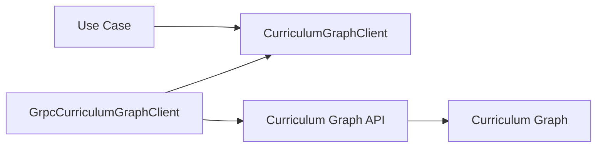
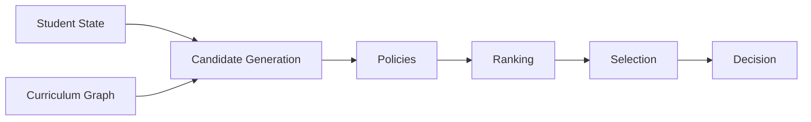
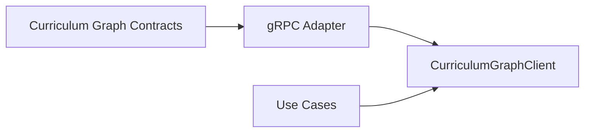

# Curriculum Graph Application Port


This document defines the application-layer contract used by the Tutor Orchestrator to access Curriculum Graph capabilities.

The objective is to establish a stable abstraction between orchestration use cases and Curriculum Graph infrastructure implementations.

The Tutor Orchestrator must depend on an application port rather than directly depending on gRPC clients, protobuf contracts, networking concerns, or persistence details.

---

# Overview

The Curriculum Graph is the authoritative source of curriculum topology within the AIGORA platform.

The Tutor Orchestrator consumes curriculum topology data to support deterministic pedagogical decision-making.

To preserve architectural boundaries, the Tutor Orchestrator accesses Curriculum Graph functionality through an application port named:

```text
CurriculumGraphClient
```

This port acts as an anti-corruption boundary between orchestration logic and graph infrastructure.

---

# Architectural Principle

The Tutor Orchestrator depends on abstractions.

Infrastructure depends on implementations.

The Curriculum Graph application port exists to ensure:

* dependency inversion
* bounded context isolation
* infrastructure independence
* testability
* contract stability

The application layer must never depend directly on:

```text
gRPC

Protobuf

Neo4j

Network Protocols

Infrastructure SDKs
```

---

# High-Level Architecture



The use case depends only on the application port.

Infrastructure concerns remain isolated behind the adapter boundary.

---

# Ownership

## Application Layer Owns

```text
CurriculumGraphClient
```

Responsibilities:

* define topology access capabilities
* expose orchestration-friendly contracts
* hide infrastructure implementation details
* provide stable integration boundaries

---

## Infrastructure Layer Owns

```text
GrpcCurriculumGraphClient
```

Responsibilities:

* execute gRPC requests
* map protobuf messages
* translate infrastructure errors
* communicate with Curriculum Graph services

---

## Curriculum Graph Owns

```text
Curriculum Topology

Graph Traversal

Dependency Resolution

Graph Versioning
```

The Tutor Orchestrator does not own curriculum topology.

It consumes curriculum topology through explicit contracts.

---

# CurriculumGraphClient

The CurriculumGraphClient represents the primary application port used by Tutor Orchestrator use cases.

Conceptually:

```java
public interface CurriculumGraphClient
```

The interface defines curriculum topology operations required by orchestration flows.

The interface must remain independent from:

* gRPC
* protobuf
* network protocols
* persistence technologies

---

# Supported Operations

The following operations represent the expected capabilities exposed by the Curriculum Graph application port.

---

## Get Current Learning Node

Retrieves curriculum information associated with the student's current learning position.

Purpose:

```text
Determine learning context
```

---

## Get Prerequisites

Retrieves prerequisite nodes for a target learning node.

Purpose:

```text
Support regression evaluation

Support dependency validation
```

---

## Get Next Candidate Learning Nodes

Retrieves topology-adjacent candidate nodes available for progression.

Purpose:

```text
Candidate generation
```

---

## Get Unlocked Nodes

Retrieves nodes currently available according to curriculum topology constraints.

Purpose:

```text
Progression evaluation

Candidate discovery
```

---

## Validate Node Existence

Verifies whether a curriculum node exists in the active graph version.

Purpose:

```text
Input validation

Consistency checks
```

---

## Get Curriculum Path Context

Retrieves curriculum context surrounding a learning node.

Purpose:

```text
Topology awareness

Path evaluation

Decision traceability
```

---

# Collaboration Model

The Curriculum Graph application port participates in deterministic orchestration flows.



The Curriculum Graph contributes topology information.

It does not participate in pedagogical decision-making.

---

# Use Case Integration

The application port is expected to be consumed by:

```text
SelectNextLearningNode

SelectRegressionNode

EvaluateLearningProgress
```

Use cases coordinate orchestration.

The Curriculum Graph application port provides topology data.

---

# Dependency Rules

The following dependency rules are mandatory.

## Allowed

```text
Use Case
    ↓
CurriculumGraphClient
```

```text
GrpcCurriculumGraphClient
    ↓
Curriculum Graph API
```

---

## Forbidden

```text
Use Case
    ↓
gRPC Stub
```

```text
Use Case
    ↓
Protobuf Message
```

```text
Domain
    ↓
gRPC Client
```

```text
Domain
    ↓
Neo4j
```

---

# Error Boundary

Infrastructure failures must be translated before crossing the application boundary.

Example:

```text
gRPC UNAVAILABLE
        ↓
GraphUnavailable
```

```text
gRPC DEADLINE_EXCEEDED
        ↓
DependencyTimeout
```

Application logic must never depend on infrastructure-specific exceptions.

---

# Anti-Corruption Boundary

The CurriculumGraphClient acts as an anti-corruption layer between:

```text
Tutor Orchestrator Domain
```

and

```text
Curriculum Graph Infrastructure
```

This boundary protects orchestration logic from:

* transport changes
* protocol changes
* protobuf evolution
* infrastructure replacement
* persistence changes

Future changes to Curriculum Graph communication mechanisms must not require modifications to use cases.

---

# Future Evolution

Future implementations may introduce:

```text
GrpcCurriculumGraphClient

CachedCurriculumGraphClient

ResilientCurriculumGraphClient

ObservabilityDecoratedCurriculumGraphClient
```

without modifying application use cases.

The CurriculumGraphClient contract remains the stable integration boundary.

---

# Relationship to Other Documents



The Curriculum Graph Contracts document defines the external service contract.

This document defines the internal application abstraction used by the Tutor Orchestrator.

---

# Related Documents

* [Use Cases](use-cases.md)
* [Application Contracts](application-contracts.md)
* [Ports and Adapters](ports-and-adapters.md)
* [Dependency Rules](dependency-rules.md)
* [Runtime Architecture](../06-integration/runtime-architecture.md)
* [Curriculum Graph Contracts](../../curriculum-graph/contracts.md)
* [Decision Engine Architecture](../03-decision-engine/decision-engine-architecture.md)
