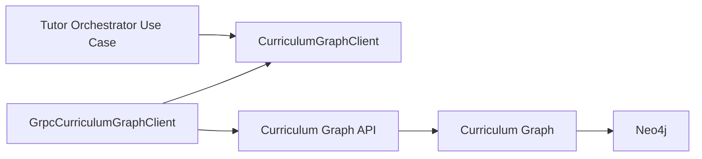
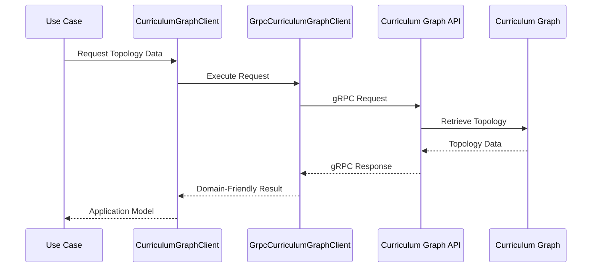
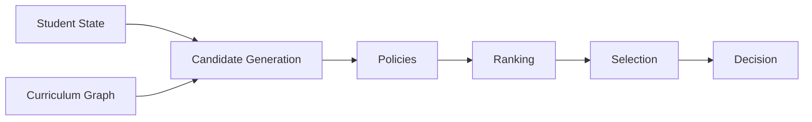
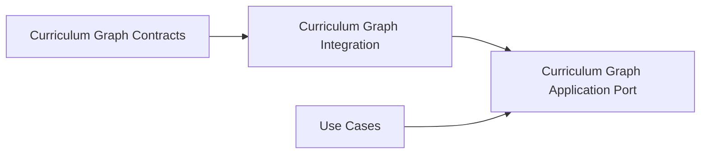

# Curriculum Graph Integration

This document defines the integration contract between the Tutor Orchestrator and the Curriculum Graph.

The objective is to establish a stable, explicit, and maintainable integration model while preserving bounded context isolation and dependency inversion.

The Tutor Orchestrator consumes curriculum topology information through application-level abstractions without exposing infrastructure concerns to orchestration use cases or domain logic.

---

# Overview

The Curriculum Graph is the authoritative source of curriculum topology within the AIGORA platform.

The Tutor Orchestrator consumes topology information to support deterministic pedagogical orchestration decisions.

The integration is intentionally designed around explicit architectural boundaries.

The Tutor Orchestrator must not directly depend on:

```text
gRPC

Protobuf

Neo4j

Network Protocols

Infrastructure SDKs
```

Instead, all interactions occur through application ports and infrastructure adapters.

---

# Architectural Principle

The integration follows Dependency Inversion principles.

```text
Application
    ↓
Port
    ↓
Adapter
    ↓
External System
```

The application layer depends on abstractions.

Infrastructure implementations depend on those abstractions.

This design enables:

* technology independence
* testability
* replaceability
* bounded context isolation
* stable orchestration behavior

---

# High-Level Integration Architecture



The use case remains unaware of infrastructure implementation details.

---

# Integration Ownership

## Tutor Orchestrator Owns

```text
Use Cases

Application Ports

Domain Policies

Ranking Strategies

Selection Strategies

Orchestration Decisions
```

---

## Curriculum Graph Owns

```text
Curriculum Topology

Prerequisite Relationships

Node Dependencies

Graph Traversal

Graph Versioning
```

---

## Infrastructure Layer Owns

```text
gRPC Communication

Protobuf Mapping

Transport Serialization

Connection Management

Error Translation
```

---

# CurriculumGraphClient

The CurriculumGraphClient represents the application-layer abstraction used by orchestration use cases.

Conceptually:

```java
public interface CurriculumGraphClient
```

Use cases depend on this contract rather than infrastructure implementations.

The CurriculumGraphClient defines topology access capabilities required by orchestration workflows.

---

# Integration Flow

The following sequence illustrates the expected interaction model.



The application layer never receives transport-specific objects.

---

# Data Flow into Orchestration

Curriculum Graph data contributes to candidate generation and orchestration decisions.



The Curriculum Graph provides topology information.

The Tutor Orchestrator produces pedagogical decisions.

---

# Expected Topology Capabilities

The Curriculum Graph integration is expected to provide capabilities such as:

```text
Get Current Learning Node

Get Prerequisites

Get Candidate Nodes

Get Unlocked Nodes

Validate Node Existence

Get Curriculum Context

Get Graph Version
```

These capabilities support orchestration without exposing graph internals.

---

# Adapter Responsibilities

The infrastructure adapter is responsible for communication with the Curriculum Graph service.

Example implementation:

```text
GrpcCurriculumGraphClient
```

Responsibilities include:

* gRPC invocation
* protobuf mapping
* transport serialization
* request construction
* response translation
* infrastructure error handling

Adapters must not contain orchestration logic.

---

# Application Layer Isolation

The application layer must remain independent from communication technologies.

Allowed:

```text
Use Case
    ↓
CurriculumGraphClient
```

Forbidden:

```text
Use Case
    ↓
gRPC Stub
```

```text
Use Case
    ↓
Protobuf Message
```

```text
Domain Policy
    ↓
gRPC Client
```

```text
Domain Policy
    ↓
Neo4j
```

---

# Error Translation Boundary

Infrastructure failures must be translated before crossing the application boundary.

Examples:

```text
gRPC UNAVAILABLE
        ↓
GraphUnavailable
```

```text
gRPC DEADLINE_EXCEEDED
        ↓
DependencyTimeout
```

```text
Invalid Response
        ↓
InvalidDependencyResponse
```

Application and domain layers must never depend on transport-specific exceptions.

---

# Future Evolution

Future integration improvements may introduce:

```text
Retry Policies

Circuit Breakers

Request Caching

Observability Decorators

Timeout Strategies

Load Balancing
```

These concerns belong to infrastructure implementations and must remain transparent to orchestration use cases.

The CurriculumGraphClient contract remains unchanged.

---

# Relationship to Other Documents



The Curriculum Graph Contracts document defines the service capabilities exposed by the Curriculum Graph.

The Curriculum Graph Application Port document defines the application abstraction used by the Tutor Orchestrator.

This document defines how both sides collaborate while preserving architectural boundaries.

---

# Architectural Guarantees

The integration preserves the following guarantees:

* dependency inversion
* bounded context isolation
* infrastructure encapsulation
* transport independence
* deterministic topology retrieval
* stable orchestration contracts
* replaceable communication implementations

These guarantees ensure that orchestration behavior remains independent from infrastructure evolution.

---

# Related Documents

* [Curriculum Graph Application Port](curriculum-graph-application-port.md)
* [Ports and Adapters](ports-and-adapters.md)
* [Dependency Rules](dependency-rules.md)
* [Use Cases](use-cases.md)
* [Application Contracts](application-contracts.md)
* [Runtime Architecture](../06-integration/runtime-architecture.md)
* [Curriculum Graph Contracts](../../curriculum-graph/contracts.md)
* [Decision Engine Architecture](../03-decision-engine/decision-engine-architecture.md)
