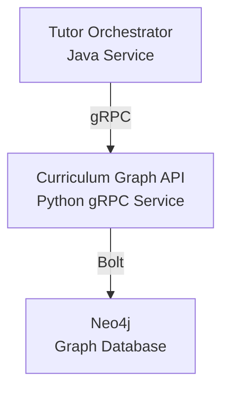
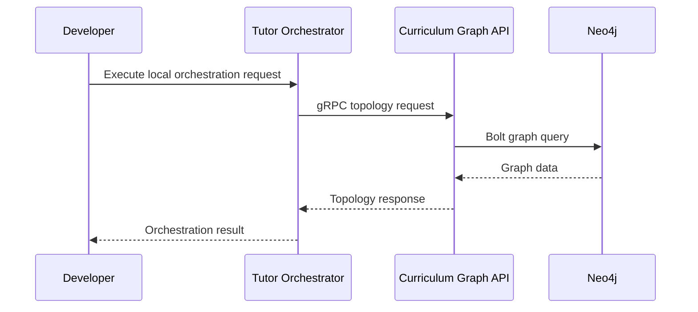
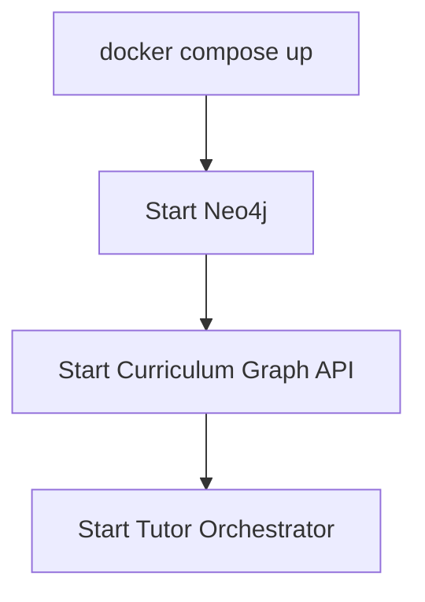
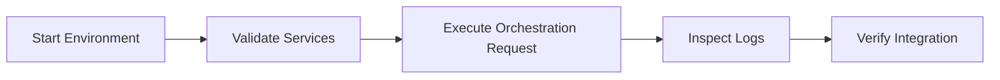
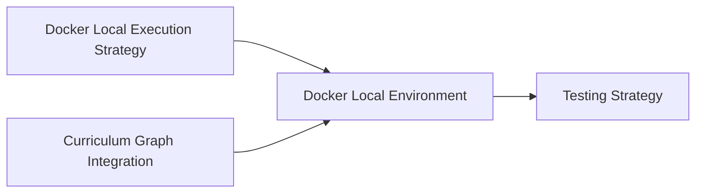

# Docker Local Environment

This document defines the local Docker environment for the Tutor Orchestrator ecosystem.

The objective is to provide a centralized reference for developers to understand which services are required, how they communicate, which ports are expected, and how the environment supports local development and future integration workflows.

This document complements the Docker local execution strategy by focusing on the developer-facing local environment structure.

---

# Overview

The local Docker environment runs the Tutor Orchestrator and its required dependencies as isolated services.

The expected local topology is:

```text
Tutor Orchestrator (Java)
        ↓ gRPC
Curriculum Graph API (Python)
        ↓ Bolt
Neo4j
```

The environment must remain reproducible, explicit, and easy to reason about.

---

# Service Topology



The Tutor Orchestrator never connects directly to Neo4j.

Neo4j remains encapsulated behind the Curriculum Graph API.

---

# Expected Services

The local environment is expected to contain the following services.

| Service              | Technology  | Responsibility                             |
| -------------------- | ----------- | ------------------------------------------ |
| tutor-orchestrator   | Java        | Executes deterministic orchestration flows |
| curriculum-graph-api | Python gRPC | Exposes curriculum topology capabilities   |
| neo4j                | Neo4j       | Stores curriculum graph data               |

---

# Service Responsibilities

## Tutor Orchestrator

Responsible for:

* executing orchestration use cases
* invoking the CurriculumGraphClient application port
* coordinating policies, ranking, and selection
* producing deterministic orchestration decisions

Must not:

* query Neo4j directly
* depend on protobuf models inside use cases
* own curriculum topology

---

## Curriculum Graph API

Responsible for:

* exposing graph traversal operations
* resolving prerequisites
* resolving adjacent learning nodes
* exposing graph version information
* encapsulating Neo4j access

Must not:

* perform pedagogical orchestration
* select learning nodes
* own student progression decisions

---

## Neo4j

Responsible for:

* storing curriculum topology
* storing graph relationships
* supporting traversal queries used by the Curriculum Graph API

Must not:

* be accessed directly by the Tutor Orchestrator
* contain orchestration logic

---

# Communication Flow



The local communication flow mirrors the intended production integration model.

---

# Expected Exposed Ports

The following ports are expected for local development.

| Service              | Port  | Purpose                     |
| -------------------- | ----- | --------------------------- |
| tutor-orchestrator   | 8080  | Future HTTP/API entry point |
| curriculum-graph-api | 50051 | gRPC API                    |
| neo4j                | 7474  | Neo4j Browser               |
| neo4j                | 7687  | Bolt protocol               |

Port values may evolve during implementation, but the responsibilities should remain stable.

---

# Expected Environment Variables

## Tutor Orchestrator

```text
CURRICULUM_GRAPH_HOST=curriculum-graph-api
CURRICULUM_GRAPH_PORT=50051
ENVIRONMENT=local
LOG_LEVEL=INFO
```

## Curriculum Graph API

```text
NEO4J_URI=bolt://neo4j:7687
NEO4J_USERNAME=neo4j
NEO4J_PASSWORD=password
GRAPH_VERSION=local
LOG_LEVEL=INFO
```

## Neo4j

```text
NEO4J_AUTH=neo4j/password
```

Environment values are examples and should not be treated as production configuration.

---

# Startup Flow

The expected startup order is:

```text
Neo4j
    ↓
Curriculum Graph API
    ↓
Tutor Orchestrator
```



Docker Compose startup order must not be confused with service readiness.

Future implementation should consider:

* health checks
* readiness validation
* dependency retries
* startup diagnostics

---

# Docker Compose Expectations

Docker Compose is expected to provide:

* service definitions
* shared Docker network
* environment variable injection
* local port exposure
* dependency wiring
* reproducible startup behavior

Expected services:

```yaml
services:
  tutor-orchestrator:
  curriculum-graph-api:
  neo4j:
```

This document does not define the final docker-compose.yml implementation.

---

# Local Integration Workflow

The local environment should support the following workflow.



This workflow supports:

* local development
* onboarding
* integration validation
* contract validation
* dependency debugging

---

# Integration Testing Support

The local Docker environment prepares the project for future integration testing.

It should support validation of:

* Tutor Orchestrator to Curriculum Graph communication
* Curriculum Graph to Neo4j communication
* gRPC adapter behavior
* application port boundaries
* graph version retrieval
* topology-driven candidate generation
* dependency failure behavior

Integration tests should be added in future implementation tasks.

---

# Environment Boundaries

The local Docker environment must preserve the same ownership boundaries as the architecture.

| Boundary                              | Rule      |
| ------------------------------------- | --------- |
| Tutor Orchestrator → Curriculum Graph | gRPC only |
| Tutor Orchestrator → Neo4j            | Forbidden |
| Curriculum Graph → Neo4j              | Bolt      |
| Domain Layer → Infrastructure         | Forbidden |
| Use Cases → gRPC/protobuf             | Forbidden |

---

# Future Evolution

Future local environment capabilities may include:

* Neo4j seed data
* service health checks
* Testcontainers support
* OpenTelemetry Collector
* local dashboards
* contract test runners
* integration test profiles
* synthetic graph datasets

These additions should extend the local environment without changing the core service topology.

---

# Relationship to Other Documents



The Docker Local Execution Strategy defines the architectural execution model.

This document defines the developer-facing local environment structure.

---

# Related Documents

* [Docker Local Execution Strategy](docker-local-execution-strategy.md)
* [Curriculum Graph Integration](curriculum-graph-integration.md)
* [Curriculum Graph Application Port](curriculum-graph-application-port.md)
* [gRPC Infrastructure Adapter Strategy](grpc-infrastructure-adapter-strategy.md)
* [Runtime Architecture](runtime-architecture.md)
* [Testing Strategy](../07-java-architecture/testing-strategy.md)
