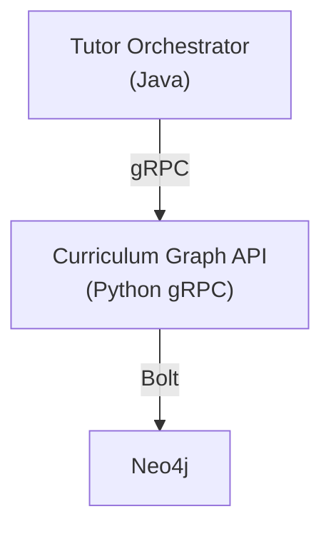
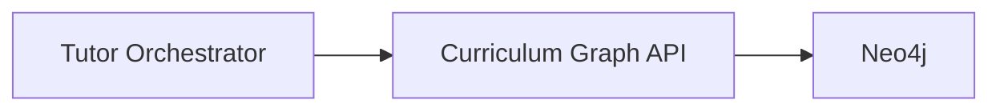
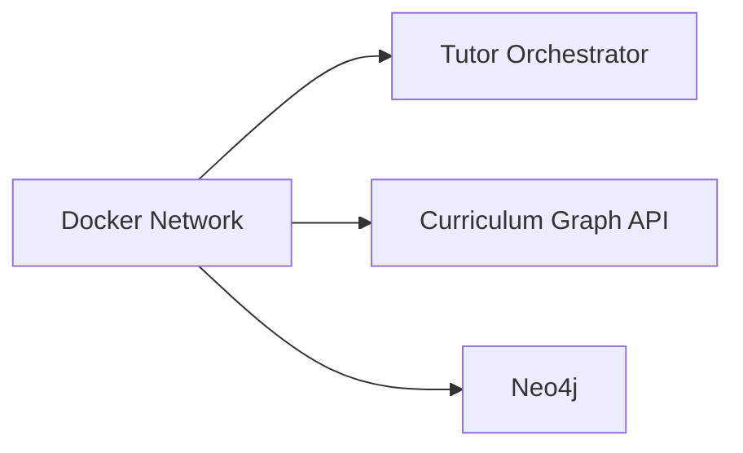
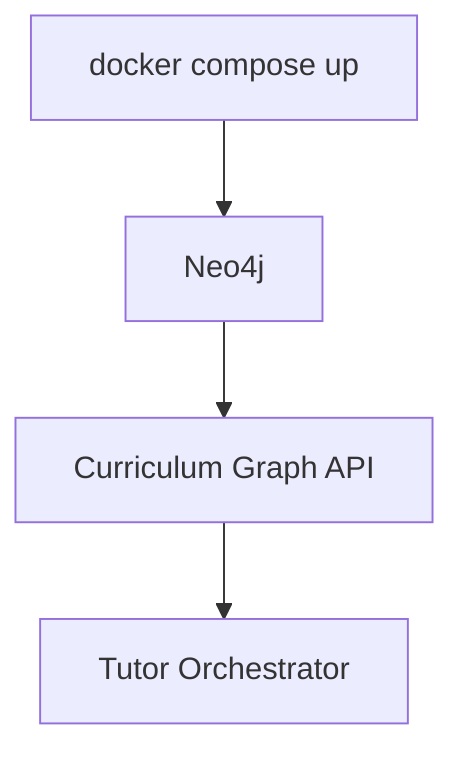
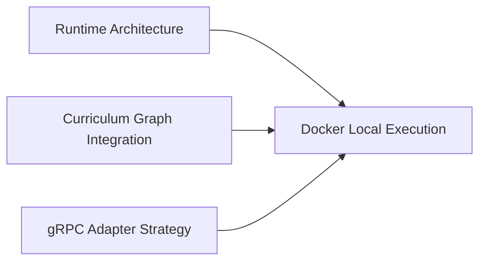

# Docker Local Execution Strategy

**Last Updated:** 2026-06-12

This document defines the local Docker-based execution strategy for the Tutor Orchestrator ecosystem.

The objective is to provide a reproducible local environment capable of running the Tutor Orchestrator, Curriculum Graph API, and Neo4j together while preserving production-like integration behavior.

The local environment supports:

* developer onboarding
* local development
* architecture validation
* contract validation
* future integration testing
* future end-to-end validation

This document focuses on execution strategy and architecture expectations rather than implementation details.

---

# Overview

The Tutor Orchestrator depends on Curriculum Graph capabilities to perform deterministic orchestration decisions.

The Curriculum Graph depends on Neo4j to provide curriculum topology information.

The local Docker environment must execute all required services together.

---

# Local Architecture



The local topology mirrors the intended production interaction model.

---

# Architecture Goals

The Docker environment must provide:

---

## Reproducibility

Every developer should obtain the same environment.

---

## Isolation

Dependencies must be isolated from host operating system configuration.

---

## Consistency

Local execution should behave similarly to future deployment environments.

---

## Integration Readiness

The environment should support future integration and contract testing.

---

# Expected Services

The local environment is expected to execute three primary services.

---

## Tutor Orchestrator

Responsible for:

```text
Deterministic Orchestration

Use Cases

Decision Creation

Policy Execution

Candidate Ranking
```

Technology:

```text
Java
```

---

## Curriculum Graph API

Responsible for:

```text
Topology Retrieval

Prerequisite Resolution

Graph Traversal

Graph Version Access
```

Technology:

```text
Python

gRPC
```

---

## Neo4j

Responsible for:

```text
Curriculum Persistence

Topology Storage

Graph Queries
```

Technology:

```text
Neo4j
```

---

# Service Responsibilities



Ownership boundaries remain preserved.

The Tutor Orchestrator does not directly access Neo4j.

---

# Communication Model

The local environment follows the same communication model used by the architecture.

---

## Orchestrator → Curriculum Graph

Protocol:

```text
gRPC
```

Purpose:

```text
Topology Queries

Candidate Discovery

Prerequisite Resolution

Graph Context Retrieval
```

---

## Curriculum Graph → Neo4j

Protocol:

```text
Bolt
```

Purpose:

```text
Graph Queries

Topology Traversal

Dependency Resolution
```

---

# Expected Network Topology

All services should execute inside a shared Docker network.



The network allows service discovery through container names.

---

# Expected Exposed Ports

The following ports are recommended.

| Service              | Protocol      | Port  |
| -------------------- | ------------- | ----- |
| Tutor Orchestrator   | HTTP (future) | 8080  |
| Curriculum Graph API | gRPC          | 50051 |
| Neo4j Browser        | HTTP          | 7474  |
| Neo4j Bolt           | Bolt          | 7687  |

These values may evolve during implementation.

---

# Expected Environment Variables

The following environment variables are expected.

---

## Tutor Orchestrator

```text
CURRICULUM_GRAPH_HOST

CURRICULUM_GRAPH_PORT

LOG_LEVEL

ENVIRONMENT
```

Example:

```text
CURRICULUM_GRAPH_HOST=curriculum-graph-api

CURRICULUM_GRAPH_PORT=50051
```

---

## Curriculum Graph API

```text
NEO4J_URI

NEO4J_USERNAME

NEO4J_PASSWORD

GRAPH_VERSION

LOG_LEVEL
```

Example:

```text
NEO4J_URI=bolt://neo4j:7687
```

---

## Neo4j

```text
NEO4J_AUTH
```

Example:

```text
neo4j/password
```

---

# Docker Compose Expectations

The local environment is expected to be orchestrated through Docker Compose.

Expected services:

```text
services:

  tutor-orchestrator

  curriculum-graph-api

  neo4j
```

Docker Compose is responsible for:

* service orchestration
* network creation
* dependency startup
* environment injection
* port exposure

---

# Startup Order Considerations

The local strategy must consider dependency readiness.

Expected dependency chain:

```text
Neo4j
    ↓
Curriculum Graph API
    ↓
Tutor Orchestrator
```

---

## Important Note

Container startup order does not guarantee service readiness.

Future implementation tasks should consider:

```text
Health Checks

Readiness Probes

Retry Policies

Connection Validation
```

These concerns remain outside the scope of this document.

---

# Local Development Workflow

Expected workflow:



Developers interact with the running services through exposed ports.

---

# Integration Testing Support

The local Docker architecture is intentionally designed to support future integration testing.

The environment enables validation of:

```text
Curriculum Graph Contracts

gRPC Integration

Dependency Communication

Error Propagation

Application Port Contracts

Runtime Architecture
```

Future integration tests should execute against real services whenever possible.

---

# Architecture Validation Goals

The local environment should allow validation of:

```text
Runtime Communication

Dependency Isolation

Port Contracts

gRPC Adapters

Topology Retrieval

Graph Versioning

Decision Creation
```

without requiring cloud infrastructure.

---

# Future Evolution

Future local execution capabilities may include:

```text
Health Checks

Testcontainers

Seed Data

Contract Test Suites

Synthetic Topologies

Local Monitoring Stack

OpenTelemetry Collector
```

The architecture defined in this document remains stable regardless of those future additions.

---

# Relationship to Other Documents



This document defines how the integration architecture is executed locally.

---

# Related Documents

* [Runtime Architecture](runtime-architecture.md)
* [Curriculum Graph Integration](curriculum-graph-integration.md)
* [Curriculum Graph Application Port](curriculum-graph-application-port.md)
* [gRPC Infrastructure Adapter Strategy](grpc-infrastructure-adapter-strategy.md)
* [Tutor Orchestrator Container Diagram](tutor-orchestrator-container-diagram.md)
* [Testing Strategy](../07-java-architecture/testing-strategy.md)
