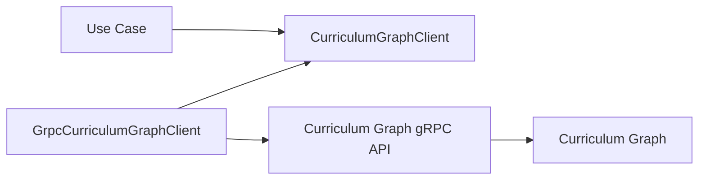
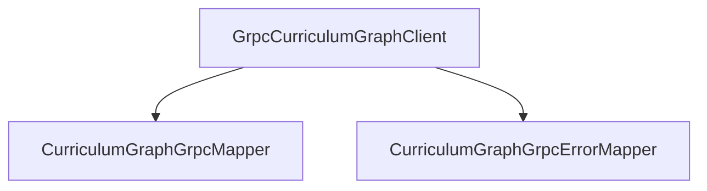
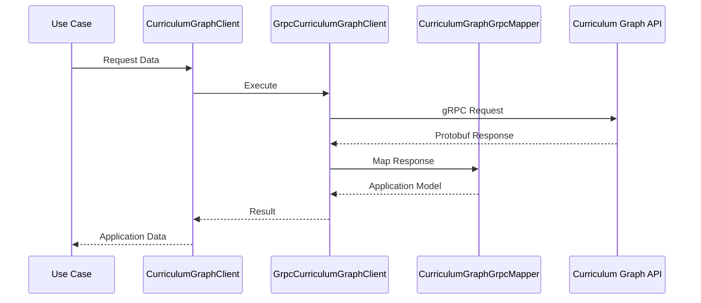
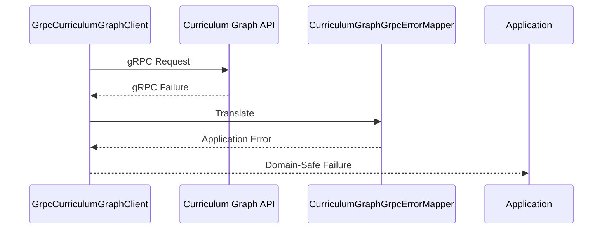
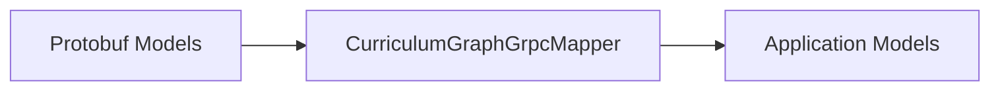
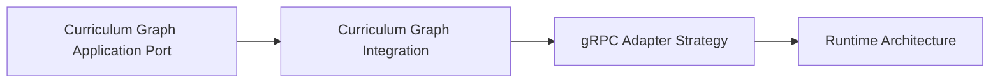

# gRPC Infrastructure Adapter Strategy

This document defines the gRPC infrastructure adapter strategy used by the Tutor Orchestrator to integrate with the Curriculum Graph.

The objective is to establish a clear infrastructure architecture that implements the CurriculumGraphClient application port while preserving dependency inversion, bounded context isolation, and transport independence.

The gRPC adapter layer is considered an implementation detail of the infrastructure layer and must remain invisible to application and domain logic.

---

# Overview

The Tutor Orchestrator accesses Curriculum Graph capabilities through an application port.

The infrastructure layer provides a gRPC-based implementation of that port.

The adapter architecture is responsible for:

* executing gRPC requests
* mapping protobuf messages
* translating transport failures
* preserving application-layer isolation
* enforcing anti-corruption boundaries

The adapter layer must never leak transport-specific concepts into the application or domain layers.

---

# Architectural Principle

The integration follows Ports and Adapters architecture.



The application layer depends on the port.

The infrastructure layer depends on the implementation.

---

# Infrastructure Components

The Curriculum Graph integration is implemented through three primary infrastructure components.



Each component owns a specific responsibility.

---

# GrpcCurriculumGraphClient

## Purpose

Implements the CurriculumGraphClient application port.

Conceptually:

```java
public final class GrpcCurriculumGraphClient
    implements CurriculumGraphClient
```

The component acts as the primary infrastructure adapter.

---

## Responsibilities

Responsible for:

* invoking gRPC services
* coordinating request execution
* invoking protobuf mappers
* invoking error mappers
* returning application-safe models

---

## Must Not Own

The adapter must not contain:

```text
Pedagogical Rules

Ranking Logic

Selection Logic

Policy Evaluation

Curriculum Decisions
```

Those responsibilities belong elsewhere.

---

# CurriculumGraphGrpcMapper

## Purpose

Converts protobuf transport models into application-safe models.

The mapper isolates transport representations from orchestration logic.

---

## Responsibilities

Responsible for:

* protobuf → application model conversion
* protobuf → domain model conversion
* transport normalization
* response transformation

---

## Example

```text
GetPrerequisitesResponse
        ↓
CurriculumGraphGrpcMapper
        ↓
PrerequisiteNodes
```

---

## Must Not Own

The mapper must not contain:

```text
Business Rules

Policy Logic

Validation Rules

Ranking Logic
```

Its only responsibility is model translation.

---

# CurriculumGraphGrpcErrorMapper

## Purpose

Converts transport-level failures into application-level errors.

The application layer must never depend on gRPC exceptions.

---

## Responsibilities

Responsible for:

* gRPC status translation
* transport exception translation
* infrastructure failure normalization
* application error generation

---

## Example

```text
Status.UNAVAILABLE
        ↓
CurriculumGraphGrpcErrorMapper
        ↓
GraphUnavailable
```

```text
Status.DEADLINE_EXCEEDED
        ↓
CurriculumGraphGrpcErrorMapper
        ↓
DependencyTimeout
```

---

## Must Not Own

The error mapper must not:

```text
Retry Requests

Execute Recovery Logic

Perform Logging Decisions

Implement Circuit Breakers
```

Those concerns belong to infrastructure decorators.

---

# Request Execution Flow

The following sequence illustrates the expected execution lifecycle.



Application layers never interact with protobuf messages directly.

---

# Error Handling Flow



All transport failures are translated before crossing the infrastructure boundary.

---

# Mapping Boundary

The mapper layer establishes a strict anti-corruption boundary.



This prevents transport concerns from contaminating orchestration models.

---

# Dependency Rules

Allowed dependencies:

```text
Use Cases
    ↓
CurriculumGraphClient

GrpcCurriculumGraphClient
    ↓
gRPC Stub

GrpcCurriculumGraphClient
    ↓
CurriculumGraphGrpcMapper

GrpcCurriculumGraphClient
    ↓
CurriculumGraphGrpcErrorMapper
```

---

Forbidden dependencies:

```text
Use Case
    ↓
gRPC Stub
```

```text
Domain
    ↓
Protobuf
```

```text
Domain
    ↓
gRPC Exception
```

```text
Policy
    ↓
Transport Models
```

```text
Selection Strategy
    ↓
Protobuf Contracts
```

---

# Anti-Corruption Layer

The infrastructure adapter layer acts as an Anti-Corruption Layer (ACL).

Its purpose is to shield the Tutor Orchestrator from:

* protobuf evolution
* transport protocol changes
* gRPC implementation details
* external service changes
* serialization concerns

Future communication technologies must not require modifications to use cases or domain policies.

---

# Future Evolution

Future infrastructure capabilities may be introduced through decorators.

Examples:

```text
RetryingCurriculumGraphClient

CachingCurriculumGraphClient

ObservabilityCurriculumGraphClient

CircuitBreakerCurriculumGraphClient
```

The CurriculumGraphClient contract remains unchanged.

---

# Recommended Package Structure

```text
infrastructure/
└── curriculumgraph/
    └── grpc/
        ├── GrpcCurriculumGraphClient.java
        ├── CurriculumGraphGrpcMapper.java
        └── CurriculumGraphGrpcErrorMapper.java
```

This structure isolates transport concerns from the rest of the application.

---

# Relationship to Other Documents



This document refines the infrastructure implementation strategy defined by the integration architecture.

---

# Related Documents

* [Curriculum Graph Application Port](curriculum-graph-application-port.md)
* [Curriculum Graph Integration](curriculum-graph-integration.md)
* [Curriculum Graph Contracts](curriculum-graph-contracts.md)
* [Ports and Adapters](../07-java-architecture/ports-and-adapters.md)
* [Dependency Rules](../07-java-architecture/dependency-rules.md)
* [Error Model](../07-java-architecture/error-model.md)
* [Runtime Architecture](runtime-architecture.md)
