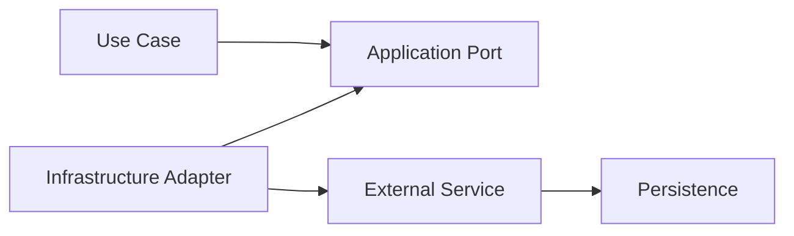
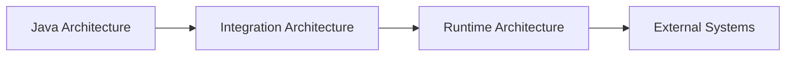

# Integration Architecture

This section defines the integration architecture of the Tutor Orchestrator.

The objective is to establish explicit integration boundaries, communication contracts, dependency isolation, and runtime interactions between the Tutor Orchestrator and external systems.

The Tutor Orchestrator follows a contract-driven integration model where all external dependencies are accessed through application ports and infrastructure adapters.

---

# Overview

The integration architecture is organized into a set of complementary documents.

Each document focuses on a specific integration concern.

```mermaid
flowchart LR

runtime["Runtime Architecture"]

port["Curriculum Graph Application Port"]

integration["Curriculum Graph Integration"]

grpc["gRPC Infrastructure Adapter Strategy"]

dockerStrategy["Docker Local Execution Strategy"]

dockerEnvironment["Docker Local Environment"]

contracts["Curriculum Graph Contracts"]

container["Container Diagram"]

runtime --> port

port --> integration

integration --> grpc

grpc --> dockerStrategy

dockerStrategy --> dockerEnvironment

dockerEnvironment --> contracts

contracts --> container
```



The recommended reading order follows the progression from runtime interactions to external service contracts.

---

# Reading Order

For new contributors, the recommended reading sequence is:

```text
1. Runtime Architecture
2. Curriculum Graph Application Port
3. Curriculum Graph Integration
4. gRPC Infrastructure Adapter Strategy
5. Docker Local Execution Strategy
6. Docker Local Environment
7. Curriculum Graph Contracts
8. Container Diagram
```

This sequence progressively introduces:

* runtime interactions
* application integration boundaries
* communication architecture
* infrastructure adapters
* local execution architecture
* local development environment
* service contracts
* deployment topology

---

# Integration Documentation

## Runtime Integration

Defines how components collaborate during orchestration execution.

| Document                                        | Purpose                                                      |
| ----------------------------------------------- | ------------------------------------------------------------ |
| [Runtime Architecture](runtime-architecture.md) | Defines runtime communication and orchestration interactions |

---

## Application Integration

Defines how external systems are accessed from the application layer.

| Document                                                                        | Purpose                                                                                               |
| ------------------------------------------------------------------------------- | ----------------------------------------------------------------------------------------------------- |
| [Curriculum Graph Application Port](curriculum-graph-application-port.md)       | Defines the CurriculumGraphClient application contract                                                |
| [Curriculum Graph Integration](curriculum-graph-integration.md)                 | Defines integration boundaries and communication flow between Tutor Orchestrator and Curriculum Graph |
| [gRPC Infrastructure Adapter Strategy](grpc-infrastructure-adapter-strategy.md) | Defines the gRPC adapter architecture, mapping strategy, and error translation responsibilities       |

---

## Local Development Environment

Defines how the Tutor Orchestrator ecosystem is executed locally for development, onboarding, architecture validation, and future integration testing.

| Document                                                              | Purpose                                                                                                                   |
| --------------------------------------------------------------------- | ------------------------------------------------------------------------------------------------------------------------- |
| [Docker Local Execution Strategy](docker-local-execution-strategy.md) | Defines the local execution architecture, service topology, communication model, and Docker Compose expectations          |
| [Docker Local Environment](docker-local-environment.md)               | Defines the developer-facing local environment, startup workflow, environment variables, ports, and integration workflows |

---

## Service Contracts

Defines external service capabilities and ownership boundaries.

| Document                                                    | Purpose                                                        |
| ----------------------------------------------------------- | -------------------------------------------------------------- |
| [Curriculum Graph Contracts](curriculum-graph-contracts.md) | Defines the topology contracts exposed by the Curriculum Graph |

---

## Deployment View

Defines the deployment-level representation of integration components.

| Document                                                                        | Purpose                                                            |
| ------------------------------------------------------------------------------- | ------------------------------------------------------------------ |
| [Tutor Orchestrator Container Diagram](tutor-orchestrator-container-diagram.md) | Defines the container-level architecture and service relationships |

---

# Integration Architecture Model



The integration architecture enforces strict separation between:

* application logic
* integration contracts
* infrastructure implementations
* external service ownership

---

# Architectural Principles

The integration architecture follows the principles below.

## Dependency Inversion

Application logic depends on ports.

Infrastructure implementations depend on those ports.

---

## Infrastructure Isolation

External communication technologies remain isolated from use cases and domain logic.

Examples:

```text
gRPC

HTTP

Neo4j

Protobuf

Serialization
```

---

## Bounded Context Isolation

The Tutor Orchestrator consumes external capabilities.

It does not own external domains.

Examples:

```text
Curriculum Graph owns topology

Student Model owns student state

Assessment Engine owns assessment evaluation
```

---

## Contract-Driven Integration

External systems are accessed through explicit contracts.

No integration should depend on implementation details.

---

## Replaceable Infrastructure

Communication technologies may evolve without impacting orchestration behavior.

Examples:

```text
gRPC → HTTP

Neo4j → Alternative Graph Database

Direct Calls → Service Mesh
```

Application use cases remain unchanged.

---

# Integration Scope

This section defines:

* integration boundaries
* application ports
* infrastructure adapters
* service communication
* dependency isolation
* runtime interactions
* local execution architecture
* local development environment
* service contracts

This section does not define:

* orchestration policies
* ranking strategies
* decision logic
* domain models
* use case responsibilities

Those concerns belong to their respective architectural sections.

---

# Relationship to Other Documentation



The Integration Architecture section connects the internal architecture of the Tutor Orchestrator to the external services it depends upon.

---

# Ownership

The Integration Architecture section owns:

```text
Application Ports

Infrastructure Adapters

Integration Contracts

Communication Boundaries

Dependency Isolation Rules

Runtime Interactions

Local Execution Architecture

Local Development Environment
```

The Integration Architecture section does not own:

```text
Curriculum Topology

Student State

Assessment Logic

Graph Persistence

Pedagogical Decisions
```

Those responsibilities remain inside their respective bounded contexts.

---

# Related Documents

* [Java Architecture](../07-java-architecture/index.md)
* [Runtime Architecture](runtime-architecture.md)
* [Curriculum Graph Application Port](curriculum-graph-application-port.md)
* [Curriculum Graph Integration](curriculum-graph-integration.md)
* [gRPC Infrastructure Adapter Strategy](grpc-infrastructure-adapter-strategy.md)
* [Docker Local Execution Strategy](docker-local-execution-strategy.md)
* [Docker Local Environment](docker-local-environment.md)
* [Curriculum Graph Contracts](curriculum-graph-contracts.md)
* [Tutor Orchestrator Container Diagram](tutor-orchestrator-container-diagram.md)
