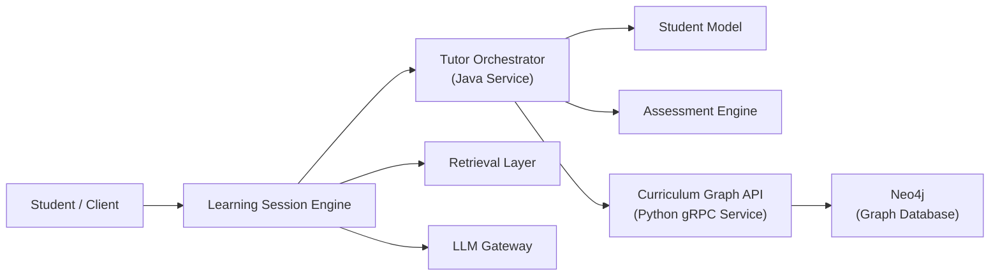
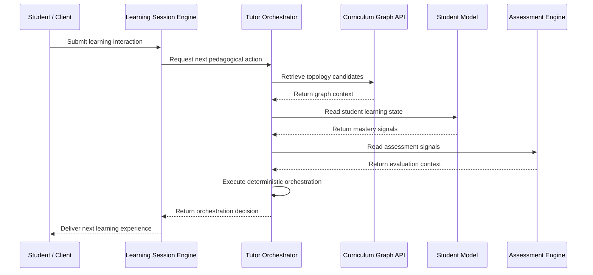
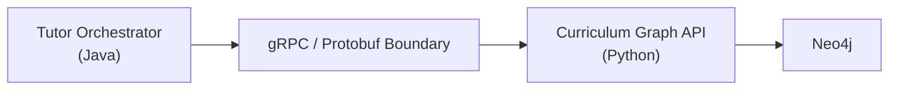
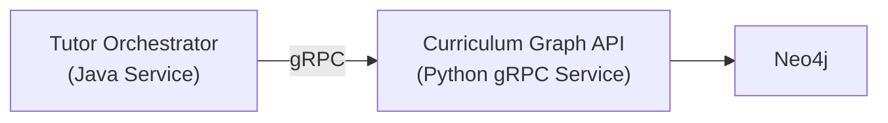

# Runtime Architecture

## Overview

This document describes the runtime architecture of the AIGORA Tutor Orchestrator ecosystem.

The runtime architecture explains how platform components interact during execution, how service boundaries are preserved, and how the Tutor Orchestrator coordinates deterministic pedagogical decisions through external dependencies.

The objective is to make runtime behavior explicit, observable, and maintainable.

---

# Runtime Principle

The Tutor Orchestrator must coordinate pedagogical decisions without owning external component responsibilities.

At runtime, the orchestrator:

* receives orchestration requests
* retrieves curriculum topology through the Curriculum Graph API
* consumes student state from the Student Model
* consumes assessment signals from the Assessment Engine
* executes deterministic orchestration logic
* returns a reproducible orchestration decision

The Tutor Orchestrator must never bypass explicit service boundaries.

---

# Runtime Component Topology

---

# Runtime Request Flow

A typical orchestration request follows this high-level runtime flow:

---

# Runtime Boundaries

The runtime architecture preserves strict bounded context isolation.

| Boundary                              | Rule                                                      |
| ------------------------------------- | --------------------------------------------------------- |
| Tutor Orchestrator → Curriculum Graph | Access only through explicit API contracts                |
| Tutor Orchestrator → Neo4j            | Direct access is forbidden                                |
| Curriculum Graph → Pedagogy           | Curriculum Graph does not make pedagogical decisions      |
| LLM Gateway → Orchestration           | LLM output cannot bypass orchestration policies           |
| Retrieval Layer → Orchestration       | Retrieved context does not decide learning progression    |
| Student Model → Orchestration         | Student state informs decisions but does not select nodes |

These boundaries prevent infrastructure leakage and responsibility drift.

---

# gRPC Runtime Boundary

The Curriculum Graph API is accessed through gRPC contracts.

The gRPC boundary provides:

* explicit service contracts
* language isolation
* infrastructure encapsulation
* stable integration points
* deterministic topology access

The Tutor Orchestrator depends on the contract, not on the graph implementation.

---

# Dependency Failure Boundaries

Runtime dependencies may fail independently.

The Tutor Orchestrator must treat each external dependency as a bounded failure domain.

| Dependency           | Possible Failure                       | Expected Behavior                          |
| -------------------- | -------------------------------------- | ------------------------------------------ |
| Curriculum Graph API | unavailable, timeout, invalid response | fail orchestration safely                  |
| Student Model        | unavailable, stale state               | avoid committing unsafe decisions          |
| Assessment Engine    | unavailable, incomplete signal         | defer evaluation-dependent decisions       |
| Retrieval Layer      | unavailable                            | continue only if retrieval is non-critical |
| LLM Gateway          | unavailable                            | avoid unguided generated responses         |

Failures must be:

* observable
* traceable
* bounded
* reproducible when possible

---

# Timeout Strategy

Each runtime dependency must have explicit timeout expectations.

Timeouts prevent orchestration requests from hanging indefinitely and protect the system from cascading failures.

Recommended timeout categories:

| Dependency Type                   | Timeout Strategy                 |
| --------------------------------- | -------------------------------- |
| Critical orchestration dependency | fail fast                        |
| Optional enrichment dependency    | degrade gracefully               |
| External generation dependency    | isolate and timeout aggressively |
| Persistence dependency            | retry only when safe             |

Timeout behavior must be documented and observable.

---

# Retry Strategy

Retries must be applied carefully to preserve deterministic orchestration behavior.

Retry behavior should follow these rules:

* retry only idempotent operations
* avoid retrying state-mutating operations without safeguards
* preserve correlation identifiers across retries
* log retry attempts
* expose retry metrics
* never allow retries to change orchestration semantics

Topology reads from Curriculum Graph are good retry candidates when the request is idempotent.

State mutations require stricter guarantees.

---

# Runtime Observability

The runtime architecture must expose enough information to reconstruct orchestration behavior.

Required observability signals include:

* request correlation ID
* orchestration decision ID
* graph version
* dependency latency
* timeout events
* retry attempts
* dependency failures
* selected learning node
* policy execution result
* ranking trace reference

These signals allow deterministic decisions to be debugged, audited, and reconstructed.

---

# Runtime Decision Trace

Every runtime orchestration decision should produce a decision trace.

A decision trace should include:

* input context
* graph version
* candidate set reference
* policy execution summary
* ranking summary
* selected node
* fallback behavior, if any
* dependency failures, if any
* orchestration timestamp
* correlation ID

The trace enables runtime reproducibility and operational debugging.

---

# Local Runtime Topology

The local development environment should mirror the production runtime boundaries as much as possible.

Expected local topology:

Local development may use simplified or mocked versions of:

* Student Model
* Assessment Engine
* Retrieval Layer
* LLM Gateway

but service boundaries should remain explicit.

---

# Non-Goals

The runtime architecture does not aim to:

* colocate all components inside the Tutor Orchestrator
* allow direct graph database access from orchestration logic
* bypass gRPC contracts
* hide dependency failures
* allow LLM output to override orchestration policies
* centralize all runtime logic inside a single service

These non-goals preserve long-term scalability and maintainability.

---

# Related Documents

* [Architecture Overview](../01-overview/architecture-overview.md)
* [Component Ownership](../05-governance/component-ownership.md)
* [Curriculum Graph Contracts](curriculum-graph-contracts.md)
* [Tutor Orchestrator Container Diagram](tutor-orchestrator-container-diagram.md)
* [Deterministic Governance](../02-orchestration/deterministic-governance.md)
* [Decision Engine Architecture](../03-decision-engine/decision-engine-architecture.md)
