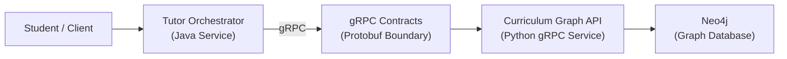

# Tutor Orchestrator Container Diagram

## Overview

This document describes the high-level container architecture of the AIGORA Tutor Orchestrator ecosystem.

---

# Container Diagram

The container architecture separates pedagogical orchestration from curriculum topology management through explicit gRPC service boundaries.

This separation preserves bounded context isolation, infrastructure encapsulation, and deterministic orchestration governance.

---

# Architectural Responsibilities

* Tutor Orchestrator owns pedagogical decision-making.
* Curriculum Graph API owns graph traversal and topology access.
* Neo4j remains encapsulated behind the Curriculum Graph API.
* Communication occurs through explicit gRPC contracts.
* Tutor Orchestrator never queries Neo4j directly.

---

# Design Principle

The architecture separates educational orchestration from curriculum topology management to reduce coupling, improve scalability, and preserve bounded context ownership.
