# Application Contracts

## Overview

This document defines the application contracts used by the AIGORA Tutor Orchestrator.

Application contracts establish the communication model between external callers and application use cases.

The objective is to provide a stable and explicit boundary for application orchestration.

Application contracts are composed of:

* Use Cases
* Commands
* Results

Together, they form the public application API of the Tutor Orchestrator.

---

# Architectural Principle

The application layer coordinates orchestration behavior.

External callers must interact with the application layer through explicit contracts rather than directly invoking domain models or infrastructure components.

Every use case must:

* receive a command
* execute orchestration logic
* return a result

This pattern provides:

* consistency
* testability
* traceability
* extensibility

---

# Application Contract Model

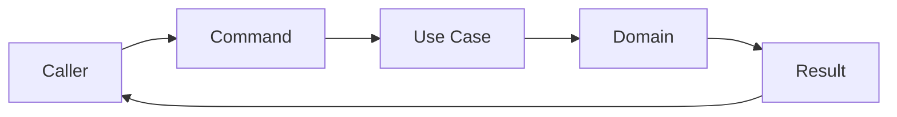

The application layer acts as a coordinator between external callers and the orchestration domain.

---

# Contract Components

| Component | Responsibility            |
| --------- | ------------------------- |
| Command   | Input contract            |
| Use Case  | Application orchestration |
| Result    | Output contract           |

---

# Use Cases

## Purpose

Use cases represent application operations supported by the Tutor Orchestrator.

Each use case encapsulates a complete orchestration workflow.

---

## High-Level Model

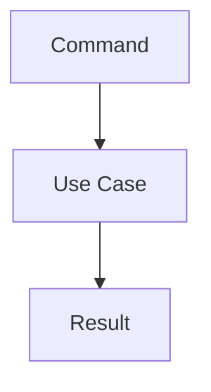

---

## Initial Use Cases

### Select Next Learning Node

Determines the next learning node for a student.

Responsibilities:

* retrieve topology information
* generate candidates
* evaluate policies
* rank candidates
* select final node
* produce orchestration decision

---

### Select Regression Node

Determines whether regression is required.

Responsibilities:

* evaluate regression policies
* identify prerequisite nodes
* select regression target

---

### Evaluate Learning Progress

Evaluates student progression state.

Responsibilities:

* analyze mastery state
* determine progression eligibility
* produce progression outcome

---

# Use Case Catalog

| Use Case                        | Purpose                    |
| ------------------------------- | -------------------------- |
| SelectNextLearningNodeUseCase   | Select next learning node  |
| SelectRegressionNodeUseCase     | Select regression target   |
| EvaluateLearningProgressUseCase | Evaluate progression state |

---

# Command Model

## Purpose

Commands represent application inputs.

Commands contain all information required to execute a use case.

Commands must:

* be immutable
* be self-contained
* represent user intent

---

## Command Lifecycle

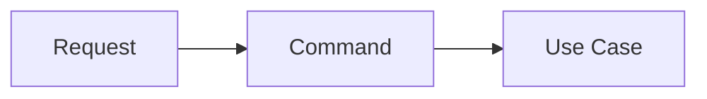

---

# SelectNextLearningNodeCommand

## Purpose

Requests selection of the next learning node.

---

## Conceptual Model

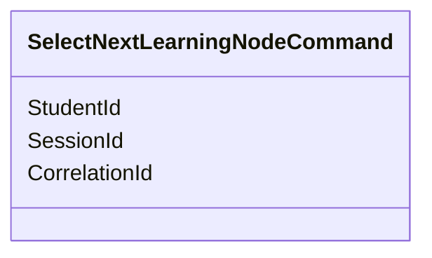

---

## Example Fields

```text
studentId
sessionId
correlationId
```

---

# SelectRegressionNodeCommand

## Purpose

Requests evaluation of regression requirements.

---

## Conceptual Model

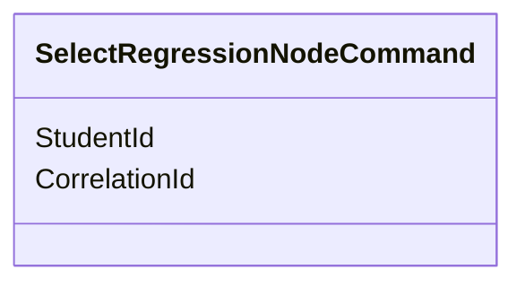

---

# EvaluateLearningProgressCommand

## Purpose

Requests progression evaluation.

---

## Conceptual Model

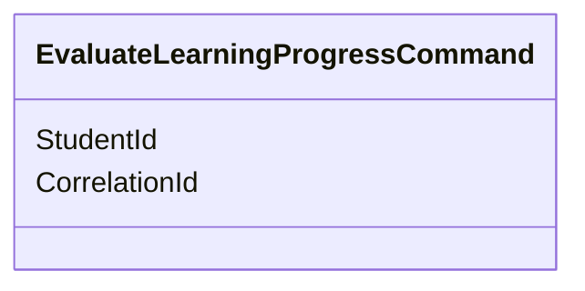

---

# Result Model

## Purpose

Results represent application outputs.

Results communicate orchestration outcomes to callers.

Results must:

* be immutable
* contain execution outcome
* contain domain information
* support auditability

---

## Result Lifecycle

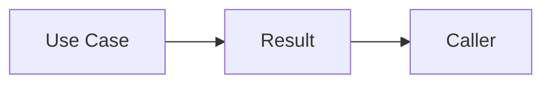

---

# SelectNextLearningNodeResult

## Purpose

Returns the final orchestration outcome.

---

## Conceptual Model

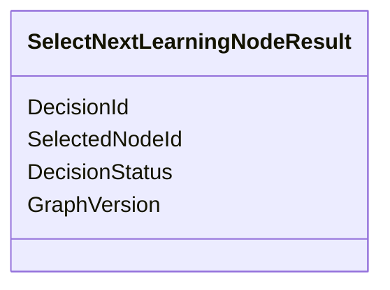

---

## Example Fields

```text
decisionId
selectedNodeId
decisionStatus
graphVersion
```

---

# SelectRegressionNodeResult

## Purpose

Returns the regression evaluation outcome.

---

## Conceptual Model

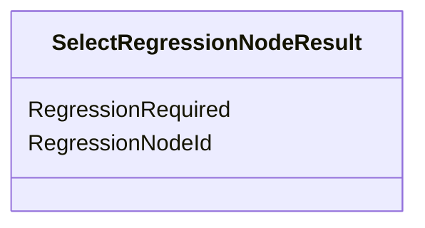

---

# EvaluateLearningProgressResult

## Purpose

Returns progression evaluation results.

---

## Conceptual Model

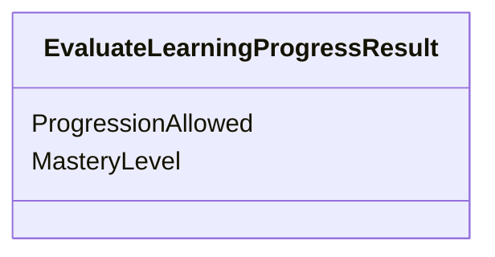

---

# Application Flow Example

The following diagram illustrates the complete application contract flow.

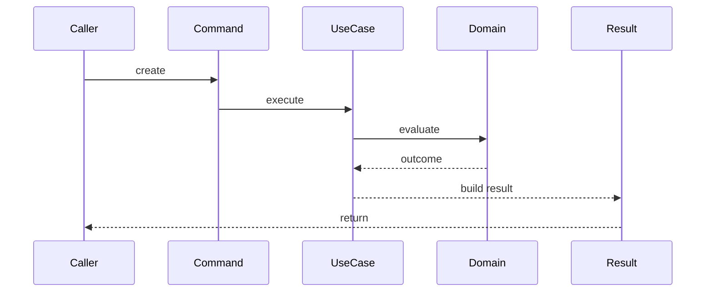

---

# Contract Ownership

The application layer owns:

```text
Commands
Use Cases
Results
```

The domain layer owns:

```text
Policies
Ranking
Selection
Domain Models
```

The application layer coordinates.

The domain layer decides.

---

# Command Responsibilities

Commands are responsible for:

* expressing intent
* carrying execution parameters
* initiating application workflows

Commands are not responsible for:

* validation rules
* ranking
* policy execution
* orchestration decisions

---

# Result Responsibilities

Results are responsible for:

* communicating outcomes
* exposing orchestration results
* exposing execution status
* exposing decision references

Results are not responsible for:

* domain behavior
* orchestration logic
* policy evaluation

---

# Command and Result Naming Rules

Commands must follow:

```text
<UseCaseName>Command
```

Examples:

```text
SelectNextLearningNodeCommand
SelectRegressionNodeCommand
EvaluateLearningProgressCommand
```

---

Results must follow:

```text
<UseCaseName>Result
```

Examples:

```text
SelectNextLearningNodeResult
SelectRegressionNodeResult
EvaluateLearningProgressResult
```

---

Use cases must follow:

```text
<BusinessOperation>UseCase
```

Examples:

```text
SelectNextLearningNodeUseCase
SelectRegressionNodeUseCase
EvaluateLearningProgressUseCase
```

---

# Application Layer Ownership Diagram

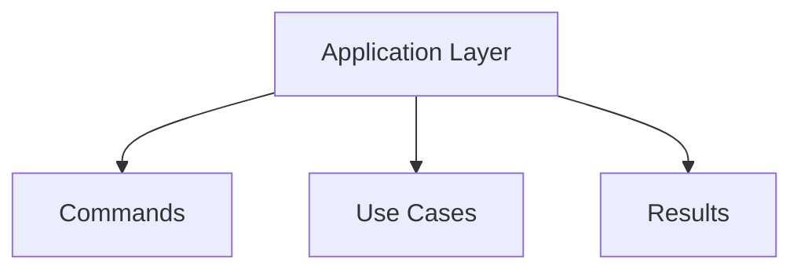

The application layer owns the orchestration workflow boundary.

---

# Future Evolution

Future iterations may introduce additional contracts such as:

```text
EvaluateMasteryUseCase

SelectRemediationNodeUseCase

CreateLearningSessionUseCase

EvaluateKnowledgeGapUseCase

GenerateLearningRecommendationUseCase
```

without changing the fundamental command/use case/result model.

---

# Governance Rules

The following rules are mandatory.

1. Every use case must receive a command.
2. Every use case must return a result.
3. Commands must be immutable.
4. Results must be immutable.
5. Use cases must coordinate domain behavior.
6. Domain decisions must not be moved into commands or results.
7. Commands must not contain orchestration logic.
8. Results must not contain orchestration logic.

---

# Related Documents

* [Package Structure](package-structure.md)
* [Layer Responsibilities](layer-responsibilities.md)
* [Dependency Rules](dependency-rules.md)
* [Domain Model](domain-model.md)
* [Ports and Adapters](ports-and-adapters.md)
* [Decision Lifecycle](../03-decision-engine/decision-lifecycle.md)
* [Decision Engine Architecture](../03-decision-engine/decision-engine-architecture.md)
