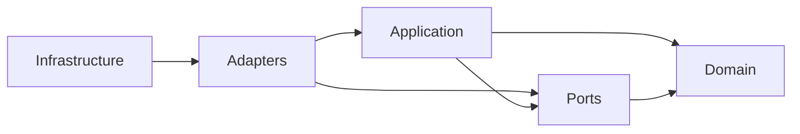
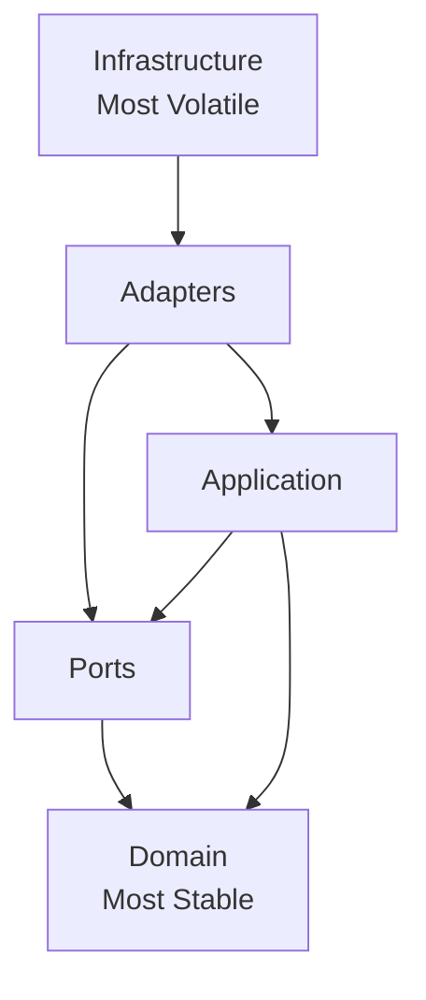
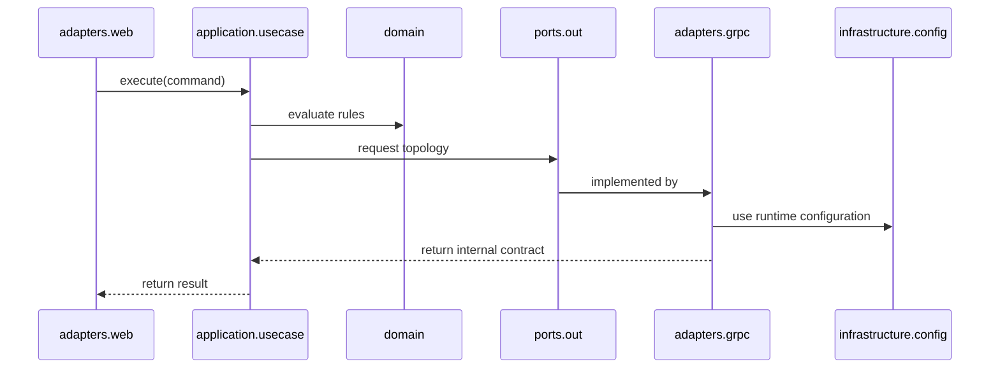

# Dependency Rules

## Overview

This document defines the dependency rules for the Java architecture of the AIGORA Tutor Orchestrator.

The objective is to preserve clean architectural boundaries, prevent framework leakage, protect the domain model, and ensure that the Tutor Orchestrator remains testable, maintainable, and evolvable.

This document complements:

* [Package Structure](package-structure.md)
* [Layer Responsibilities](layer-responsibilities.md)
* [Ports and Adapters](ports-and-adapters.md)
* [Testing Strategy](testing-strategy.md)

---

# Architectural Principle

Dependencies must always point toward the orchestration core.

The Tutor Orchestrator follows a Ports and Adapters architecture where:

* domain logic remains independent
* application use cases depend on abstractions
* ports define explicit boundaries
* adapters translate external protocols
* infrastructure wires runtime concerns

The domain layer must never depend on frameworks, protocols, databases, or infrastructure implementations.

---

# Dependency Direction



The allowed dependency direction is inward.

Outer layers may depend on inner layers.

Inner layers must not depend on outer layers.

---

# Layer Stability Model



The most stable layers must be protected from volatile runtime and framework concerns.

---

# Dependency Matrix

| From             | May Depend On                      | Must Not Depend On                                                                    |
| ---------------- | ---------------------------------- | ------------------------------------------------------------------------------------- |
| `domain`         | none                               | `application`, `ports`, `adapters`, `infrastructure`, Spring, gRPC, HTTP, persistence |
| `application`    | `domain`, `ports`                  | `adapters`, `infrastructure`, Spring controllers, gRPC clients, database clients      |
| `ports`          | `domain`                           | `adapters`, `infrastructure`, generated stubs, protocol DTOs                          |
| `adapters`       | `application`, `ports`, `domain`   | infrastructure decision logic, unrelated adapters                                     |
| `infrastructure` | `application`, `ports`, `adapters` | domain decision ownership                                                             |
| `shared`         | stable low-level abstractions only | orchestration rules, policies, ranking, selection                                     |

---

# Allowed Dependencies

The following dependency directions are allowed.

## Application to Domain

```text
application.usecase -> domain.model
application.usecase -> domain.policy
application.usecase -> domain.ranking
application.usecase -> domain.decision
```

Use cases may coordinate domain objects and deterministic rules.

---

## Application to Ports

```text
application.usecase -> ports.out
application.usecase -> ports.in
```

Use cases may depend on port interfaces.

They must not depend on adapter implementations.

---

## Ports to Domain

```text
ports.out -> domain.model
ports.in -> domain.model
```

Ports may use stable domain types when they represent orchestration contracts.

Ports must not expose protocol-specific DTOs.

---

## Adapters to Ports

```text
adapters.grpc -> ports.out
adapters.web -> ports.in
```

Adapters implement or call ports.

Adapters translate external protocols into internal contracts.

---

## Adapters to Application

```text
adapters.web -> application.usecase
```

Input adapters may invoke application use cases directly when this is simpler than routing through an input port.

If input ports are used, controllers should depend on input ports rather than concrete use cases.

---

## Infrastructure to Adapters

```text
infrastructure.config -> adapters.grpc
infrastructure.config -> adapters.web
```

Infrastructure may wire adapters and runtime configuration.

Infrastructure must not own orchestration behavior.

---

# Forbidden Dependencies

The following dependencies are explicitly forbidden.

## Domain to Frameworks

```text
domain -> Spring
domain -> gRPC
domain -> HTTP
domain -> Neo4j
domain -> Jackson
domain -> Lombok configuration concerns
```

The domain must be pure Java and framework-independent.

---

## Domain to Application

```text
domain -> application
```

Domain models and policies must not know about use cases.

---

## Domain to Ports

```text
domain -> ports
```

The domain must not depend on boundary abstractions.

Ports depend on domain, not the other way around.

---

## Application to Adapters

```text
application -> adapters.grpc
application -> adapters.web
```

Use cases must not know which adapter fulfills a dependency.

---

## Application to Infrastructure

```text
application -> infrastructure.config
application -> infrastructure.observability
application -> infrastructure.error
```

Application flow must remain independent from runtime wiring and framework configuration.

---

## Ports to Protocol DTOs

```text
ports -> generated gRPC stubs
ports -> HTTP request DTOs
ports -> database records
```

Ports must define internal contracts, not external protocol payloads.

---

## Adapter to Adapter

```text
adapters.grpc -> adapters.web
adapters.web -> adapters.grpc
```

Adapters should not depend on each other.

If coordination is required, it belongs in the application layer.

---

# Runtime Dependency Example



This flow preserves dependency direction and keeps external protocols outside the orchestration core.

---

# Package Boundary Rules

## Domain Rules

The domain package:

* may depend only on Java standard library and stable shared primitives
* must not depend on Spring
* must not depend on gRPC
* must not depend on generated classes
* must not depend on application services
* must not depend on ports
* must not depend on adapters

---

## Application Rules

The application package:

* may depend on domain
* may depend on ports
* must not depend on adapters
* must not depend on infrastructure
* must not depend on generated gRPC stubs
* must not depend on HTTP request or response DTOs

---

## Ports Rules

The ports package:

* may depend on domain
* must not depend on adapters
* must not depend on infrastructure
* must not expose generated protocol classes
* must not encode framework-specific concerns

---

## Adapters Rules

The adapters package:

* may depend on application
* may depend on ports
* may depend on domain for mapping
* may depend on external protocol libraries
* must not own orchestration rules
* must not mutate domain state outside application use cases

---

## Infrastructure Rules

The infrastructure package:

* may depend on adapters
* may depend on application
* may depend on ports
* may depend on framework libraries
* must not contain domain policies
* must not contain ranking rules
* must not contain selection logic

---

# Dependency Enforcement

Dependency rules must be enforced through automated architecture tests.

Recommended tooling:

```text
ArchUnit
```

Example test categories:

* domain independence tests
* application dependency tests
* adapter isolation tests
* infrastructure isolation tests
* forbidden framework dependency tests
* package cycle detection tests

---

# Architecture Test Examples

```java
@Test
void domainShouldNotDependOnSpringOrGrpc() {
    noClasses()
        .that()
        .resideInAPackage("..domain..")
        .should()
        .dependOnClassesThat()
        .resideInAnyPackage(
            "org.springframework..",
            "io.grpc..",
            "com.aigora.generated.."
        );
}
```

```java
@Test
void applicationShouldNotDependOnAdapters() {
    noClasses()
        .that()
        .resideInAPackage("..application..")
        .should()
        .dependOnClassesThat()
        .resideInAPackage("..adapters..");
}
```

```java
@Test
void portsShouldNotExposeProtocolTypes() {
    noClasses()
        .that()
        .resideInAPackage("..ports..")
        .should()
        .dependOnClassesThat()
        .resideInAnyPackage(
            "io.grpc..",
            "org.springframework.web..",
            "com.aigora.generated.."
        );
}
```

---

# Anti-Patterns

## Use Case Calls gRPC Client Directly

```text
SelectNextLearningNodeUseCase -> GrpcCurriculumGraphAdapter
```

This violates Ports and Adapters.

Correct:

```text
SelectNextLearningNodeUseCase -> CurriculumGraphPort
GrpcCurriculumGraphAdapter -> CurriculumGraphPort
```

---

## Domain Policy Reads External State

```text
EligibilityPolicy -> CurriculumGraphGrpcClient
```

This violates domain purity.

Correct:

```text
UseCase retrieves required data through ports
UseCase passes data into EligibilityPolicy
EligibilityPolicy evaluates pure inputs
```

---

## Controller Executes Business Rules

```text
TutorOrchestratorController -> EligibilityPolicy
```

This bypasses the application layer.

Correct:

```text
TutorOrchestratorController -> SelectNextLearningNodeUseCase
SelectNextLearningNodeUseCase -> EligibilityPolicy
```

---

## Infrastructure Owns Orchestration Logic

```text
ObservabilityConfiguration -> CandidateRanking
```

This mixes runtime wiring with business behavior.

Correct:

```text
StrategyEngine -> CandidateRanking
ObservabilityConfiguration -> tracing/logging setup
```

---

# Dependency Review Checklist

Before adding a new dependency, verify:

* Does this dependency point inward?
* Does this dependency introduce framework leakage?
* Does this dependency make testing harder?
* Does this dependency duplicate ownership?
* Does this dependency violate a bounded context?
* Could this dependency be represented as a port instead?
* Does this dependency belong to infrastructure rather than application or domain?

If the answer is unclear, the dependency should not be introduced.

---

# Governance Rules

The following rules are mandatory:

1. Domain must remain framework-independent.
2. Use cases must depend on ports, not adapters.
3. External systems must be accessed through output ports.
4. Protocol-specific DTOs must not cross into application or domain layers.
5. Adapters must translate external payloads into internal contracts.
6. Infrastructure must wire dependencies but must not own decisions.
7. Dependency direction must be enforced by architecture tests.
8. Package cycles are not allowed.

---

# Related Documents

* [Package Structure](package-structure.md)
* [Layer Responsibilities](layer-responsibilities.md)
* [Ports and Adapters](ports-and-adapters.md)
* [Testing Strategy](testing-strategy.md)
* [Runtime Architecture](../06-integration/runtime-architecture.md)
* [Decision Engine Architecture](../03-decision-engine/decision-engine-architecture.md)
