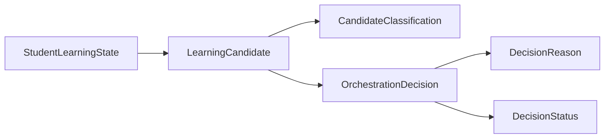
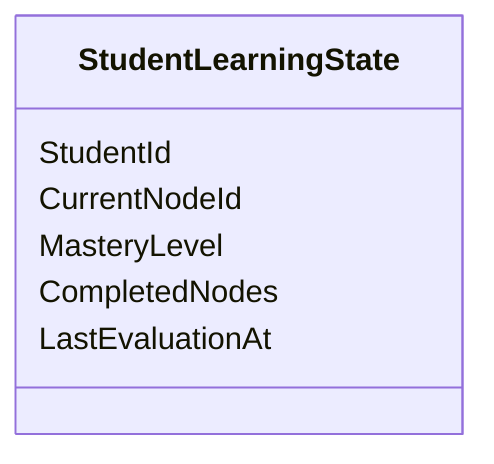
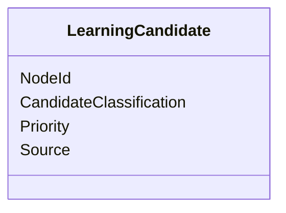
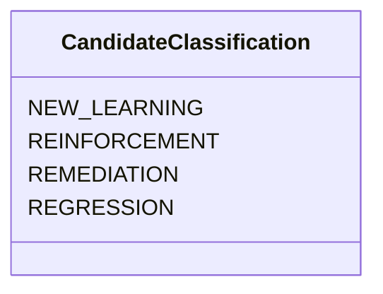
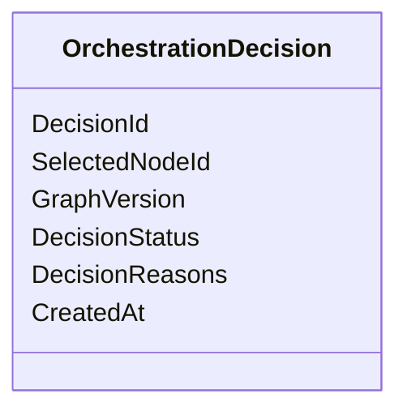
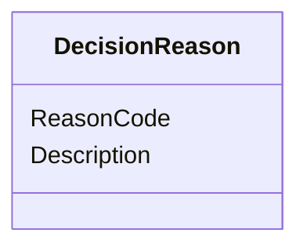
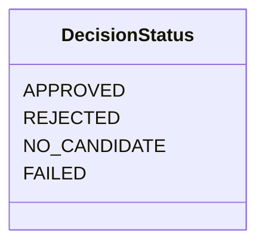
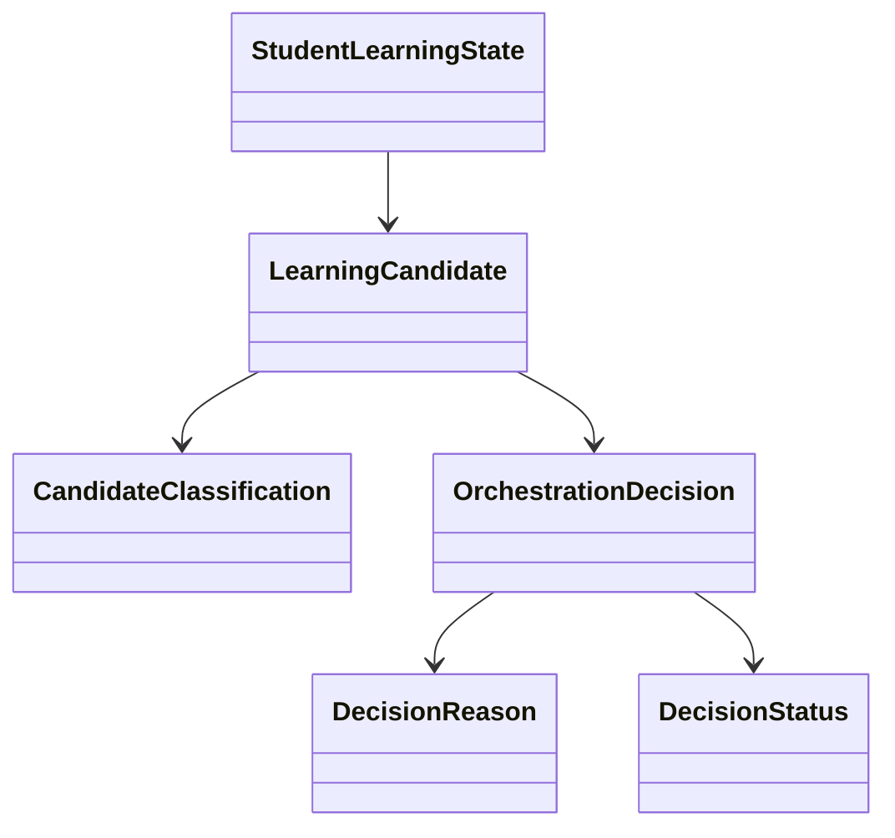
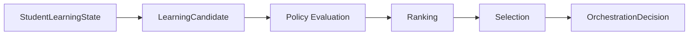
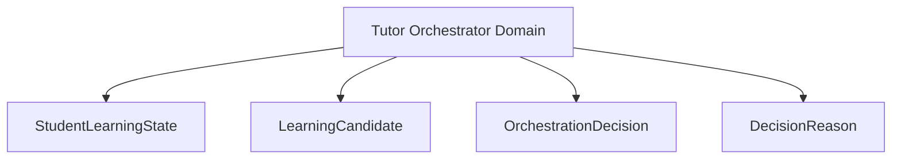

# Domain Model

## Overview

This document defines the core domain model of the AIGORA Tutor Orchestrator.

The domain model represents the deterministic pedagogical concepts used by the orchestration system to evaluate learning progression, generate candidates, apply policies, rank alternatives, and produce orchestration decisions.

The objective is to establish a shared language for the Tutor Orchestrator bounded context.

---

# Architectural Principle

The domain model represents business concepts, not implementation details.

Domain objects must:

* express pedagogical meaning
* remain framework-independent
* be immutable whenever possible
* support deterministic orchestration
* preserve auditability and traceability

The domain model must not contain:

* gRPC concerns
* HTTP concerns
* database concerns
* framework annotations
* infrastructure logic

---

# Domain Model Overview



The orchestration process transforms student state and learning candidates into a deterministic orchestration decision.

---

# Core Domain Concepts

| Domain Object           | Purpose                                                  |
| ----------------------- | -------------------------------------------------------- |
| StudentLearningState    | Represents the current learning state of a student       |
| LearningCandidate       | Represents a possible learning node that may be selected |
| CandidateClassification | Identifies the pedagogical purpose of a candidate        |
| OrchestrationDecision   | Represents the final orchestration outcome               |
| DecisionReason          | Explains why a decision was produced                     |
| DecisionStatus          | Represents the outcome status of a decision              |

---

# Student Learning State

## Purpose

Represents the current pedagogical state of a student.

The Tutor Orchestrator uses this information to evaluate progression, remediation, and regression decisions.

---

## Conceptual Model



---

## Responsibilities

* represent student progression
* represent mastery information
* represent learning history
* support policy evaluation
* support candidate ranking

---

## Example Fields

```text
studentId
currentNodeId
masteryLevel
completedNodes
lastEvaluationTimestamp
```

---

# Learning Candidate

## Purpose

Represents a potential learning node that may be selected by the orchestration process.

Candidates are generated before policies, ranking, and selection are executed.

---

## Conceptual Model



---

## Responsibilities

* represent a learning opportunity
* participate in policy evaluation
* participate in ranking
* participate in selection

---

## Example Fields

```text
nodeId
classification
priority
source
```

---

# Candidate Classification

## Purpose

Represents the pedagogical intention of a candidate.

---

## Enumeration



---

## Values

| Classification | Meaning                                |
| -------------- | -------------------------------------- |
| NEW_LEARNING   | Introduces new knowledge               |
| REINFORCEMENT  | Reinforces previously learned concepts |
| REMEDIATION    | Repairs insufficient mastery           |
| REGRESSION     | Returns to prerequisite knowledge      |

---

# Orchestration Decision

## Purpose

Represents the final outcome of the deterministic orchestration process.

Every orchestration cycle must produce exactly one decision outcome.

---

## Conceptual Model



---

## Responsibilities

* represent final node selection
* preserve auditability
* preserve traceability
* preserve graph version references
* preserve decision rationale

---

## Example Fields

```text
decisionId
selectedNodeId
graphVersion
status
decisionReasons
createdAt
```

---

# Decision Reason

## Purpose

Represents a traceable explanation for an orchestration outcome.

Decision reasons enable decision reconstruction and auditability.

---

## Conceptual Model



---

## Examples

```text
ELIGIBILITY_APPROVED

COMPLETION_POLICY_PASSED

REGRESSION_REQUIRED

RANKING_WINNER

TIE_BREAK_APPLIED
```

---

# Decision Status

## Purpose

Represents the final status of an orchestration execution.

---

## Enumeration



---

## Values

| Status       | Meaning                        |
| ------------ | ------------------------------ |
| APPROVED     | A learning node was selected   |
| REJECTED     | Candidates were rejected       |
| NO_CANDIDATE | No valid candidate existed     |
| FAILED       | Orchestration execution failed |

---

# Domain Relationship Diagram



---

# Decision Lifecycle

The domain model participates in the following orchestration lifecycle.



---

# Aggregate Ownership

The Tutor Orchestrator owns all orchestration domain objects.



The Curriculum Graph does not own orchestration domain objects.

The Curriculum Graph owns topology.

The Tutor Orchestrator owns decisions.

---

# Domain Invariants

The following invariants must always hold.

## Learning Candidate

A candidate must:

* reference a valid learning node
* contain a valid classification
* contain a deterministic source

---

## Orchestration Decision

A decision must:

* contain a status
* contain a graph version
* contain a timestamp
* contain at least one decision reason when approved

---

## Student Learning State

A student state must:

* reference a valid student
* contain a current learning position
* preserve completed learning history

---

# Future Domain Evolution

Future iterations may introduce:

```text
MasteryEvaluation

LearningObjective

KnowledgeGap

LearningRecommendation

OrchestrationSession

CandidateScore

DecisionTrace
```

without changing the ownership boundaries defined in this document.

---

# Related Documents

* [Package Structure](package-structure.md)
* [Layer Responsibilities](layer-responsibilities.md)
* [Dependency Rules](dependency-rules.md)
* [Application Contracts](application-contracts.md)
* [Ports and Adapters](ports-and-adapters.md)
* [Decision Lifecycle](../03-decision-engine/decision-lifecycle.md)
* [Decision Engine Architecture](../03-decision-engine/decision-engine-architecture.md)
