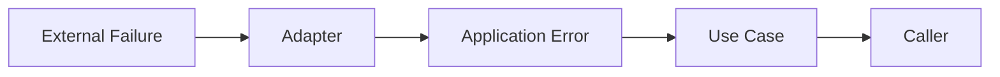
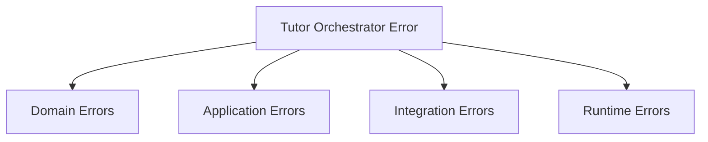
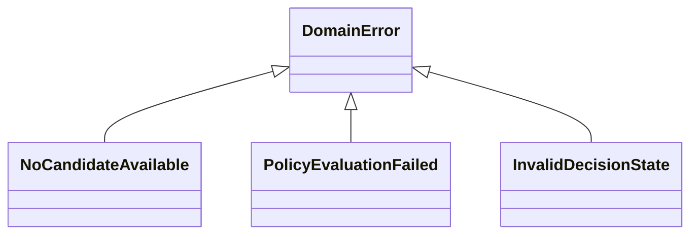
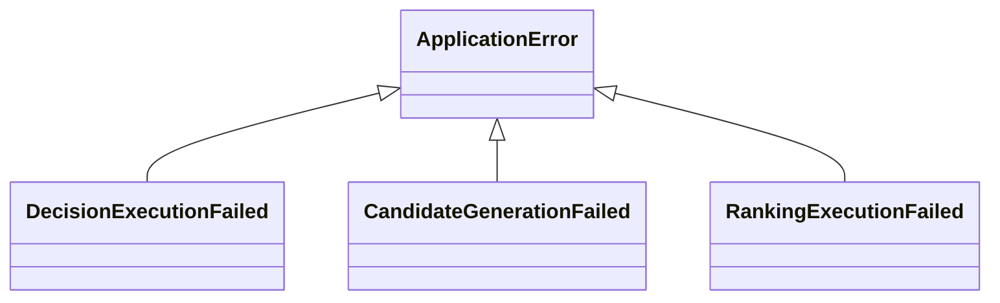
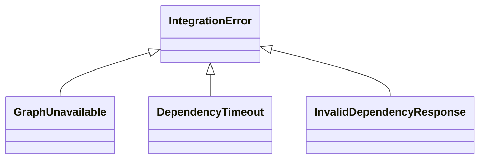
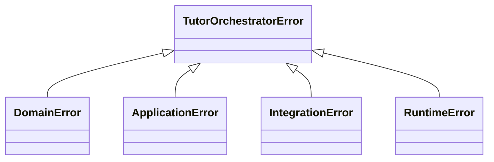
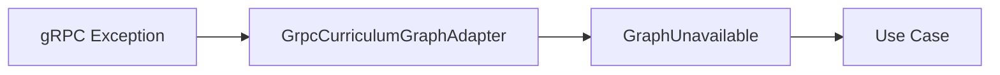
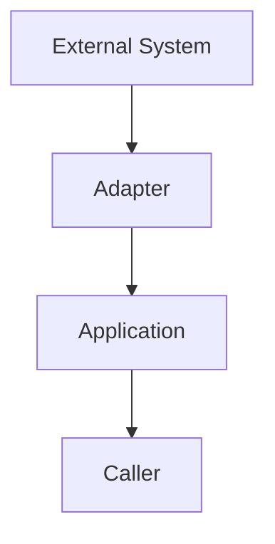
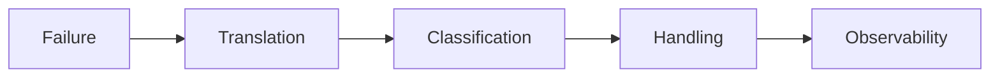

# Error Model

## Overview

This document defines the error model used by the AIGORA Tutor Orchestrator.

The objective is to establish a consistent, deterministic, and observable approach for representing, propagating, handling, and tracing failures across the orchestration platform.

The error model must support:

* deterministic orchestration
* bounded context isolation
* infrastructure abstraction
* observability
* auditability
* operational diagnostics

Errors must be treated as first-class architectural concepts.

---

# Architectural Principle

The Tutor Orchestrator must communicate failures through explicit domain-oriented error contracts.

Application and domain layers must never expose:

* gRPC exceptions
* HTTP exceptions
* framework exceptions
* database exceptions
* infrastructure-specific exceptions

Instead, infrastructure failures must be translated into orchestration errors.

---

# Error Architecture



External failures are translated into orchestration errors before entering the application core.

---

# Error Classification

Errors are grouped into four categories.



---

# Error Categories

| Category           | Responsibility                        |
| ------------------ | ------------------------------------- |
| Domain Errors      | Violations of orchestration rules     |
| Application Errors | Use case execution failures           |
| Integration Errors | External dependency failures          |
| Runtime Errors     | Infrastructure and execution failures |

---

# Domain Errors

## Purpose

Represent failures related to orchestration behavior.

These errors originate inside the domain model.

---

## Examples

```text
NoCandidateAvailable

PolicyEvaluationFailed

InvalidCandidateClassification

InvalidDecisionState

DecisionInvariantViolation
```

---

## Domain Error Diagram



---

# Application Errors

## Purpose

Represent failures during use case execution.

These errors occur when orchestration workflows cannot complete successfully.

---

## Examples

```text
DecisionExecutionFailed

CandidateGenerationFailed

RankingExecutionFailed

SelectionExecutionFailed
```

---

## Application Error Diagram



---

# Integration Errors

## Purpose

Represent failures caused by external dependencies.

Integration errors originate outside the Tutor Orchestrator bounded context.

---

## Examples

```text
GraphUnavailable

StudentModelUnavailable

AssessmentServiceUnavailable

DependencyTimeout

InvalidDependencyResponse
```

---

## Integration Error Diagram



---

# Runtime Errors

## Purpose

Represent infrastructure and execution failures.

These errors are usually handled at runtime boundaries.

---

## Examples

```text
ConfigurationFailure

SerializationFailure

UnexpectedExecutionFailure

ObservabilityFailure
```

---

# Error Hierarchy



All orchestration errors derive from a common root type.

---

# Error Translation

External exceptions must never enter the application layer.

---

## Incorrect Flow

```text
gRPC Exception
      ↓
Use Case
```

This leaks infrastructure concerns into orchestration logic.

---

## Correct Flow

```text
gRPC Exception
      ↓
GrpcCurriculumGraphAdapter
      ↓
GraphUnavailable
      ↓
Use Case
```

---

# Error Translation Diagram



---

# Error Ownership

Each layer owns a specific category of errors.

| Layer            | Error Ownership     |
| ---------------- | ------------------- |
| Domain           | Domain Errors       |
| Application      | Application Errors  |
| Adapters         | Error Translation   |
| Infrastructure   | Runtime Errors      |
| External Systems | External Exceptions |

---

# Error Propagation Rules

Errors must move upward through the architecture.



Dependency direction and error direction must remain consistent.

---

# Error Context

Every orchestration error should contain contextual information.

Recommended fields:

```text
errorCode

message

correlationId

timestamp

component

operation
```

---

# Error Context Example

```text
errorCode:
GRAPH_UNAVAILABLE

correlationId:
9b9d4f12

operation:
SelectNextLearningNode

component:
CurriculumGraphPort

timestamp:
2026-07-01T15:22:10Z
```

---

# Error Codes

Error codes should remain stable.

---

## Domain Codes

```text
NO_CANDIDATE_AVAILABLE

POLICY_EVALUATION_FAILED

INVALID_DECISION_STATE
```

---

## Integration Codes

```text
GRAPH_UNAVAILABLE

DEPENDENCY_TIMEOUT

INVALID_DEPENDENCY_RESPONSE
```

---

## Runtime Codes

```text
CONFIGURATION_FAILURE

SERIALIZATION_FAILURE

UNEXPECTED_EXECUTION_FAILURE
```

---

# Error Lifecycle



Every error should pass through a deterministic lifecycle.

---

# Observability Integration

Errors must integrate with:

* structured logging
* metrics
* tracing
* auditability

---

## Error Traceability

Every error should be traceable using:

```text
correlationId

decisionId

studentId

graphVersion
```

when available.

---

# Recoverable vs Non-Recoverable Errors

## Recoverable

Examples:

```text
DependencyTimeout

GraphUnavailable

StudentModelUnavailable
```

The orchestration process may retry or recover.

---

## Non-Recoverable

Examples:

```text
InvalidDecisionState

DecisionInvariantViolation

ConfigurationFailure
```

The orchestration process should fail immediately.

---

# Error Handling Matrix

| Error                     | Retryable |
| ------------------------- | --------- |
| GraphUnavailable          | Yes       |
| DependencyTimeout         | Yes       |
| StudentModelUnavailable   | Yes       |
| InvalidDependencyResponse | No        |
| InvalidDecisionState      | No        |
| ConfigurationFailure      | No        |
| SerializationFailure      | No        |

---

# Anti-Patterns

## Exposing gRPC Exceptions

Forbidden:

```text
Use Case
    ↓
StatusRuntimeException
```

Correct:

```text
Use Case
    ↓
GraphUnavailable
```

---

## Throwing Generic Exceptions

Forbidden:

```java
throw new RuntimeException(...)
```

Correct:

```java
throw new GraphUnavailable(...)
```

---

## Infrastructure Leaking Into Domain

Forbidden:

```text
EligibilityPolicy
    ↓
gRPC Exception
```

Domain logic must remain independent from infrastructure concerns.

---

# Governance Rules

The following rules are mandatory.

1. Every error must belong to a category.
2. Every error must have a stable error code.
3. Infrastructure exceptions must be translated.
4. Domain errors must remain framework-independent.
5. Error translation belongs to adapters.
6. Runtime failures must be observable.
7. Error propagation must preserve context.
8. Generic exceptions are prohibited in orchestration flows.

---

# Future Evolution

Future iterations may introduce:

```text
Error Registry

Error Catalog

Retry Policies

Circuit Breakers

Distributed Failure Tracing

Failure Analytics
```

without changing the core error hierarchy.

---

# Related Documents

* [Package Structure](package-structure.md)
* [Layer Responsibilities](layer-responsibilities.md)
* [Dependency Rules](dependency-rules.md)
* [Ports and Adapters](ports-and-adapters.md)
* [Application Contracts](application-contracts.md)
* [Testing Strategy](testing-strategy.md)
* [Runtime Architecture](../06-integration/runtime-architecture.md)
* [Auditability Engine](../03-decision-engine/auditability-engine.md)
