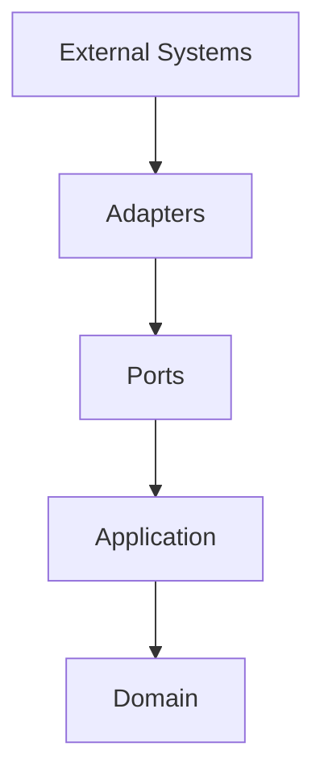
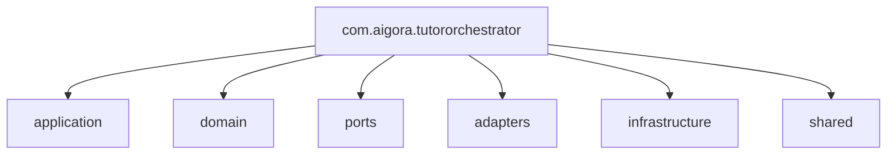
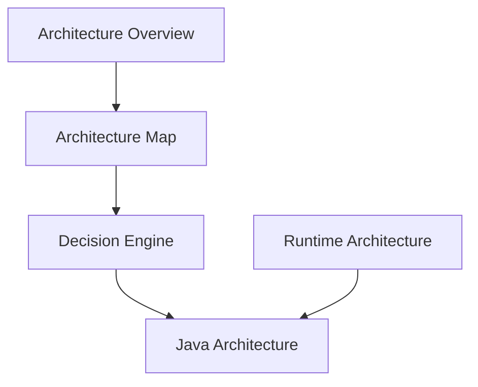

# Java Architecture

**Last Updated:** 2026-06-06

This section defines the Java architecture of the AIGORA Tutor Orchestrator.

The objective is to establish a scalable, maintainable, and deterministic architecture foundation before implementation begins.

The Tutor Orchestrator follows a Ports and Adapters architecture combined with deterministic orchestration principles, explicit application contracts, bounded context isolation, and contract-driven integration.

---

# Overview

The Java architecture is organized into a set of complementary documents.

Each document focuses on a specific architectural concern.

```mermaid
flowchart LR

packages["Package Structure"]

layers["Layer Responsibilities"]

dependencies["Dependency Rules"]

domain["Domain Model"]

contracts["Application Contracts"]

ports["Ports & Adapters"]

errors["Error Model"]

testing["Testing Strategy"]

packages --> layers
layers --> dependencies
dependencies --> domain
domain --> contracts
contracts --> ports
ports --> errors
errors --> testing
```



The recommended reading order follows the architecture progression from structural concerns to behavioral concerns.

---

---

# Physical vs Logical Architecture

The Java Architecture documentation describes two complementary views of the Tutor Orchestrator.

## Physical Service Structure

Represents how the Tutor Orchestrator is deployed inside the AIGORA platform.

Example:

```text
services/

├── tutor-orchestrator
├── student-model
├── assessment-engine
└── api-gateway
```

Each service is independently deployable and owns its own runtime lifecycle.

## Logical Package Structure

Represents the internal organization of code inside the Tutor Orchestrator service.

Example:

```text
src/main/java/com/aigora/tutororchestrator

├── application
├── domain
├── ports
├── adapters
├── infrastructure
└── shared
```

The physical architecture organizes services.

The logical architecture organizes code within a service.

Both views are required to understand the complete architecture of the Tutor Orchestrator.

---

# Reading Order

For new contributors, the recommended reading sequence is:

```text
1. Package Structure
2. Layer Responsibilities
3. Dependency Rules
4. Domain Model
5. Application Contracts
6. Ports and Adapters
7. Error Model
8. Testing Strategy
```

This sequence progressively introduces:

* package organization
* architectural boundaries
* dependency direction
* domain concepts
* application workflows
* integration contracts
* failure handling
* testing philosophy

---

# Architecture Documentation

## Foundation

Defines the structural foundation of the Java codebase.

| Document                                            | Purpose                                               |
| --------------------------------------------------- | ----------------------------------------------------- |
| [Package Structure](package-structure.md)           | Defines package organization and architectural layers |
| [Layer Responsibilities](layer-responsibilities.md) | Defines ownership boundaries for each layer           |
| [Dependency Rules](dependency-rules.md)             | Defines allowed and forbidden dependencies            |

---

## Domain Design

Defines the core orchestration domain.

| Document                                          | Purpose                                  |
| ------------------------------------------------- | ---------------------------------------- |
| [Domain Model](domain-model.md)                   | Defines orchestration domain concepts    |
| [Application Contracts](application-contracts.md) | Defines commands, results, and use cases |

---

## Integration Architecture

Defines interaction with external systems.

| Document                                    | Purpose                                               |
| ------------------------------------------- | ----------------------------------------------------- |
| [Ports and Adapters](ports-and-adapters.md) | Defines integration boundaries and contract ownership |
| [Error Model](error-model.md)               | Defines error classification and propagation          |

---

## Quality and Governance

Defines validation and architectural enforcement.

| Document                                | Purpose                                              |
| --------------------------------------- | ---------------------------------------------------- |
| [Testing Strategy](testing-strategy.md) | Defines testing architecture and validation strategy |

---

# High-Level Architecture



The architecture is designed to preserve:

* deterministic behavior
* dependency inversion
* bounded context isolation
* infrastructure independence
* long-term maintainability

---

# Architectural Principles

The Tutor Orchestrator Java architecture is based on the following principles:

## Deterministic First

The same orchestration input must always produce the same orchestration output.

---

## Domain-Centric Design

Business rules belong to the domain layer.

Infrastructure must not own orchestration behavior.

---

## Dependency Inversion

Application logic depends on abstractions rather than implementations.

---

## Contract-Driven Integration

External systems are accessed through explicit contracts.

---

## Bounded Context Isolation

The Tutor Orchestrator owns orchestration.

External systems own their respective domains.

---

## Auditability by Design

Every orchestration decision must be traceable and reproducible.

---

# Package Ownership Model



Each package has a clearly defined responsibility and ownership boundary.

---

# Scope

This section defines:

* package organization
* dependency direction
* layer ownership
* domain models
* application contracts
* integration contracts
* error handling
* testing strategy

This section does not define:

* Curriculum Graph internals
* Neo4j schema
* Student Model architecture
* Assessment Engine architecture
* Learning Session Engine architecture

Those concerns belong to their respective bounded contexts.

---

# Relationship to Other Documentation

The Java Architecture documentation builds upon the conceptual architecture already defined in the Tutor Orchestrator documentation.



The Java Architecture section translates architectural concepts into implementation-ready structures.

It serves as the bridge between architecture design and future implementation.


---

# Ownership

The Tutor Orchestrator Java architecture owns:

```text
Package Structure
Dependency Rules
Application Contracts
Ports
Adapters
Error Model
Testing Strategy
```

The Java architecture does not own:

```text
Curriculum Topology
Graph Traversal
Neo4j Persistence
Assessment Logic
Student State Ownership
```

These responsibilities remain outside the Tutor Orchestrator bounded context.

---

# Related Documents

* [Architecture Overview](../01-overview/architecture-overview.md)
* [Architecture Map](../01-overview/architecture-map.md)
* [Runtime Architecture](../06-integration/runtime-architecture.md)
* [Decision Engine Architecture](../03-decision-engine/decision-engine-architecture.md)
* [ADR Index](../adr/index.md)
