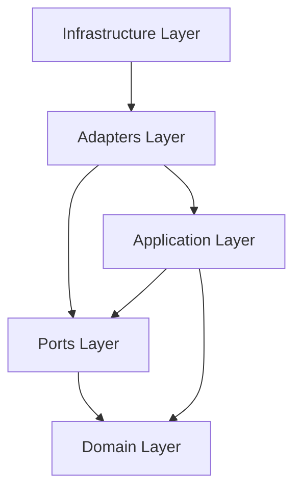

# Layer Responsibilities

## Overview

This document defines the responsibility boundaries for each Java architecture layer of the AIGORA Tutor Orchestrator.

The objective is to make explicit what each layer owns, what each layer may depend on, and what must never be placed inside each layer.

This document complements:

* [Package Structure](package-structure.md)
* [Dependency Rules](dependency-rules.md)
* [Ports and Adapters](ports-and-adapters.md)

---

# Architectural Principle

Each layer must own a single architectural responsibility.

The Tutor Orchestrator follows a Ports and Adapters architecture where:

* the domain layer owns deterministic orchestration rules
* the application layer coordinates use cases
* ports define boundaries
* adapters translate external protocols
* infrastructure provides runtime wiring and technical capabilities

No layer should accumulate responsibilities that belong to another layer.

---

# Layer Overview

| Layer          | Main Responsibility                                           |
| -------------- | ------------------------------------------------------------- |
| Domain         | Deterministic orchestration rules and domain models           |
| Application    | Use case orchestration and application flow                   |
| Ports          | Explicit input and output contracts                           |
| Adapters       | Protocol and integration translation                          |
| Infrastructure | Framework, configuration, observability, and runtime concerns |
| Shared         | Stable low-level abstractions                                 |

---

# Layer Dependency Model



The domain layer must remain the most stable and least dependent layer.

---

# Domain Layer

Package:

```text
com.aigora.tutororchestrator.domain
```

The domain layer owns deterministic orchestration concepts and rules.

## Responsibilities

* model orchestration domain concepts
* represent learning candidates
* represent orchestration decisions
* execute deterministic policies
* execute deterministic ranking rules
* represent decision reasons
* preserve business invariants

## Allowed Content

* entities
* value objects
* domain services
* policies
* ranking strategies
* decision models
* pure domain exceptions

## Examples

```text
LearningCandidate
StudentLearningState
OrchestrationDecision
DecisionReason

EligibilityPolicy
CompletionPolicy
RegressionPolicy

DeterministicCandidateRanking
```

## Must Not Contain

* Spring annotations
* gRPC stubs
* HTTP request DTOs
* database entities
* repository implementations
* logging framework code
* configuration classes
* external service clients

The domain layer must be framework-independent.

---

# Application Layer

Package:

```text
com.aigora.tutororchestrator.application
```

The application layer coordinates use cases and orchestration flows.

## Responsibilities

* execute application use cases
* coordinate domain policies and ranking
* call output ports
* receive input commands
* return application results
* coordinate orchestration flow
* translate domain outcomes into use case results

## Allowed Content

* use cases
* command objects
* result objects
* application services
* application-level orchestration flow
* application exceptions

## Examples

```text
SelectNextLearningNodeUseCase
SelectRegressionNodeUseCase
EvaluateLearningProgressUseCase

SelectNextLearningNodeCommand
SelectNextLearningNodeResult
```

## Must Not Contain

* controller logic
* gRPC implementation details
* database access code
* framework-specific configuration
* direct Neo4j access
* protocol-specific DTOs
* infrastructure exception mapping

The application layer depends on abstractions, not concrete adapters.

---

# Ports Layer

Package:

```text
com.aigora.tutororchestrator.ports
```

The ports layer defines explicit boundaries between the application core and external systems.

## Responsibilities

* define input ports
* define output ports
* isolate application logic from adapters
* define integration contracts
* prevent infrastructure leakage into core logic

## Allowed Content

* input port interfaces
* output port interfaces
* port request contracts
* port response contracts
* port-level error abstractions

## Examples

```text
SelectNextLearningNodePort
EvaluateLearningProgressPort

CurriculumGraphPort
StudentModelPort
AssessmentPort
DecisionTracePort
```

## Must Not Contain

* gRPC stubs
* HTTP controllers
* database access
* framework-specific configuration
* adapter implementations
* protocol-specific generated classes

Ports define contracts only.

---

# Adapters Layer

Package:

```text
com.aigora.tutororchestrator.adapters
```

The adapters layer translates external protocols into internal application and port contracts.

## Responsibilities

* implement input adapters
* implement output adapters
* translate protocol DTOs
* map external errors into application errors
* isolate framework and protocol details
* adapt gRPC, HTTP, or messaging interfaces

## Allowed Content

* REST controllers
* gRPC clients
* gRPC mappers
* HTTP request/response mappers
* adapter-specific error mappers
* external service adapters

## Examples

```text
TutorOrchestratorController

GrpcCurriculumGraphAdapter
CurriculumGraphGrpcMapper
CurriculumGraphGrpcErrorMapper
```

## Must Not Contain

* domain decision logic
* policy evaluation rules
* ranking rules
* final selection logic
* direct mutation of domain state outside use cases
* orchestration flow ownership

Adapters translate. They do not decide.

---

# Infrastructure Layer

Package:

```text
com.aigora.tutororchestrator.infrastructure
```

The infrastructure layer owns technical runtime concerns.

## Responsibilities

* dependency injection configuration
* framework configuration
* observability configuration
* error handling configuration
* runtime properties
* logging setup
* gRPC client configuration

## Allowed Content

* Spring configuration classes
* application properties binding
* observability setup
* global exception handling
* correlation ID infrastructure
* runtime wiring

## Examples

```text
TutorOrchestratorConfiguration
GrpcClientConfiguration
ObservabilityConfiguration
GlobalExceptionHandler
CorrelationIdProvider
```

## Must Not Contain

* domain rules
* policy evaluation
* ranking strategies
* candidate selection
* pedagogical decisions
* graph traversal logic

Infrastructure wires the system. It does not own orchestration behavior.

---

# Shared Layer

Package:

```text
com.aigora.tutororchestrator.shared
```

The shared layer contains stable low-level abstractions used across layers.

## Responsibilities

* provide stable technical primitives
* avoid duplicated low-level utilities
* support cross-cutting identifiers and time abstractions

## Allowed Content

* correlation identifiers
* clock abstractions
* stable identifiers
* immutable utility types

## Examples

```text
CorrelationId
ClockProvider
Identifier
```

## Must Not Contain

* business rules
* orchestration decisions
* policies
* ranking logic
* adapter logic
* framework configuration

The shared layer must remain small.

If shared code starts accumulating orchestration behavior, it must move to the domain or application layer.

---

# Responsibility Matrix

| Concern             | Owning Layer            |
| ------------------- | ----------------------- |
| Domain models       | Domain                  |
| Policies            | Domain                  |
| Ranking rules       | Domain                  |
| Use case flow       | Application             |
| Input contracts     | Ports                   |
| Output contracts    | Ports                   |
| HTTP controllers    | Adapters                |
| gRPC clients        | Adapters                |
| Configuration       | Infrastructure          |
| Observability setup | Infrastructure          |
| Correlation IDs     | Shared / Infrastructure |

---

# Boundary Rules

The following rules must always be preserved:

1. Domain must not depend on frameworks.
2. Application must not depend on adapters.
3. Ports must not contain protocol-specific DTOs.
4. Adapters must not own orchestration decisions.
5. Infrastructure must not contain business rules.
6. Shared must remain minimal and stable.
7. External systems must be accessed only through output ports.
8. Use cases must be invoked only through input ports or application services.

---

# Anti-Patterns

The following designs are explicitly forbidden.

## Domain Calling Infrastructure

```text
domain.policy -> infrastructure.grpc
```

This violates dependency direction.

## Use Case Instantiating gRPC Client

```text
SelectNextLearningNodeUseCase -> GrpcCurriculumGraphClient
```

Use cases must depend on `CurriculumGraphPort`, not concrete adapters.

## Controller Executing Domain Rules

```text
TutorOrchestratorController -> EligibilityPolicy
```

Controllers must delegate to application use cases.

## Infrastructure Owning Policy Logic

```text
GrpcClientConfiguration -> RegressionPolicy
```

Infrastructure must not own orchestration behavior.

---

# Testing Implications

Layer responsibilities must be enforced through tests.

Recommended test types:

* domain unit tests
* application use case tests
* adapter contract tests
* architecture dependency tests
* integration tests for external adapters

Architecture tests should verify that dependency rules are not violated.

---

# Related Documents

* [Package Structure](package-structure.md)
* [Dependency Rules](dependency-rules.md)
* [Ports and Adapters](ports-and-adapters.md)
* [Domain Model](domain-model.md)
* [Application Contracts](application-contracts.md)
* [Testing Strategy](testing-strategy.md)
* [Decision Engine Architecture](../03-decision-engine/decision-engine-architecture.md)
