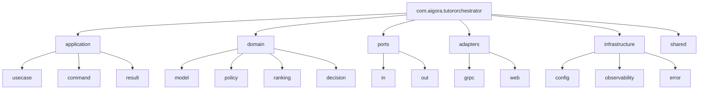
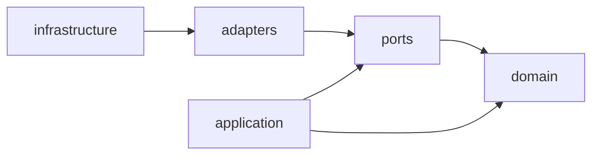
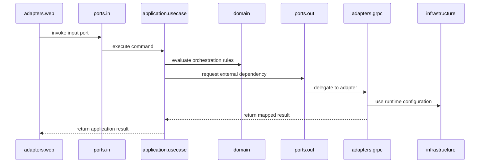

# Package Structure

## Overview

This document defines the initial Java package structure for the AIGORA Tutor Orchestrator.

The package structure follows a Ports and Adapters architecture with explicit separation between application orchestration, domain rules, ports, adapters, infrastructure concerns, and shared technical utilities.

The objective is to preserve:

* deterministic orchestration boundaries
* clean dependency direction
* isolated domain logic
* explicit integration contracts
* testability
* long-term maintainability

---

# Base Package

All Tutor Orchestrator Java code must live under the following base package:

```text
com.aigora.tutororchestrator
```

This package is the root namespace for the Tutor Orchestrator bounded context.

---

# High-Level Package Structure

```text
com.aigora.tutororchestrator

├── application
│   ├── usecase
│   ├── command
│   └── result
│
├── domain
│   ├── model
│   ├── policy
│   ├── ranking
│   └── decision
│
├── ports
│   ├── in
│   └── out
│
├── adapters
│   ├── grpc
│   └── web
│
├── infrastructure
│   ├── config
│   ├── observability
│   └── error
│
└── shared
```

---

# Package Architecture Diagram



---

# Architectural Layers

The package structure is organized into architectural layers.

| Package          | Layer                | Responsibility                                                       |
| ---------------- | -------------------- | -------------------------------------------------------------------- |
| `application`    | Application Layer    | Coordinates use cases and orchestration flows                        |
| `domain`         | Domain Layer         | Owns deterministic orchestration rules and domain models             |
| `ports`          | Boundary Layer       | Defines input and output contracts                                   |
| `adapters`       | Adapter Layer        | Implements external interfaces and integrations                      |
| `infrastructure` | Infrastructure Layer | Owns framework, configuration, observability, and technical concerns |
| `shared`         | Shared Kernel        | Contains cross-cutting utilities and stable shared abstractions      |

---

# Dependency Direction

Dependencies must point inward toward the domain and application core.



## Dependency Rules

* `domain` must not depend on any other package.
* `application` may depend on `domain` and `ports`.
* `ports` may depend on `domain` types when needed for contract definitions.
* `adapters` may depend on `ports`, `application`, and `domain`.
* `infrastructure` may depend on adapters and application configuration.
* `shared` must remain minimal and stable.

The domain package must remain framework-independent.

---

# Application Package

```text
com.aigora.tutororchestrator.application

├── usecase
├── command
└── result
```

The `application` package coordinates orchestration use cases.

## Responsibilities

* execute application use cases
* coordinate domain services and policies
* consume ports
* return application results
* enforce application flow

## Example Classes

```text
SelectNextLearningNodeUseCase
SelectRegressionNodeUseCase
EvaluateLearningProgressUseCase

SelectNextLearningNodeCommand
SelectRegressionNodeCommand
EvaluateLearningProgressCommand

SelectNextLearningNodeResult
SelectRegressionNodeResult
EvaluateLearningProgressResult
```

The application layer must not contain infrastructure-specific code.

---

# Domain Package

```text
com.aigora.tutororchestrator.domain

├── model
├── policy
├── ranking
└── decision
```

The `domain` package owns deterministic orchestration logic.

## Responsibilities

* represent orchestration domain concepts
* enforce deterministic policy rules
* model candidate ranking behavior
* represent orchestration decisions
* remain independent from external systems

## Example Classes

```text
StudentLearningState
LearningCandidate
OrchestrationDecision
DecisionReason

EligibilityPolicy
RegressionPolicy
CompletionPolicy

DeterministicCandidateRanking
```

The domain layer must not depend on Spring, gRPC, databases, HTTP, or infrastructure code.

---

# Ports Package

```text
com.aigora.tutororchestrator.ports

├── in
└── out
```

The `ports` package defines explicit boundaries.

## Input Ports

Input ports represent operations exposed by the Tutor Orchestrator.

```text
SelectNextLearningNodePort
SelectRegressionNodePort
EvaluateLearningProgressPort
```

## Output Ports

Output ports represent dependencies consumed by the Tutor Orchestrator.

```text
CurriculumGraphPort
StudentModelPort
AssessmentPort
DecisionTracePort
```

Ports define contracts, not implementations.

---

# Adapters Package

```text
com.aigora.tutororchestrator.adapters

├── grpc
└── web
```

The `adapters` package adapts external technologies to internal ports.

## gRPC Adapters

```text
GrpcCurriculumGraphAdapter
CurriculumGraphGrpcMapper
CurriculumGraphGrpcErrorMapper
```

## Web Adapters

```text
TutorOrchestratorController
SelectNextLearningNodeRequestMapper
SelectNextLearningNodeResponseMapper
```

Adapters may depend on framework and protocol-specific libraries.

They must not leak infrastructure models into the domain.

---

# Infrastructure Package

```text
com.aigora.tutororchestrator.infrastructure

├── config
├── observability
└── error
```

The `infrastructure` package owns runtime and technical concerns.

## Responsibilities

* application configuration
* dependency injection wiring
* observability configuration
* global error mapping
* framework-specific runtime configuration

## Example Classes

```text
TutorOrchestratorConfiguration
GrpcClientConfiguration
ObservabilityConfiguration

StructuredLogFactory
CorrelationIdProvider

GlobalExceptionHandler
ApplicationErrorMapper
```

Infrastructure must not own domain decisions.

---

# Shared Package

```text
com.aigora.tutororchestrator.shared
```

The `shared` package contains stable cross-cutting abstractions.

## Allowed Content

* identifiers
* value formatting helpers
* time abstractions
* correlation identifiers
* immutable utility types

## Example Classes

```text
CorrelationId
ClockProvider
Identifier
```

Shared code must remain small.

If a shared abstraction starts accumulating business behavior, it must move to a proper domain package.

---

# Package Dependency Matrix

| From             | May Depend On                      |
| ---------------- | ---------------------------------- |
| `domain`         | none                               |
| `application`    | `domain`, `ports`                  |
| `ports`          | `domain`                           |
| `adapters`       | `ports`, `application`, `domain`   |
| `infrastructure` | `application`, `adapters`, `ports` |
| `shared`         | stable low-level abstractions only |

---

# Forbidden Dependencies

The following dependencies are forbidden:

| Package          | Must Not Depend On                                                 |
| ---------------- | ------------------------------------------------------------------ |
| `domain`         | `application`, `ports`, `adapters`, `infrastructure`, Spring, gRPC |
| `application`    | `adapters`, `infrastructure`, Spring controllers, gRPC stubs       |
| `ports`          | `adapters`, `infrastructure`, protocol-specific DTOs               |
| `adapters`       | direct domain mutation outside use cases                           |
| `infrastructure` | domain decision logic                                              |

---

# Runtime Package Interaction



---

# Package Ownership Rules

1. Domain models must remain independent from frameworks.
2. Use cases must depend on ports, not adapters.
3. gRPC stubs must never enter the domain layer.
4. HTTP request and response DTOs must never enter the domain layer.
5. Infrastructure configuration must not contain orchestration decisions.
6. External dependency failures must be mapped before entering application flow.
7. Package boundaries must be testable through architecture tests.

---

# Initial Implementation Scope

The first implementation phase should create the package structure and only the minimum classes required to validate boundaries.

Initial focus:

* package skeleton
* application use case contracts
* domain model placeholders
* output port interfaces
* gRPC adapter placeholders
* error model placeholders
* architecture tests for dependency direction

Implementation of full orchestration behavior should happen after package boundaries are validated.

---

# Related Documents

* [Layer Responsibilities](layer-responsibilities.md)
* [Dependency Rules](dependency-rules.md)
* [Domain Model](domain-model.md)
* [Application Contracts](application-contracts.md)
* [Ports and Adapters](ports-and-adapters.md)
* [Error Model](error-model.md)
* [Testing Strategy](testing-strategy.md)
* [Decision Engine Architecture](../03-decision-engine/decision-engine-architecture.md)
* [Runtime Architecture](../06-integration/runtime-architecture.md)
