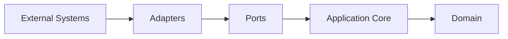
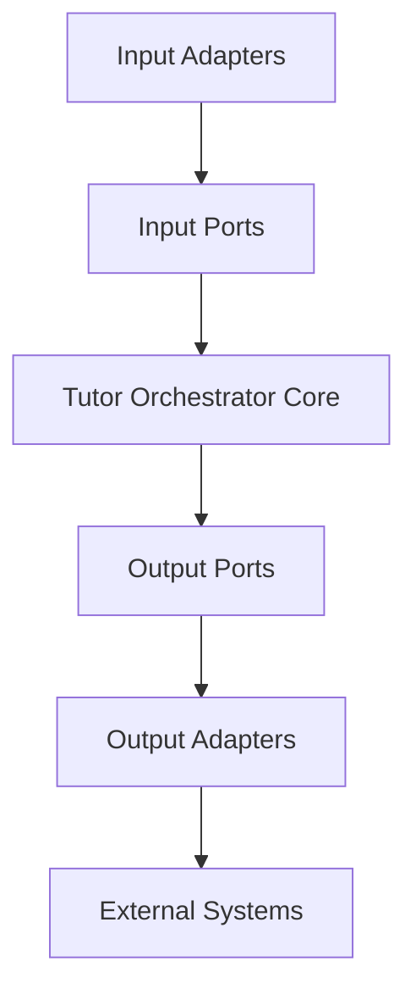
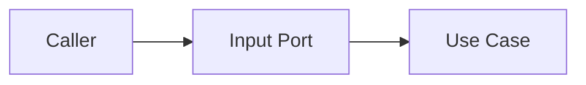
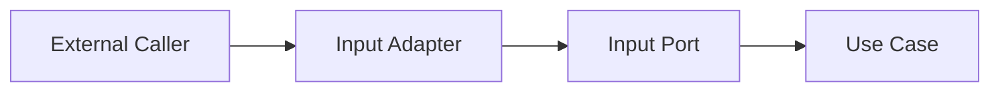
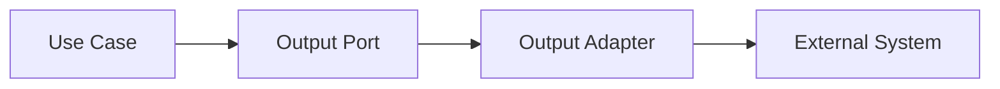
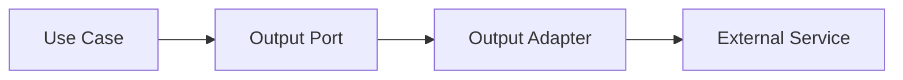
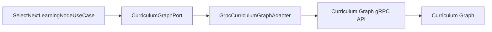
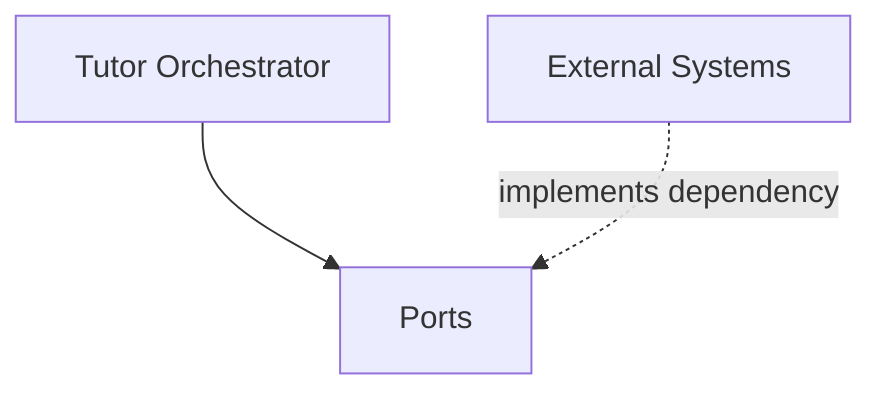
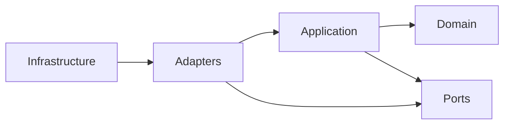

# Ports and Adapters

## Overview

This document defines the Ports and Adapters architecture used by the AIGORA Tutor Orchestrator.

The objective is to isolate orchestration logic from infrastructure concerns, external systems, communication protocols, and implementation details.

The Tutor Orchestrator follows a dependency inversion model where the application core depends on abstractions rather than concrete implementations.

This architecture enables:

* deterministic orchestration
* bounded context isolation
* testability
* infrastructure independence
* contract-driven integration
* long-term maintainability

---

# Architectural Principle

The Tutor Orchestrator must never depend directly on:

* gRPC clients
* HTTP clients
* databases
* messaging systems
* framework-specific implementations

Instead, the application core interacts with external dependencies through explicit ports.

Adapters implement those ports.

```text
Application Core
        ↓
      Ports
        ↓
    Adapters
        ↓
External Systems
```

---

# High-Level Architecture



The orchestration core remains isolated from external technologies.

---

# Ports and Adapters Overview



Ports define boundaries.

Adapters implement boundaries.

---

# Input Ports

## Purpose

Input ports define operations exposed by the Tutor Orchestrator.

They represent application capabilities.

Input ports describe what the system can do.

---

# Input Port Model



---

## Initial Input Ports

### SelectNextLearningNodePort

Purpose:

```text
Select the next learning node.
```

---

### SelectRegressionNodePort

Purpose:

```text
Evaluate regression requirements.
```

---

### EvaluateLearningProgressPort

Purpose:

```text
Evaluate progression eligibility.
```

---

# Input Port Catalog

| Port                         | Responsibility                   |
| ---------------------------- | -------------------------------- |
| SelectNextLearningNodePort   | Select next learning node        |
| SelectRegressionNodePort     | Evaluate regression requirements |
| EvaluateLearningProgressPort | Evaluate progression state       |

---

# Input Adapter Layer

Input adapters receive requests from external callers and translate them into application contracts.

Examples:

```text
REST API
GraphQL API
CLI
Message Consumers
Future Agent Interfaces
```

---

# Input Adapter Diagram



---

# Example Input Adapter

```text
TutorOrchestratorController
```

Responsibilities:

* receive HTTP requests
* validate transport-level payloads
* map requests into commands
* invoke input ports
* return responses

Responsibilities do not include:

* ranking
* policy evaluation
* candidate selection
* orchestration decisions

---

# Output Ports

## Purpose

Output ports define dependencies required by the Tutor Orchestrator.

They represent capabilities provided by external systems.

Output ports describe what the application needs.

---

# Output Port Model



---

# Initial Output Ports

## CurriculumGraphPort

Purpose:

```text
Retrieve curriculum topology information.
```

Responsibilities:

* adjacent nodes
* prerequisites
* dependencies
* graph traversal
* graph version retrieval

---

## StudentModelPort

Purpose:

```text
Retrieve student state information.
```

Responsibilities:

* mastery retrieval
* progression state
* learning history

---

## AssessmentPort

Purpose:

```text
Retrieve assessment information.
```

Responsibilities:

* assessment outcomes
* evaluation results
* mastery indicators

---

## DecisionTracePort

Purpose:

```text
Persist orchestration traceability.
```

Responsibilities:

* decision trace persistence
* auditability records
* ranking traces
* policy traces

---

# Output Port Catalog

| Port                | Responsibility             |
| ------------------- | -------------------------- |
| CurriculumGraphPort | Curriculum topology access |
| StudentModelPort    | Student state retrieval    |
| AssessmentPort      | Assessment retrieval       |
| DecisionTracePort   | Auditability persistence   |

---

# Output Adapter Layer

Output adapters implement output ports.

Output adapters translate internal contracts into external protocol interactions.

---

# Output Adapter Diagram



---

# Curriculum Graph Integration

The Curriculum Graph is the first external dependency of the Tutor Orchestrator.

---

## Integration Flow



The use case never communicates directly with gRPC.

The adapter owns protocol-specific behavior.

---

# Contract-Driven Integration

The application layer depends exclusively on port contracts.

```text
Application
    ↓
CurriculumGraphPort
    ↓
GrpcCurriculumGraphAdapter
```

The application layer never knows:

```text
gRPC
Neo4j
HTTP
serialization
networking
```

This preserves infrastructure independence.

---

# Port Ownership

Ports belong to the Tutor Orchestrator bounded context.

External systems do not define Tutor Orchestrator ports.



The Tutor Orchestrator owns its own abstractions.

---

# Adapter Ownership

Adapters belong to the integration boundary.

They exist to isolate protocol and infrastructure concerns.

---

## Adapter Responsibilities

Adapters may:

* translate requests
* translate responses
* translate errors
* call external services
* handle protocol-specific details

Adapters must not:

* rank candidates
* evaluate policies
* select nodes
* own orchestration decisions
* own business rules

---

# Port Package Structure

```text
ports

├── in
│
│   ├── SelectNextLearningNodePort
│   ├── SelectRegressionNodePort
│   └── EvaluateLearningProgressPort
│
└── out
    ├── CurriculumGraphPort
    ├── StudentModelPort
    ├── AssessmentPort
    └── DecisionTracePort
```

---

# Adapter Package Structure

```text
adapters

├── web
│
│   ├── TutorOrchestratorController
│   ├── RequestMapper
│   └── ResponseMapper
│
└── grpc
    ├── GrpcCurriculumGraphAdapter
    ├── CurriculumGraphGrpcMapper
    └── CurriculumGraphGrpcErrorMapper
```

---

# Dependency Boundary



Dependency direction must always point inward.

---

# Testing Strategy

Ports enable testing without external systems.

Example:

```text
SelectNextLearningNodeUseCase
        ↓
Fake CurriculumGraphPort
```

instead of:

```text
SelectNextLearningNodeUseCase
        ↓
Real gRPC Service
```

This improves:

* test speed
* determinism
* isolation

---

# Anti-Patterns

## Direct gRPC Usage

Forbidden:

```text
UseCase
    ↓
gRPC Client
```

Correct:

```text
UseCase
    ↓
CurriculumGraphPort
    ↓
GrpcCurriculumGraphAdapter
```

---

## Domain Depending on External Services

Forbidden:

```text
EligibilityPolicy
    ↓
Curriculum Graph API
```

Policies must receive data.

They must not retrieve data.

---

## Adapter Owning Business Logic

Forbidden:

```text
GrpcCurriculumGraphAdapter
    ↓
Candidate Ranking
```

Adapters translate.

They do not decide.

---

# Future Evolution

Future integrations may introduce:

```text
Student Model Service

Assessment Engine

Learning Session Engine

LLM Gateway

Recommendation Engine
```

without changing the application core.

Only new ports and adapters are added.

---

# Governance Rules

The following rules are mandatory.

1. Every external dependency must be accessed through an output port.
2. Every externally exposed operation must be represented by an input port.
3. Adapters must implement ports.
4. Application use cases must depend on ports.
5. Domain objects must never depend on adapters.
6. Ports must remain technology-agnostic.
7. Adapters must own protocol translation.
8. External systems must never leak implementation details into the orchestration core.

---

# Related Documents

* [Package Structure](package-structure.md)
* [Layer Responsibilities](layer-responsibilities.md)
* [Dependency Rules](dependency-rules.md)
* [Domain Model](domain-model.md)
* [Application Contracts](application-contracts.md)
* [Runtime Architecture](../06-integration/runtime-architecture.md)
* [Curriculum Graph Contracts](../06-integration/curriculum-graph-contracts.md)
* [Decision Engine Architecture](../03-decision-engine/decision-engine-architecture.md)
