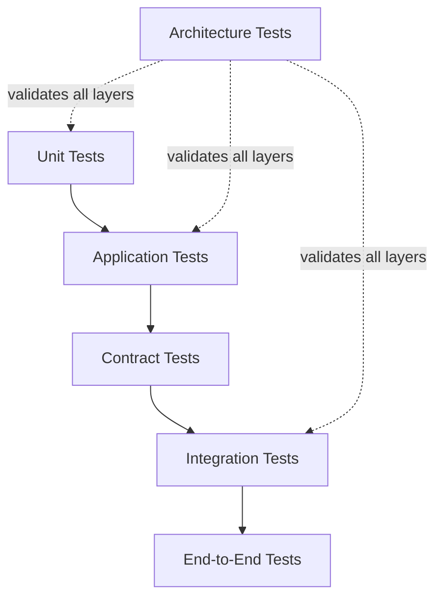
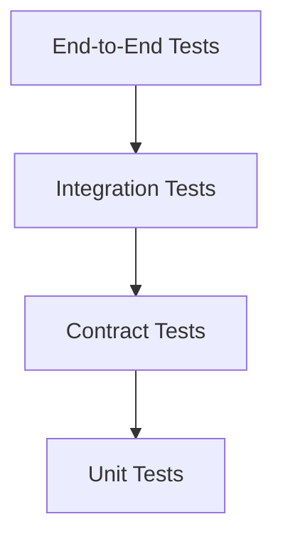
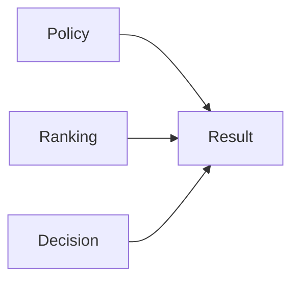
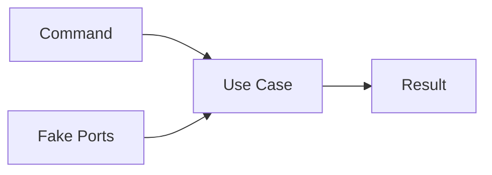
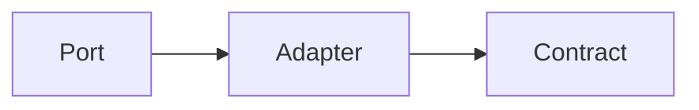
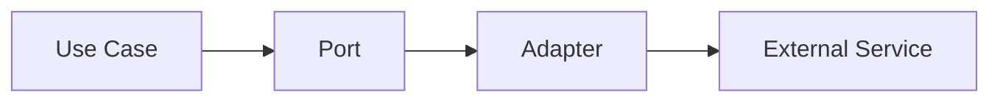
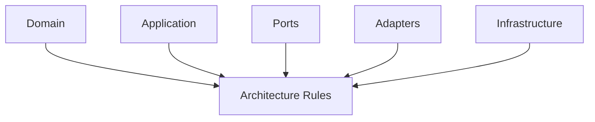
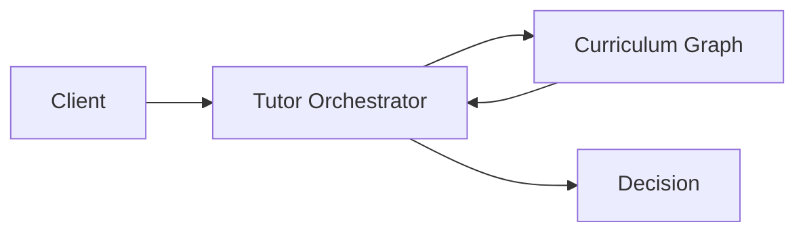
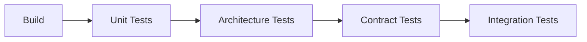
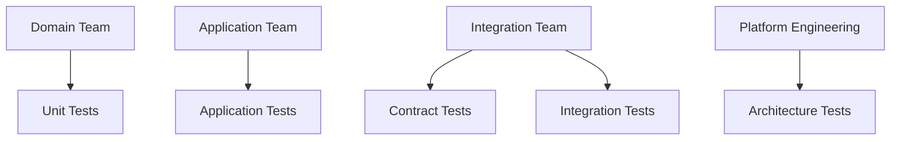

# Testing Strategy

## Overview

This document defines the testing strategy for the AIGORA Tutor Orchestrator.

The objective is to establish a deterministic, scalable, and maintainable testing approach that validates business behavior, architectural boundaries, integration contracts, and runtime reliability.

Testing is considered a first-class architectural concern.

The testing strategy must ensure:

* deterministic orchestration behavior
* architectural integrity
* contract stability
* integration reliability
* regression prevention
* long-term maintainability

---

# Architectural Principle

The Tutor Orchestrator must be testable at every architectural layer.

Testing must validate:

* business correctness
* dependency boundaries
* contract compatibility
* integration behavior
* runtime resilience

The strategy prioritizes fast feedback while preserving confidence.

---

# Testing Architecture



---

# Testing Pyramid

The Tutor Orchestrator follows a testing pyramid model.



Most tests should be unit tests.

The higher the test level, the fewer tests should exist.

---

# Test Categories

| Test Type          | Purpose                          |
| ------------------ | -------------------------------- |
| Unit Tests         | Validate isolated behavior       |
| Application Tests  | Validate use case execution      |
| Contract Tests     | Validate service contracts       |
| Integration Tests  | Validate external integrations   |
| Architecture Tests | Validate dependency rules        |
| End-to-End Tests   | Validate full orchestration flow |

---

# Unit Tests

## Purpose

Validate isolated business behavior.

Unit tests focus on:

* domain models
* policies
* ranking strategies
* decision logic
* value objects

---

## Scope



---

## Examples

```text
EligibilityPolicyTests

CompletionPolicyTests

RegressionPolicyTests

DeterministicCandidateRankingTests

DecisionReasonTests
```

---

## Rules

Unit tests:

* must be deterministic
* must execute quickly
* must not use external services
* must not depend on infrastructure

---

# Application Tests

## Purpose

Validate orchestration use cases.

Application tests verify:

* use case behavior
* orchestration flow
* interaction with ports
* decision generation

---

## Scope



---

## Examples

```text
SelectNextLearningNodeUseCaseTests

SelectRegressionNodeUseCaseTests

EvaluateLearningProgressUseCaseTests
```

---

## Rules

Application tests:

* use fake implementations of ports
* avoid external systems
* validate orchestration behavior

---

# Contract Tests

## Purpose

Validate compatibility between the Tutor Orchestrator and external services.

Contract tests verify:

* request schemas
* response schemas
* protocol compatibility
* contract evolution

---

## Scope



---

## Examples

```text
CurriculumGraphGrpcContractTests

StudentModelContractTests

AssessmentContractTests
```

---

## Rules

Contract tests:

* validate DTO compatibility
* validate schema evolution
* validate backward compatibility

---

# Integration Tests

## Purpose

Validate interaction with real dependencies.

Integration tests verify:

* gRPC communication
* configuration
* serialization
* infrastructure behavior

---

## Scope



---

## Examples

```text
CurriculumGraphIntegrationTests

GrpcClientIntegrationTests

DecisionTraceIntegrationTests
```

---

## Rules

Integration tests:

* may use Docker containers
* may use test environments
* should remain isolated
* should not depend on production systems

---

# Architecture Tests

## Purpose

Validate architectural rules.

Architecture tests prevent architectural erosion.

---

# Scope



---

## Examples

```text
DomainMustNotDependOnSpring

ApplicationMustNotDependOnAdapters

PortsMustRemainTechnologyAgnostic

NoPackageCyclesAllowed
```

---

## Recommended Tool

```text
ArchUnit
```

---

## Example Rule

```java
noClasses()
    .that()
    .resideInAPackage("..domain..")
    .should()
    .dependOnClassesThat()
    .resideInAnyPackage(
        "org.springframework..",
        "io.grpc.."
    );
```

---

# End-to-End Tests

## Purpose

Validate complete orchestration workflows.

End-to-end tests verify:

* request handling
* orchestration execution
* external integrations
* final decisions

---

## Scope



---

## Examples

```text
StudentProgressionScenario

RegressionScenario

RemediationScenario

CandidateRankingScenario
```

---

# Test Coverage Strategy

Coverage must focus on business-critical behavior.

---

## High Priority

```text
Policies

Ranking

Selection

Decision Generation

Use Cases

Error Handling
```

---

## Medium Priority

```text
Mappers

DTOs

Configuration Validation
```

---

## Low Priority

```text
Simple Getters

Generated Code

Framework Boilerplate
```

---

# Test Doubles Strategy

The Tutor Orchestrator primarily uses:

```text
Fake Implementations
```

instead of:

```text
Heavy Mocking
```

---

# Example

Preferred:

```text
FakeCurriculumGraphPort
```

Avoid:

```text
Deep Mock Chains
```

---

# Test Data Strategy

Test data must be:

* deterministic
* reproducible
* isolated
* versioned

---

## Recommended Fixtures

```text
minimal_orchestrator_graph

regression_scenario

remediation_scenario

ranking_scenario

candidate_generation_scenario
```

---

# CI/CD Validation Pipeline



---

# Failure Classification

Tests should identify failures according to the layer.

| Failure Type         | Example                          |
| -------------------- | -------------------------------- |
| Domain Failure       | Ranking logic incorrect          |
| Application Failure  | Use case orchestration incorrect |
| Contract Failure     | gRPC schema mismatch             |
| Integration Failure  | Curriculum Graph unavailable     |
| Architecture Failure | Invalid dependency introduced    |

---

# Governance Rules

The following rules are mandatory.

1. Every use case must have tests.
2. Every policy must have tests.
3. Every ranking strategy must have tests.
4. Every external integration must have contract tests.
5. Architectural boundaries must be validated automatically.
6. New ports require contract tests.
7. New adapters require integration tests.
8. Domain logic must never require infrastructure to be tested.

---

# Testing Ownership



---

# Future Evolution

Future iterations may introduce:

```text
Mutation Testing

Chaos Testing

Load Testing

Distributed Tracing Validation

Contract Version Verification

Replay-Based Testing
```

without changing the testing foundation defined in this document.

---

# Related Documents

* [Package Structure](package-structure.md)
* [Layer Responsibilities](layer-responsibilities.md)
* [Dependency Rules](dependency-rules.md)
* [Domain Model](domain-model.md)
* [Application Contracts](application-contracts.md)
* [Ports and Adapters](ports-and-adapters.md)
* [Error Model](error-model.md)
* [Runtime Architecture](../06-integration/runtime-architecture.md)
