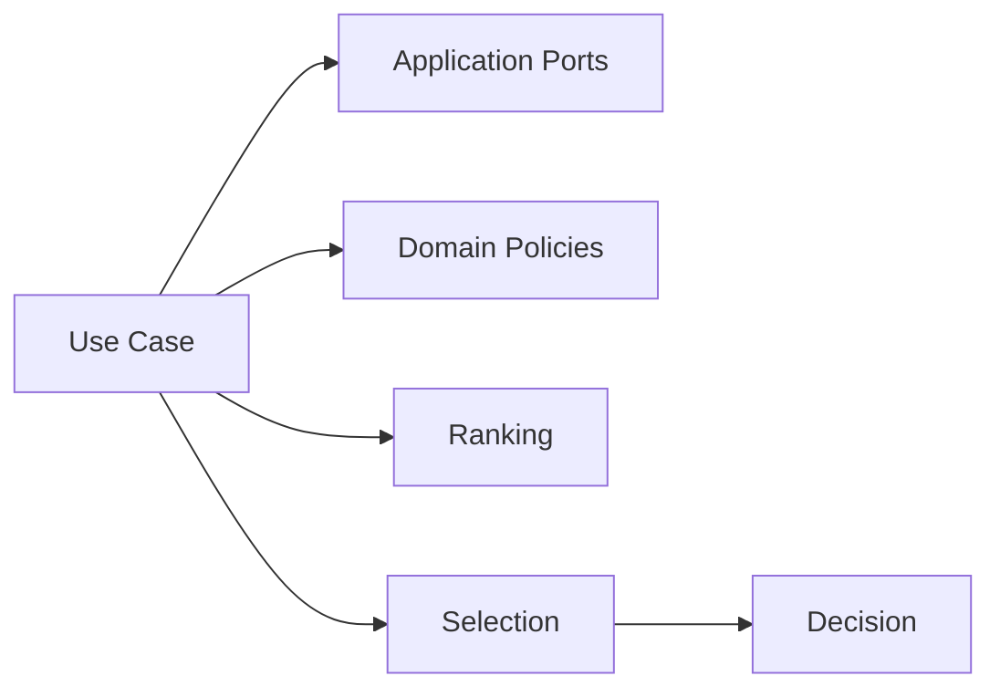
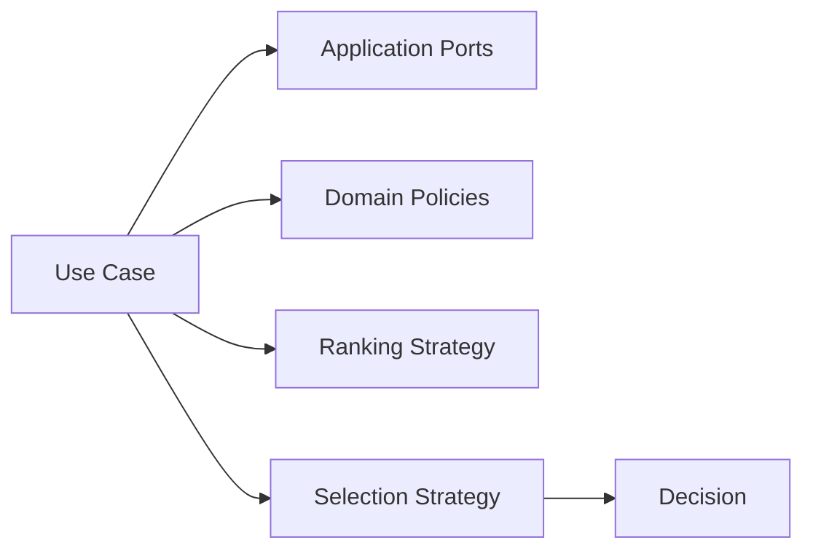
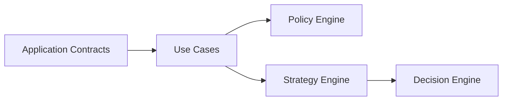

# Use Cases

**Last Updated:** 2026-06-10

This document defines the responsibilities, boundaries, collaborators, and delegation rules of the initial Tutor Orchestrator use cases.

The objective is to establish a clear separation between orchestration coordination, domain decision logic, and infrastructure access before implementation begins.

---

# Overview

Use cases represent the application orchestration layer of the Tutor Orchestrator.

They coordinate orchestration flows by:

* retrieving required data
* invoking domain policies
* invoking ranking strategies
* invoking selection strategies
* assembling orchestration decisions
* returning application results

Use cases do not own business rules.

Use cases coordinate business rules.

---

# Use Case Responsibility Model



The use case layer acts as the coordinator of deterministic orchestration flows.

---

# Initial Use Cases

The initial version of the Tutor Orchestrator contains three primary use cases:

```text
SelectNextLearningNode

SelectRegressionNode

EvaluateLearningProgress
```

Each use case owns orchestration flow coordination for a specific pedagogical scenario.

---

# SelectNextLearningNode

## Purpose

Coordinates the selection of the next learning node for a student.

This is expected to be the primary orchestration flow.

---

## Responsibilities

Responsible for:

* loading student state
* loading curriculum context
* generating candidate nodes
* invoking eligibility policies
* invoking ranking strategies
* invoking selection strategies
* producing orchestration decisions

---

## Collaborators

```text
CurriculumGraphClient

StudentModelClient

EligibilityPolicy

CompletionPolicy

DeterministicCandidateRanking

SelectionStrategy
```

---

## Delegation Rules

Must delegate:

* eligibility evaluation
* completion evaluation
* candidate ranking
* candidate selection

Must not implement those rules directly.

---

## Output

```text
OrchestrationDecision
```

---

# SelectRegressionNode

## Purpose

Coordinates regression flows when prerequisite reinforcement becomes necessary.

---

## Responsibilities

Responsible for:

* evaluating regression conditions
* retrieving prerequisite candidates
* coordinating regression policies
* producing regression decisions

---

## Collaborators

```text
CurriculumGraphClient

StudentModelClient

RegressionPolicy

DeterministicCandidateRanking

SelectionStrategy
```

---

## Delegation Rules

Must delegate:

* regression determination
* ranking
* selection

Must not implement regression rules directly.

---

## Output

```text
OrchestrationDecision
```

---

# EvaluateLearningProgress

## Purpose

Coordinates learning progression evaluation.

This use case determines whether a student may continue, reinforce, or regress.

---

## Responsibilities

Responsible for:

* loading student learning state
* evaluating completion conditions
* evaluating mastery conditions
* coordinating progression decisions

---

## Collaborators

```text
StudentModelClient

CompletionPolicy

RegressionPolicy
```

---

## Delegation Rules

Must delegate:

* mastery evaluation
* completion evaluation
* regression evaluation

Must not implement those rules directly.

---

## Output

```text
LearningProgressEvaluation
```

---

# Use Case Collaboration Model

The following diagram illustrates how use cases collaborate with the rest of the architecture.



The use case remains responsible for orchestration flow control.

Business decisions remain inside domain policies.

---

# Delegation Rules

Use cases must delegate deterministic decision logic to domain components.

## Delegate to Policies

Examples:

```text
Eligibility

Completion

Regression
```

---

## Delegate to Ranking

Examples:

```text
Candidate Ordering

Tie Resolution

Priority Evaluation
```

---

## Delegate to Selection

Examples:

```text
Final Candidate Selection

Winner Determination
```

---

## Delegate to Ports

Examples:

```text
Curriculum Graph Access

Student Model Access

Assessment Data Access
```

---

# What Must Not Be Inside Use Cases

The following concerns must never be implemented inside use cases.

## Infrastructure Logic

```text
gRPC

HTTP

Neo4j

Protobuf

Serialization
```

---

## Domain Decision Logic

```text
Eligibility Rules

Completion Rules

Regression Rules

Ranking Rules

Selection Rules
```

---

## Persistence Logic

```text
Repository Implementations

Database Queries

Caching Implementations
```

---

## Transport Logic

```text
REST Controllers

gRPC Services

Message Consumers
```

---

# Future Use Cases

Future iterations may introduce:

```text
RecommendLearningPath

EvaluateKnowledgeGap

GenerateLearningSession

EvaluateAssessmentOutcome

GenerateRemediationPlan
```

without changing the ownership boundaries defined in this document.

---

# Relationship to Other Documents



---

# Related Documents

* [Application Contracts](application-contracts.md)
* [Domain Model](domain-model.md)
* [Ports and Adapters](ports-and-adapters.md)
* [Layer Responsibilities](layer-responsibilities.md)
* [Policy Engine](../03-decision-engine/policy-engine.md)
* [Strategy Engine](../03-decision-engine/strategy-engine.md)
* [Decision Engine Architecture](../03-decision-engine/decision-engine-architecture.md)
