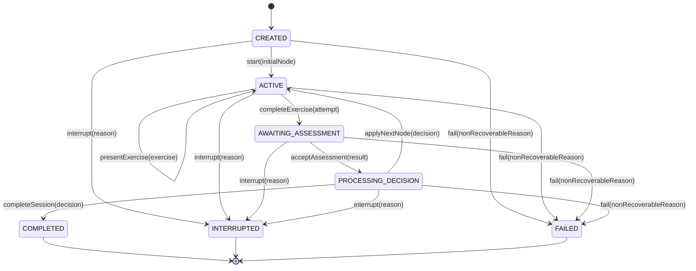

# ADR-009 — Learning Session Aggregate and Lifecycle Model

- **Status:** Accepted
- **Date:** 2026-07-27
- **Decision Owners:** AIGORA Architecture
- **Milestone:** v0.3.1 — Learning Session Orchestration
- **Related ADRs:** ADR-001, ADR-003, ADR-006, ADR-007, ADR-008
- **Supersedes:** None
- **Superseded by:** None

---

## 1. Context

ADR-008 establishes the Learning Session Engine as the authoritative owner of the `LearningSession` aggregate.

The v0.3.1 milestone now requires a precise aggregate and lifecycle model before implementation begins.

Without an explicit aggregate boundary and state machine, the implementation could:

- permit invalid lifecycle transitions;
- allow multiple active exercises;
- process the same attempt more than once;
- apply stale assessment or orchestration results;
- mix session state with Student Model state;
- leak persistence concerns into domain logic;
- duplicate Tutor Orchestrator policy behavior;
- make recovery and idempotency ambiguous;
- emit events before state is committed;
- make terminal sessions mutable.

This ADR defines:

- the aggregate root;
- entities and value objects;
- lifecycle states;
- legal transitions;
- aggregate invariants;
- command authority;
- domain events;
- versioning and causality rules;
- rehydration expectations;
- boundaries between domain and application behavior.

Detailed event-delivery guarantees are deferred to ADR-010. Persistence technology and recovery storage are deferred to ADR-011.

---

## 2. Decision

### 2.1 Aggregate root

The Learning Session bounded context contains one authoritative aggregate root:

```text
LearningSession
```

The aggregate represents the operational lifecycle of one learner session.

It is the only domain object allowed to mutate:

- session status;
- current learning node reference;
- current exercise reference;
- exercise-attempt lifecycle;
- session version;
- terminal outcome;
- aggregate-generated domain events.

All state changes occur through explicit aggregate operations.

External code must not mutate aggregate fields directly.

### 2.2 Aggregate identity

The aggregate is identified by:

```text
LearningSessionId
```

A session ID:

- is globally unique within the Learning Session bounded context;
- is immutable;
- is assigned at creation;
- is never reused;
- is required in every command, event, repository operation, and trace related to the session.

### 2.3 Aggregate contents

The aggregate may contain:

- `LearningSessionId`;
- `StudentId` reference;
- `LearningSessionStatus`;
- `SessionVersion`;
- current `NodeId` reference;
- current `ExerciseId` reference;
- current or latest `ExerciseAttempt`;
- session start timestamp;
- last transition timestamp;
- terminal timestamp, when applicable;
- terminal reason, when applicable;
- processed command/event identities required by domain-level idempotency;
- uncommitted domain events.

The aggregate does not contain:

- Student Model mastery state as authoritative data;
- Curriculum Graph topology;
- complete assessment-engine domain objects;
- Tutor Orchestrator candidate lists as durable aggregate state;
- retrieved educational documents;
- raw LLM provider responses;
- adapter, transport, or persistence models.

---

## 3. Aggregate Entities and Value Objects

### 3.1 Aggregate root

#### `LearningSession`

Responsibilities:

- protect lifecycle invariants;
- validate legal transitions;
- associate a single current node and exercise;
- create and complete exercise attempts;
- accept assessment references only for the expected attempt;
- apply an orchestration decision only to the expected session version and context;
- enter a terminal state exactly once;
- generate domain events after successful state changes.

### 3.2 Entity

#### `ExerciseAttempt`

`ExerciseAttempt` is an entity inside the aggregate.

It is identified by:

```text
AttemptId
```

It owns:

- attempt identity;
- exercise identity;
- attempt status;
- started/completed timestamps;
- answer submission reference or approved value representation;
- assessment result reference;
- attempt version or internal transition evidence where necessary.

It does not own assessment scoring semantics.

### 3.3 Required value objects

- `LearningSessionId`
- `AttemptId`
- `SessionVersion`
- `LearningSessionStatus`
- `ExerciseAttemptStatus`
- `SessionTerminalReason`
- existing `StudentId`
- existing `NodeId`
- existing `ExerciseId`, or a new one if not yet defined
- existing `CorrelationId`
- existing `GraphVersion`
- `AssessmentResultId` or equivalent immutable reference
- `OrchestrationDecisionId` or equivalent immutable reference

Value objects must be:

- immutable;
- validated at construction;
- framework independent;
- comparable by value;
- safe to use in domain contracts.

---

## 4. Lifecycle States

The accepted baseline state model is:

```text
CREATED
ACTIVE
AWAITING_ASSESSMENT
PROCESSING_DECISION
COMPLETED
INTERRUPTED
FAILED
```

### 4.1 `CREATED`

The aggregate exists but has not yet begun active learning.

Allowed characteristics:

- no current attempt;
- initial student and session identity are established;
- an initial node may be supplied at creation or at activation, according to the application use case.

### 4.2 `ACTIVE`

The session is active and may present or complete an exercise.

Required characteristics:

- a current node exists;
- zero or one current exercise exists;
- no assessment is currently pending;
- no pedagogical decision is currently being applied.

### 4.3 `AWAITING_ASSESSMENT`

A completed attempt exists and the session is waiting for its assessment outcome.

Required characteristics:

- exactly one expected completed attempt exists;
- its attempt ID is known;
- a second exercise completion cannot be accepted;
- an assessment for another attempt is rejected.

### 4.4 `PROCESSING_DECISION`

An assessment has been accepted and the system is obtaining or applying a pedagogical decision.

Required characteristics:

- the accepted assessment result is associated with the expected attempt;
- the session cannot accept another exercise completion;
- stale decisions are rejected;
- the current session version remains part of the decision request and application validation.

### 4.5 `COMPLETED`

The session ended successfully according to an explicit completion condition.

This state is terminal.

### 4.6 `INTERRUPTED`

The session ended before successful completion due to an explicit interruption requested by an authorised flow.

This state is terminal in v0.3.1.

Session resumption is future scope unless ADR-011 later defines a separate recovery behavior that does not mutate the same terminal aggregate.

### 4.7 `FAILED`

The session ended because a non-recoverable condition prevented safe continuation.

This state is terminal.

Recoverable dependency failures must not automatically transition the aggregate to `FAILED`. They should return typed application failures and allow retry from the last committed state.

---

## 5. State Transition Model



### 5.1 Legal transition table

| Current state | Operation | Next state |
|---|---|---|
| CREATED | `start` | ACTIVE |
| ACTIVE | `presentExercise` | ACTIVE |
| ACTIVE | `completeExercise` | AWAITING_ASSESSMENT |
| AWAITING_ASSESSMENT | `acceptAssessment` | PROCESSING_DECISION |
| PROCESSING_DECISION | `applyNextNode` | ACTIVE |
| PROCESSING_DECISION | `completeSession` | COMPLETED |
| CREATED, ACTIVE, AWAITING_ASSESSMENT, PROCESSING_DECISION | `interrupt` | INTERRUPTED |
| CREATED, ACTIVE, AWAITING_ASSESSMENT, PROCESSING_DECISION | `fail` | FAILED |

Every transition not explicitly listed is illegal.

---

## 6. Aggregate Invariants

The aggregate must enforce all of the following.

### 6.1 Identity invariants

- session identity is immutable;
- student identity is immutable for the lifetime of the session;
- attempt identity is immutable;
- an assessment result must reference the expected attempt;
- an orchestration decision must reference the expected session and context.

### 6.2 Lifecycle invariants

- a terminal session cannot transition again;
- a session can be started only once;
- an active session has at most one current exercise;
- at most one attempt may await assessment;
- a session cannot process a new exercise while awaiting assessment;
- a session cannot apply a decision before accepting the matching assessment;
- completion may occur only from `PROCESSING_DECISION`;
- interruption and failure occur at most once.

### 6.3 Attempt invariants

- an attempt belongs to exactly one session;
- an attempt must target the current exercise;
- an attempt cannot be completed twice;
- a duplicate completion with the same idempotency identity is a no-op or returns the prior result;
- a different completion for an already completed attempt is rejected;
- an assessment cannot be attached to an open or unrelated attempt;
- an assessment result cannot be replaced after acceptance.

### 6.4 Decision invariants

- a decision must reference the expected session version;
- a decision must reference the accepted assessment context;
- a stale decision is rejected;
- a next-node decision must contain a valid node reference;
- a completion decision must not contain a next active node;
- the aggregate applies only the outcome required for its lifecycle;
- candidate ranking and policy execution remain outside the aggregate.

### 6.5 Version invariants

- every successful aggregate mutation increments `SessionVersion`;
- rejected commands do not increment the version;
- duplicate idempotent replays do not create an additional version;
- repository writes must use the expected previous version;
- rehydration must restore the exact persisted version.

### 6.6 Event invariants

- events are produced only after a successful domain mutation;
- an event contains the aggregate ID and resulting session version;
- event order matches aggregate mutation order;
- rejected operations produce no domain event;
- rehydration produces no new domain event.

---

## 7. Aggregate Operations

The aggregate exposes behavior-oriented operations rather than setters.

Indicative domain API:

```java
public final class LearningSession {

    public static LearningSession create(
        LearningSessionId sessionId,
        StudentId studentId,
        Instant createdAt
    );

    public void start(
        NodeId initialNodeId,
        Instant occurredAt
    );

    public void presentExercise(
        ExerciseId exerciseId,
        Instant occurredAt
    );

    public void completeExercise(
        AttemptId attemptId,
        ExerciseId exerciseId,
        AnswerSubmission answer,
        CommandId commandId,
        Instant occurredAt
    );

    public void acceptAssessment(
        AttemptId attemptId,
        AssessmentResultId assessmentResultId,
        Instant occurredAt
    );

    public void applyNextNode(
        OrchestrationDecisionId decisionId,
        SessionVersion expectedVersion,
        NodeId nextNodeId,
        Instant occurredAt
    );

    public void completeSession(
        OrchestrationDecisionId decisionId,
        SessionVersion expectedVersion,
        SessionTerminalReason reason,
        Instant occurredAt
    );

    public void interrupt(
        SessionTerminalReason reason,
        Instant occurredAt
    );

    public void fail(
        SessionTerminalReason reason,
        Instant occurredAt
    );
}
```

The exact Java signatures may evolve, but the semantic operations and invariants are mandatory.

---

## 8. Command Authority

Application commands are handled outside the aggregate.

Indicative commands:

- `StartLearningSessionCommand`
- `PresentExerciseCommand`
- `CompleteExerciseCommand`
- `ApplyAssessmentResultCommand`
- `ApplyOrchestrationDecisionCommand`
- `InterruptLearningSessionCommand`

Application handlers must:

1. validate the application contract;
2. load or create the aggregate;
3. invoke exactly one aggregate behavior or one coherent transactional operation;
4. persist with expected version;
5. publish committed events according to ADR-010;
6. return a typed result according to ADR-007.

Handlers must not bypass aggregate invariants.

---

## 9. Domain Events

The aggregate emits domain events representing committed domain facts.

Required baseline events:

- `LearningSessionCreated`
- `LearningSessionStarted`
- `ExercisePresented`
- `ExerciseCompleted`
- `AssessmentAccepted`
- `NextNodeApplied`
- `LearningSessionCompleted`
- `LearningSessionInterrupted`
- `LearningSessionFailed`

Each event must include:

- event ID;
- session ID;
- resulting session version;
- occurred-at timestamp;
- correlation ID;
- causation ID;
- event schema version;
- event-specific identifiers.

The final event envelope and publication semantics are governed by ADR-010.

---

## 10. Orchestration Decision Application

The Tutor Orchestrator does not mutate the aggregate.

The application flow is:

```text
1. Load LearningSession in AWAITING_ASSESSMENT.
2. Accept the matching assessment.
3. Persist PROCESSING_DECISION.
4. Build immutable orchestration request.
5. Request OrchestrationDecision from Tutor Orchestrator.
6. Reload or retain the aggregate according to ADR-011.
7. Validate session ID, expected version, attempt, assessment, and causality.
8. Apply next node or completion.
9. Persist new aggregate version.
10. Publish committed events.
```

A decision produced for a previous session version is stale and must not be applied.

---

## 11. Rehydration

The aggregate must support rehydration without violating encapsulation.

Rehydration must:

- restore identity;
- restore status;
- restore references;
- restore attempt state;
- restore terminal data;
- restore session version;
- validate that the persisted snapshot is internally consistent;
- produce no events;
- avoid invoking normal transition methods that would increment version or emit events.

Preferred mechanisms:

- dedicated package-private rehydration factory;
- validated persistence snapshot mapper;
- explicit constructor accessible only to the domain persistence mapper.

Public unrestricted constructors are prohibited.

---

## 12. Failure Semantics

### 12.1 Domain failures

Domain failures include:

- invalid state transition;
- mismatched exercise;
- mismatched attempt;
- duplicate conflicting completion;
- stale assessment;
- stale orchestration decision;
- terminal session mutation;
- missing required current node or exercise.

They must be represented as typed domain errors or exceptions mapped to typed application results.

### 12.2 Application/infrastructure failures

The aggregate does not decide:

- timeout behavior;
- retry policy;
- circuit breaking;
- repository availability;
- event publication recovery;
- network error mapping.

These concerns belong to application and infrastructure layers and are governed by ADR-010 and ADR-011.

A recoverable infrastructure failure does not automatically mutate the aggregate to `FAILED`.

---

## 13. Alternatives Considered

### Alternative A — An anemic session data model

#### Rejected

Placing lifecycle rules exclusively in application services would:

- duplicate invariants;
- make illegal states representable;
- complicate tests;
- permit mutation outside the consistency boundary.

### Alternative B — One aggregate per exercise attempt

#### Rejected for v0.3.1

A separate attempt aggregate may become useful at scale, but it introduces cross-aggregate consistency before the lifecycle semantics are stable.

In v0.3.1, `ExerciseAttempt` remains an entity inside `LearningSession`.

The design may be revisited if:

- attempts become independently long-lived;
- attempts require independent concurrency;
- attempt history grows beyond practical aggregate limits;
- attempt processing becomes independently distributed.

### Alternative C — Event-sourced Learning Session

#### Rejected for v0.3.1

Event sourcing would add:

- event-store requirements;
- snapshot strategy;
- schema evolution complexity;
- replay and migration requirements.

The aggregate still emits domain events, but persistence style is deferred to ADR-011.

### Alternative D — No explicit `PROCESSING_DECISION` state

#### Rejected

An explicit state makes it possible to:

- reject duplicate progress operations;
- distinguish assessment waiting from decision waiting;
- validate stale decision application;
- model recovery boundaries clearly.

### Alternative E — Recoverable failures transition to `FAILED`

#### Rejected

Temporary dependency failures must be retriable from the last committed state.

`FAILED` is reserved for non-recoverable terminal conditions.

---

## 14. Consequences

### 14.1 Positive consequences

- illegal lifecycle transitions are prevented in the domain;
- one aggregate protects session consistency;
- exercise and assessment causality are explicit;
- stale decisions are detectable;
- repository concurrency semantics are clear;
- application handlers remain thin;
- unit tests can verify the complete transition matrix;
- terminal behavior is unambiguous;
- recovery can restart from explicit committed states.

### 14.2 Negative consequences

- the aggregate contains more lifecycle behavior than a simple CRUD model;
- mapping persistence snapshots requires care;
- retaining attempts inside the aggregate may require later refactoring for very long sessions;
- explicit intermediate states increase the number of test cases;
- application flows may require more than one committed boundary around external calls.

### 14.3 Accepted trade-off

AIGORA accepts a richer domain model and explicit state machine in exchange for deterministic behavior, testability, auditability, and safe recovery.

---

## 15. Follow-up Actions

1. Implement Learning Session identity and lifecycle value objects.
2. Implement `LearningSessionStatus` and transition rules.
3. Implement the `LearningSession` aggregate.
4. Implement `ExerciseAttempt`.
5. Define session progress and completion policies.
6. Define event contracts under ADR-010.
7. Define repository port under ADR-011.
8. Define command and result contracts under ADR-007.
9. Add transition matrix unit tests.
10. Add architecture tests ensuring domain independence.
11. Update Learning Session architecture documentation.
12. Update traceability documentation.

---

## 16. Compliance Rules

An implementation complies with ADR-009 only when:

- `LearningSession` is the aggregate root;
- state changes occur only through aggregate operations;
- all states and transitions match this ADR or a superseding ADR;
- terminal sessions are immutable;
- attempt, assessment, and decision causality are validated;
- successful mutations increment `SessionVersion`;
- rejected and duplicate operations do not create extra committed versions;
- rehydration emits no events;
- the domain has no Spring, persistence, transport, or adapter dependency;
- Student Model, Curriculum Graph, Assessment Engine, and Tutor Orchestrator state remain external references.

---

## 17. Milestone Outcome

ADR-009 makes the v0.3.1 domain implementation ready by defining:

- the aggregate root;
- lifecycle states;
- legal transitions;
- invariants;
- attempt boundaries;
- event facts;
- version behavior;
- command authority;
- rehydration behavior.

Implementation remains gated by ADR-010 and ADR-011 for event consistency, persistence, and recovery details.
