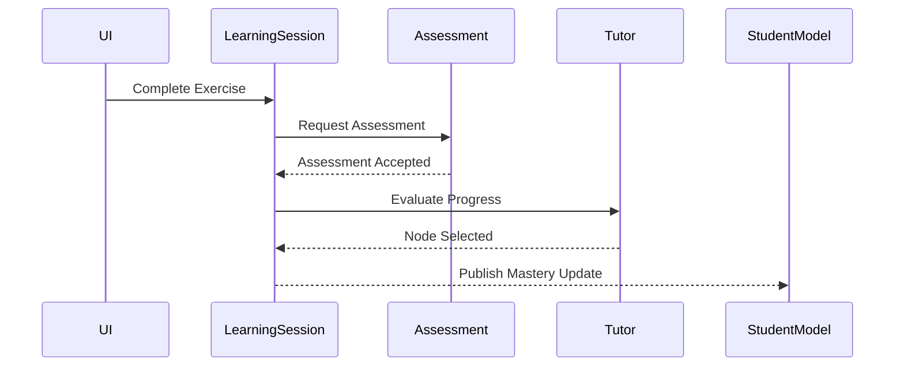
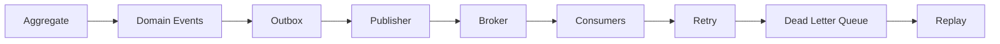

# ADR-010 — Event Publication and Consistency Boundaries

- **Status:** Accepted
- **Date:** 2026-07-29
- **Decision Owners:** AIGORA Architecture
- **Milestone:** v0.3.1 — Learning Session Orchestration
- **Supersedes:** None
- **Superseded by:** None
- **Related ADRs:**
  - ADR-001 — Deterministic-First Orchestration
  - ADR-003 — Decision Engine Decomposition
  - ADR-004 — Event-Driven Pedagogical Flow
  - ADR-005 — Auditability-First Architecture
  - ADR-008 — Learning Session Ownership and Bounded-Context Boundaries
  - ADR-009 — Learning Session Aggregate and Lifecycle Model

---

# 1. Context

The AIGORA platform is composed of multiple bounded contexts that collaborate to execute an adaptive learning experience.

Examples include:

- Learning Session Engine
- Tutor Orchestrator
- Assessment Engine
- Student Model
- Curriculum Graph
- Retrieval Layer
- LLM Gateway

Each component owns its own business responsibilities and persistence boundaries.

As the platform evolves, components increasingly communicate through events instead of direct synchronous interactions.

Without a well-defined event architecture, several architectural risks emerge:

- duplicated event publication;
- inconsistent ordering;
- non-reproducible decisions;
- event loss;
- duplicated event consumption;
- distributed race conditions;
- hidden coupling between bounded contexts;
- non-idempotent consumers;
- inability to reconstruct historical decisions;
- incompatible event evolution over time.

Since one of the long-term goals of AIGORA is to support:

- asynchronous orchestration;
- distributed execution;
- auditability;
- observability;
- replayable decisions;
- scalable orchestration;

event publication must become a first-class architectural concern.

---

# 2. Problem Statement

Multiple bounded contexts produce business facts.

Examples include:

Learning Session Engine

- Exercise completed
- Session completed
- Session interrupted

Assessment Engine

- Assessment finished
- Assessment accepted

Tutor Orchestrator

- Candidate ranking completed
- Policies executed
- Next node selected

Student Model

- Student model updated

Curriculum Graph

- Graph version changed

Without architectural rules, every component could publish events differently.

Examples:

- different event identifiers
- incompatible timestamps
- incompatible schemas
- different ordering semantics
- inconsistent retries
- inconsistent versioning
- inconsistent correlation identifiers

This would make distributed debugging extremely difficult.

---

# 3. Decision

AIGORA adopts an **Event-First Architecture** for communication between bounded contexts.

Every business fact that may be consumed outside its owning bounded context shall be represented by an explicit event.

Events become part of the public architectural contract.

Each event must:

- have exactly one authoritative publisher;
- have one semantic meaning;
- represent a committed business fact;
- never represent an intention;
- never represent an intermediate state;
- be immutable;
- be versioned;
- be replayable;
- be traceable.

---

# 4. Architectural Principles

The following principles govern every event published inside AIGORA.

## Principle 1 — Events represent facts

Events describe something that has already happened.

Correct:

- ExerciseCompleted
- AssessmentAccepted
- LearningSessionCompleted

Incorrect:

- CompleteExercise
- UpdateStudentModel
- EvaluateAssessment

Commands request work.

Events describe completed work.

---

## Principle 2 — Events are immutable

Published events shall never be modified.

If business meaning changes, a new event version must be introduced.

Consumers must treat historical events as immutable records.

---

## Principle 3 — Single publisher

Every event has exactly one owner.

Example:

LearningSessionCompleted

Publisher:

Learning Session Engine

Never:

Tutor Orchestrator

Assessment Engine

Student Model

Only one bounded context owns the fact represented by the event.

---

## Principle 4 — Publication occurs after successful state transition

An event shall only be published after:

1. aggregate validation;
2. successful mutation;
3. persistence;
4. successful transaction completion.

Publishing events before persistence is prohibited.

---

## Principle 5 — Events are append-only

Previously published events are historical records.

Events are never deleted.

Consumers reconstruct history through ordered event sequences.

---

## Principle 6 — Events are integration contracts

Events are part of the public architecture.

Breaking changes require explicit versioning.

---

# 5. Event Categories

AIGORA distinguishes three different categories of events.

## 5.1 Domain Events

Represent changes inside one bounded context.

Characteristics:

- business meaning;
- aggregate scoped;
- immutable;
- owned by one bounded context.

Examples:

LearningSessionCreated

ExerciseCompleted

LearningSessionCompleted

AssessmentAccepted

StudentModelUpdated

---

## 5.2 Application Events

Represent orchestration steps internal to an application layer.

These events coordinate internal workflows.

They are implementation details.

Examples:

AssessmentRequested

DecisionRequested

DecisionApplied

CacheInvalidated

Application Events should not be exposed as long-term integration contracts.

---

## 5.3 Integration Events

Represent communication between bounded contexts.

Examples:

LearningSessionCompleted

↓

Student Model

↓

Analytics

↓

Audit subsystem

↓

Notification subsystem

↓

Observability subsystem

Integration Events require:

- stable schema;
- explicit version;
- backward compatibility;
- replay support.

---

# 6. Event Ownership

Every event belongs to exactly one bounded context.

Ownership determines:

- publisher;
- schema authority;
- semantic authority;
- version authority.

Consumers never redefine event semantics.

---

## 6.1 Learning Session Engine

Owns:

- LearningSessionCreated
- LearningSessionStarted
- ExercisePresented
- ExerciseCompleted
- LearningSessionCompleted
- LearningSessionInterrupted
- LearningSessionFailed

---

## 6.2 Assessment Engine

Owns:

- AssessmentRequested
- AssessmentCompleted
- AssessmentAccepted
- AssessmentRejected

---

## 6.3 Tutor Orchestrator

Owns:

- CandidatesGenerated
- CandidatesRanked
- PoliciesExecuted
- NodeSelected
- CompletionSelected
- RegressionSelected

---

## 6.4 Student Model

Owns:

- StudentModelUpdated
- MasteryUpdated
- ConfidenceUpdated

---

## 6.5 Curriculum Graph

Owns:

- CurriculumGraphPublished
- CurriculumGraphVersionChanged

---

## 6.6 Retrieval Layer

Owns:

- RetrievalCompleted

---

## 6.7 LLM Gateway

Owns:

- GenerationCompleted
- GenerationFailed

---

# 7. Event Naming Convention

Events follow the pattern:

<Entity><PastTenseVerb>

Examples:

ExerciseCompleted

LearningSessionStarted

AssessmentAccepted

StudentModelUpdated

NodeSelected

Incorrect examples:

CompleteExercise

Assessment

Node

DoWork

Every event name must communicate a completed business fact.

---

# 8. Publication Lifecycle

Every event follows the same lifecycle.

```text
Business Command

↓

Aggregate Validation

↓

Aggregate Mutation

↓

Persistence

↓

Transaction Commit

↓

Event Creation

↓

Event Publication

↓

Consumer Processing
```

Publication before persistence is forbidden.

---

# 9. Publication Guarantees

AIGORA guarantees:

- events represent committed facts;
- event ordering inside one aggregate;
- immutable payloads;
- explicit ownership;
- deterministic publication sequence;
- versioned schemas;
- replay capability;
- audit traceability.

Global ordering across multiple aggregates is **not guaranteed**.

---

# 10. Event Envelope

Every published event shall be wrapped inside a standardized event envelope.

The envelope provides metadata required for:

- routing;
- auditability;
- observability;
- replay;
- ordering;
- correlation;
- schema evolution.

The event payload contains only business information.

The envelope contains technical metadata.

---

## 10.1 Standard Event Envelope

Every published event shall contain the following fields.

| Field | Description |
|---------|-------------|
| EventId | Globally unique event identifier |
| EventType | Business event name |
| AggregateId | Aggregate that generated the event |
| AggregateType | Aggregate type |
| AggregateVersion | Aggregate version after commit |
| CorrelationId | Business transaction identifier |
| CausationId | Previous event or command identifier |
| EventVersion | Event schema version |
| OccurredAt | UTC timestamp of business occurrence |
| PublishedAt | UTC timestamp of publication |
| Producer | Publishing bounded context |
| Payload | Immutable business payload |

---

## 10.2 EventId

Every event shall receive a globally unique identifier.

Properties:

- immutable;
- globally unique;
- never reused;
- generated before publication.

Recommended implementations:

- UUID v7
- ULID

The identifier shall never encode business semantics.

---

## 10.3 AggregateId

Every event references the aggregate responsible for the business fact.

Example:

LearningSession

AggregateId

```text
LS-8A7E93...
```

The AggregateId allows consumers to reconstruct aggregate history.

---

## 10.4 AggregateVersion

Every event references the version of the aggregate immediately after the committed mutation.

Example:

```text
LearningSession

Version 1

↓

ExerciseCompleted

↓

Version 2

↓

AssessmentAccepted

↓

Version 3

↓

LearningSessionCompleted

↓

Version 4
```

AggregateVersion is required for:

- optimistic concurrency;
- replay;
- duplicate detection;
- ordering validation.

---

## 10.5 EventVersion

Every event schema shall be versioned.

Version numbers evolve independently from aggregate versions.

Example:

```text
LearningSessionCompleted

Schema v1
```

↓

```text
LearningSessionCompleted

Schema v2
```

Consumers may support:

- only v2

or

- v1 and v2 simultaneously.

Schema evolution rules are defined later in this ADR.

---

## 10.6 OccurredAt

Represents when the business fact actually occurred.

Not:

- publication time;
- processing time;
- consumption time.

OccurredAt represents business chronology.

---

## 10.7 PublishedAt

Represents when the event became visible to external consumers.

Publication may occur slightly after business occurrence.

This distinction becomes important when asynchronous brokers are introduced.

---

## 10.8 Producer

Identifies the authoritative bounded context.

Examples:

```text
Learning Session Engine

Tutor Orchestrator

Assessment Engine

Student Model
```

Consumers must trust only the authoritative producer.

---

# 11. Correlation and Causation

Distributed systems require complete request tracing.

AIGORA standardizes two identifiers.

- CorrelationId
- CausationId

Both identifiers are mandatory.

---

## 11.1 CorrelationId

CorrelationId identifies one complete business workflow.

Example:

Student solves an exercise.

Entire workflow:

```text
ExerciseCompleted

↓

AssessmentAccepted

↓

PoliciesExecuted

↓

NodeSelected

↓

LearningSessionUpdated
```

All events above share the same CorrelationId.

This enables complete workflow reconstruction.

---

## 11.2 CausationId

CausationId identifies the event that immediately caused another event.

Example:

```text
ExerciseCompleted

↓

AssessmentAccepted

↓

PoliciesExecuted

↓

NodeSelected
```

Each event stores the identifier of its direct predecessor.

Example:

```text
AssessmentAccepted

CausationId

=

ExerciseCompleted
```

---

## 11.3 Correlation Example

```text
CorrelationId

12345

ExerciseCompleted

↓

AssessmentAccepted

↓

PoliciesExecuted

↓

NodeSelected

↓

LearningSessionUpdated
```

Entire chain belongs to one logical operation.

---

## 11.4 Causation Example

```text
ExerciseCompleted

EventId = A

↓

AssessmentAccepted

EventId = B

CausationId = A

↓

PoliciesExecuted

EventId = C

CausationId = B

↓

NodeSelected

EventId = D

CausationId = C
```

This chain enables deterministic audit reconstruction.

---

# 12. Publication Pipeline

The publication pipeline is standardized.

Every component follows the same lifecycle.

```text
Business Command

↓

Application Service

↓

Aggregate

↓

Domain Events

↓

Persistence

↓

Transaction Commit

↓

Publication Adapter

↓

Message Broker / Event Bus

↓

Consumers
```

No component may bypass this flow.

---

## 12.1 Domain Events

Domain Events are created inside aggregates.

They represent pure business facts.

Domain Events are not infrastructure messages.

---

## 12.2 Publication Adapter

Publication adapters convert domain events into integration events.

Responsibilities:

- serialization;
- schema validation;
- metadata injection;
- envelope creation;
- broker communication.

Aggregates never communicate directly with infrastructure.

---

## 12.3 Consumer Pipeline

Consumers process events using:

```text
Receive

↓

Validate

↓

Deserialize

↓

Version Check

↓

Duplicate Check

↓

Business Processing

↓

Acknowledge
```

Duplicate detection occurs before business execution.

---

# 13. Consistency Boundaries

Not every operation requires strong consistency.

AIGORA distinguishes two consistency models.

- Strong Consistency
- Eventual Consistency

---

## 13.1 Strong Consistency

Required inside aggregate boundaries.

Examples:

LearningSession aggregate

Must guarantee:

- valid lifecycle;
- valid version;
- invariant preservation;
- atomic mutation.

Strong consistency never crosses bounded contexts.

---

## 13.2 Eventual Consistency

Used between bounded contexts.

Example:

```text
Learning Session Engine

↓

ExerciseCompleted

↓

Assessment Engine

↓

AssessmentAccepted

↓

Student Model

↓

MasteryUpdated
```

Each bounded context updates independently.

Temporary divergence is acceptable.

---

## 13.3 Consistency Rule

Aggregate consistency:

Strong

Cross-component consistency:

Eventual

Distributed transactions are prohibited.

---

# 14. Ordering Guarantees

Ordering is guaranteed only within one aggregate.

Example:

LearningSession

```text
Created

↓

Started

↓

ExercisePresented

↓

ExerciseCompleted

↓

Completed
```

Consumers may assume this order.

Consumers must not assume ordering between unrelated aggregates.

---

## 14.1 Cross Aggregate Ordering

The following ordering is **not guaranteed**:

```text
LearningSession A

↓

LearningSession B
```

Global ordering is intentionally avoided to maximize scalability.

---

# 15. Mermaid Sequence Diagram



The sequence above represents the logical interaction.

Actual transport may be synchronous or asynchronous depending on deployment architecture.

---

# 16. Idempotency

Distributed systems must assume that event delivery is **at least once**.

Therefore, every producer and every consumer shall be idempotent.

Exactly-once delivery is not assumed.

The architecture guarantees correctness through idempotent processing rather than transport guarantees.

---

## 16.1 Producer Idempotency

A producer shall never intentionally publish two distinct events representing the same committed business fact.

Each published event must be uniquely identified by:

- EventId
- AggregateId
- AggregateVersion

Example:

```text
LearningSession
Version 12

↓

ExerciseCompleted

EventId = E-123
```

Publishing another `ExerciseCompleted` for the same aggregate version is prohibited.

---

## 16.2 Consumer Idempotency

Consumers must tolerate duplicate delivery.

Receiving the same event twice shall not execute the business logic twice.

Example:

```text
ExerciseCompleted

↓

StudentModelUpdated
```

If the same event is delivered again:

```text
ExerciseCompleted

↓

StudentModelUpdated
```

the Student Model must recognize the duplicate and avoid applying the update twice.

---

## 16.3 Duplicate Detection

Consumers shall maintain processed event identifiers.

Recommended key:

```text
EventId
```

Alternative:

```text
AggregateId
+

AggregateVersion
```

Duplicate detection must occur before business execution.

---

## 16.4 Idempotent Operations

Examples of idempotent operations:

- updating mastery to a specific value;
- marking a session as completed;
- storing immutable audit entries;
- replacing cached projections.

Examples of non-idempotent operations:

- increment counters;
- append duplicated history;
- emit duplicate notifications;
- create duplicated attempts.

Business operations should always prefer idempotent semantics.

---

# 17. Retry Strategy

Failures are inevitable.

Retry behavior shall be standardized.

---

## 17.1 Transient Failures

Retry is permitted for:

- temporary network failures;
- broker unavailability;
- temporary database locks;
- timeout while publishing;
- temporary dependency overload.

---

## 17.2 Permanent Failures

Retry shall not occur for:

- invalid schema;
- invalid event version;
- business validation failure;
- unsupported event type;
- corrupted payload.

These failures require operator intervention.

---

## 17.3 Retry Policy

Recommended policy:

```text
Attempt 1

↓

Immediate Retry

↓

1 second

↓

5 seconds

↓

15 seconds

↓

30 seconds

↓

Dead Letter Queue
```

Retry policy belongs to infrastructure.

Business logic must remain unaware of retry mechanics.

---

# 18. Dead Letter Queue

Events that repeatedly fail shall be moved to a Dead Letter Queue (DLQ).

The DLQ preserves:

- original payload;
- envelope metadata;
- failure reason;
- retry count;
- processing timestamp.

The DLQ is an operational concern.

It must never become part of normal business processing.

---

## 18.1 DLQ Usage

Typical causes:

- incompatible schema;
- malformed payload;
- missing consumer implementation;
- unrecoverable infrastructure failure.

Events remain available for later inspection or replay.

---

# 19. Outbox Pattern

## Decision

AIGORA adopts the **Transactional Outbox Pattern** for durable integration event publication.

The Outbox Pattern guarantees that:

- aggregate persistence;
- event persistence;

occur inside the same local transaction.

Publication to external brokers occurs afterwards.

---

## 19.1 Motivation

Without an Outbox:

```text
Persist Aggregate

↓

Application Crash

↓

Event Never Published
```

or

```text
Publish Event

↓

Persistence Fails
```

↓

Consumers observe a state that never existed.

The Outbox Pattern eliminates these inconsistencies.

---

## 19.2 Publication Flow

```text
Command

↓

Aggregate Mutation

↓

Transaction

↓

Persist Aggregate

+

Persist Outbox Event

↓

Commit

↓

Outbox Publisher

↓

Broker

↓

Consumers
```

---

## 19.3 Responsibilities

Application Layer

Responsible for:

- writing Outbox records.

Infrastructure Layer

Responsible for:

- reading Outbox;
- publishing events;
- retrying publication;
- marking events as published.

---

## 19.4 Broker Independence

The Outbox Pattern must not depend on a specific messaging technology.

Possible implementations:

- Kafka
- RabbitMQ
- Azure Service Bus
- AWS SNS/SQS
- Google Pub/Sub
- in-memory dispatcher (development)

The architectural model remains unchanged.

---

# 20. Event Replay

Replay allows rebuilding read models and recovering downstream systems.

Replay shall be supported for Integration Events.

---

## 20.1 Replay Rules

Replay must preserve:

- EventId
- AggregateVersion
- CorrelationId
- CausationId
- OccurredAt

Replay shall never generate new business identifiers.

---

## 20.2 Replay Consumers

Consumers must distinguish:

- live processing;
- replay processing.

Replay shall not:

- send emails;
- send notifications;
- invoke external payment;
- trigger user-visible side effects.

Replay is intended to reconstruct state.

---

# 21. Schema Evolution

Event schemas evolve over time.

Breaking existing consumers is prohibited.

---

## 21.1 Compatibility Rules

Allowed:

- add optional fields;
- extend metadata;
- introduce new event versions.

Forbidden:

- remove mandatory fields;
- rename existing fields;
- change semantic meaning;
- reuse event names with different behavior.

---

## 21.2 Versioning Strategy

Every event includes:

```text
EventVersion
```

Consumers explicitly declare supported versions.

Example:

```text
LearningSessionCompleted

v1

↓

v2
```

Older consumers may continue processing v1 while newer consumers adopt v2.

---

## 21.3 Event Deprecation

Deprecated versions remain supported until:

- all consumers migrate;
- operational replay no longer requires them.

Removing a version requires an explicit architectural review.

---

# 22. Failure Semantics

Failures are classified into four categories.

---

## 22.1 Business Failure

Example:

Invalid session transition.

No event is published.

---

## 22.2 Infrastructure Failure

Example:

Broker unavailable.

Aggregate state remains committed.

Publication retries according to infrastructure policy.

---

## 22.3 Consumer Failure

Consumer processing fails.

The producer remains unaffected.

Retry occurs independently.

---

## 22.4 Poison Event

An event that consistently fails processing.

Action:

```text
Retry

↓

DLQ

↓

Manual Analysis

↓

Replay (optional)
```

Poison events must never block the entire event pipeline.

---

# 23. Architecture Diagram



---

# 24. Operational Guarantees

The architecture guarantees:

- immutable events;
- explicit ownership;
- deterministic ordering inside an aggregate;
- idempotent processing;
- replay capability;
- schema evolution;
- broker independence;
- auditability;
- observability;
- resilient publication.

The architecture intentionally does **not** guarantee:

- global ordering;
- exactly-once delivery;
- distributed transactions;
- synchronous cross-component consistency.

These guarantees are intentionally excluded to maximize scalability and resilience.
